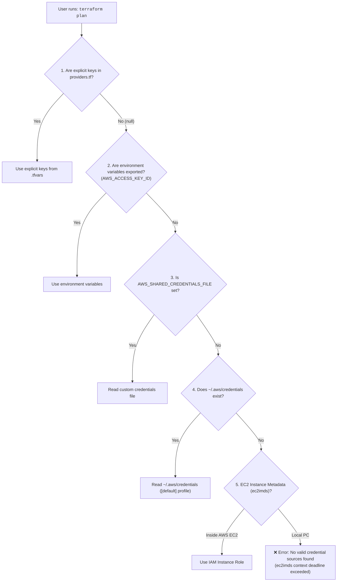

# AWS Credentials & Terraform Architecture Guide

A comprehensive deep dive into how AWS credentials work with Terraform, how the AWS Go SDK discovers credentials under the hood, and why different naming conventions (UPPERCASE vs. lowercase) are used.

---

## Table of Contents
1. [How It Works Under the Hood](#how-it-works-under-the-hood)
   - [1. The AWS Provider Embeds Amazon's Official SDK](#1-the-aws-provider-embeds-amazons-official-sdk)
   - [2. The Hardcoded Constants in the AWS SDK](#2-the-hardcoded-constants-in-the-aws-sdk)
   - [3. The Exact Lookup Logic Inside the Code](#3-the-exact-lookup-logic-inside-the-code)
   - [4. How Linux Passes It to Terraform (Process Inheritance)](#4-how-linux-passes-it-to-terraform-process-inheritance)
   - [5. Why All AWS Tools Know This Variable](#5-why-all-aws-tools-know-this-variable)
2. [Case Sensitivity: UPPERCASE vs. lowercase](#case-sensitivity-uppercase-vs-lowercase)
   - [The Short Answer](#the-short-answer)
   - [1. Why Terminal Environment Variables are CAPITALIZED](#1-why-terminal-environment-variables-are-capitalized)
   - [2. Why the Credentials File (~/.aws/credentials) is lowercase](#2-why-the-credentials-file--awscredentials-is-lowercase)
   - [3. Why Terraform Code (providers.tf) is lowercase](#3-why-terraform-code-providerstf-is-lowercase)
   - [Quick Rule of Thumb to Remember](#quick-rule-of-thumb-to-remember)
3. [Summary Diagram: Credential Discovery Chain](#summary-diagram-credential-discovery-chain)

---

## How It Works Under the Hood

### 1. The AWS Provider Embeds Amazon's Official SDK

When you add the AWS provider to Terraform:

```hcl
provider "aws" {
  region = var.aws_region
}
```

Terraform downloads the official AWS Provider binary (`terraform-provider-aws`). HashiCorp and Amazon built this provider using Amazon's official **AWS SDK for Go** (`aws-sdk-go-v2`).

---

### 2. The Hardcoded Constants in the AWS SDK

Inside Amazon's SDK source code, Amazon engineers explicitly defined these standard variable names:

```go
// Inside the official AWS Go SDK source code:
const (
    AccessKeyIDEnvVar       = "AWS_ACCESS_KEY_ID"
    SecretAccessKeyEnvVar   = "AWS_SECRET_ACCESS_KEY"
    SharedCredentialsEnvVar = "AWS_SHARED_CREDENTIALS_FILE"
    SharedConfigEnvVar      = "AWS_CONFIG_FILE"
)
```

---

### 3. The Exact Lookup Logic Inside the Code

When you run `terraform plan`, here is the exact check the Go SDK performs in memory:

```go
// 1. Check if the user set AWS_SHARED_CREDENTIALS_FILE in their terminal
customPath := os.Getenv("AWS_SHARED_CREDENTIALS_FILE")

if customPath != "" {
    // If you exported the variable, read the file from YOUR custom path
    credentialsFile = customPath
} else {
    // If NOT set, default to $HOME/.aws/credentials
    homeDir, _ := os.UserHomeDir()
    credentialsFile = filepath.Join(homeDir, ".aws", "credentials")
}
```

---

### 4. How Linux Passes It to Terraform (Process Inheritance)

When you type:

```bash
export AWS_SHARED_CREDENTIALS_FILE="/path/to/my/file"
```

You store that variable in your Linux shell's environment table.

Whenever you launch any program from that shell (like `terraform plan`), the operating system gives that program a **copy of all your exported environment variables**. The AWS SDK simply calls `os.Getenv("AWS_SHARED_CREDENTIALS_FILE")` to read it!

---

### 5. Why All AWS Tools Know This Variable

This is not specific to Terraform. Amazon designed this as a universal standard across all cloud programming languages:

| Tool | Language | Checks `AWS_SHARED_CREDENTIALS_FILE`? |
| :--- | :--- | :---: |
| **Ansible** | Python (`boto3`) | ✅ Yes |
| **Node.js** | TypeScript/JavaScript (`@aws-sdk`) | ✅ Yes |
| **Terraform** | Go (AWS SDK for Go) | ✅ Yes |
| **AWS CLI** | Python (Botocore) | ✅ Yes |
| **Docker** | Go (Amazon ECR credential helper) | ✅ Yes |

Whenever Amazon's code runs in any language, it is programmed to look for `AWS_SHARED_CREDENTIALS_FILE`.

---

## Case Sensitivity: UPPERCASE vs. lowercase

> **Question:** Why does the credentials file use `aws_access_key_id` (lowercase), but the terminal and system use `AWS_ACCESS_KEY_ID` (CAPITAL LETTERS)?

### The Short Answer

| Where it lives | Format | Example | Reason |
| :--- | :--- | :--- | :--- |
| **Terminal / Environment Variables** | **UPPERCASE** | `AWS_ACCESS_KEY_ID` | Standard Linux/POSIX rule: all environment variables must be CAPITALIZED. |
| **Credentials File (`~/.aws/credentials`)** | **lowercase** | `aws_access_key_id` | Standard INI config file convention: settings keys are lowercase `snake_case`. |
| **Terraform Code (`providers.tf`)** | **lowercase** | `access_key` | Terraform HCL convention: all syntax arguments are lowercase. |

---

### 1. Why Terminal Environment Variables are CAPITALIZED

In Linux, macOS, and Windows shell environments:

- **System environment variables** are always written in **ALL CAPS** (like `PATH`, `USER`, `HOME`, `SHELL`).
- This standard (**POSIX standard**) was created over 40 years ago so humans and programs can instantly tell the difference between:
  - A program or command name (lowercase, e.g., `ls`, `cat`, `terraform`)
  - A system environment variable (UPPERCASE, e.g., `AWS_ACCESS_KEY_ID`)

If you write `export aws_access_key_id="..."` in lowercase, many tools will ignore it because they specifically look for the uppercase name.

---

### 2. Why the Credentials File (`~/.aws/credentials`) is lowercase

The file `~/.aws/credentials` is formatted as an **INI file**:

```ini
[default]
aws_access_key_id = AKIA...
aws_secret_access_key = xEeC...
```

- In INI files, sections use brackets `[section]`, and settings use **lowercase `snake_case`**.
- **Bonus fact:** The INI file parser is actually **case-insensitive**!
  The AWS SDK automatically converts keys in `~/.aws/credentials` to lowercase when reading them. That means even if you typed `AWS_ACCESS_KEY_ID = ...` inside `~/.aws/credentials`, it would still work. But lowercase is the official AWS standard.

---

### 3. Why Terraform Code (`providers.tf`) is lowercase

In Terraform HCL (HashiCorp Configuration Language):
- All resource arguments, provider arguments, and module inputs are written in lowercase `snake_case` (e.g., `access_key`, `region`, `machine_type`).
- This keeps the Terraform codebase consistent and readable.

---

### Quick Rule of Thumb to Remember

- **In the terminal (`export`)**: Use **CAPITAL LETTERS** $\rightarrow$ `export AWS_ACCESS_KEY_ID="..."`
- **Inside files (`~/.aws/credentials` or `providers.tf`)**: Use **small letters** $\rightarrow$ `aws_access_key_id = "..."`

---

## Summary Diagram: Credential Discovery Chain



---

## 4. Configuring Custom File Locations via `terraform.tfvars`

Just like GCP supports `gcp_adc_file = "/path/to/credentials.json"`, you can now also customize the AWS credential paths directly in [`terraform.tfvars`](file:///home/seang/kubernete-aws-gcp/terraform/k8s_infrastructure/live/dev/asia-southeast1/kubespray-k8s/terraform.tfvars):

```hcl
# In terraform.tfvars:

# 1. Leave empty for automatic discovery (uses ~/.aws/credentials or env vars):
aws_shared_credentials_file = ""
aws_shared_config_file      = ""

# 2. Or point to any custom path you want:
# aws_shared_credentials_file = "~/.aws/credentials"
# aws_shared_credentials_file = "/home/seang/my-secrets/aws_creds"
# aws_shared_config_file      = "/home/seang/my-secrets/aws_conf"
```

### How Terraform processes this:
In [`providers.tf`](file:///home/seang/kubernete-aws-gcp/terraform/k8s_infrastructure/live/dev/asia-southeast1/kubespray-k8s/providers.tf):
```hcl
provider "aws" {
  region  = var.aws_region
  profile = trimspace(var.aws_profile) != "" ? var.aws_profile : null

  # If you set a path in terraform.tfvars, Terraform uses it.
  # If left empty (""), it evaluates to null and falls back to ~/.aws/credentials automatically.
  shared_credentials_files = trimspace(var.aws_shared_credentials_file) != "" ? [pathexpand(trimspace(var.aws_shared_credentials_file))] : null
  shared_config_files      = trimspace(var.aws_shared_config_file) != "" ? [pathexpand(trimspace(var.aws_shared_config_file))] : null
}
```

