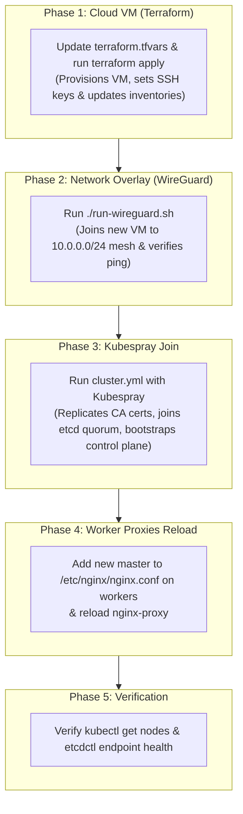

# Kubespray Add Control Plane (Master) Node Runbook

## Overview

This guide details the complete, production-tested procedure for adding a new or refreshed **Control Plane (Master)** node to an existing Kubernetes cluster deployed with **Kubespray** (specifically in multi-cloud or hybrid topologies running etcd and WireGuard mesh networking).



---

## Prerequisites & Topology Example

In this example, we illustrate adding **`master05`** (`10.0.0.5` / `104.155.219.76`) to an existing 4-master cluster:

| Host | WireGuard IP | Public IP | Role | Cloud |
| :--- | :--- | :--- | :--- | :--- |
| **`master01`** | `10.0.0.1` | `34.80.70.33` | Control Plane (Bootstrap primary) | GCP |
| **`master02`** | `10.0.0.2` | `34.80.98.67` | Control Plane & etcd | GCP |
| **`master03`** | `10.0.0.3` | `35.194.228.217` | Control Plane & etcd | GCP |
| **`master04`** | `10.0.0.4` | `34.104.159.36` | Control Plane & etcd | GCP |
| **`master05`** | `10.0.0.5` | `104.155.219.76` | **New Control Plane & etcd** | GCP / AWS |
| **`worker01..04`** | `10.0.0.6..9` | Various | Worker Nodes | AWS |

> [!NOTE]
> **Etcd Quorum Best Practice:**
> Adding `master05` scales the etcd cluster from 4 members to **5 members**.
> In etcd, odd numbers (3, 5, 7) are optimal because a 5-node cluster has a quorum of 3 and can tolerate **2 simultaneous node failures** without downtime.

---

## Phase 1: Provision the VM with Terraform

1. **Update `terraform.tfvars`:**
   In [terraform.tfvars](file:///home/seang/kubernete-aws-gcp/terraform/k8s_infrastructure/live/dev/asia-southeast1/kubespray-k8s/terraform.tfvars):
   - If adding a GCP master: Ensure `gcp_control_plane_count` includes the new node.
   - If adding an AWS master: Ensure `aws_control_plane_count` is set and `exclude_nodes = []` does not exclude it.

2. **Apply Terraform:**
   ```bash
   cd /home/seang/kubernete-aws-gcp/terraform/k8s_infrastructure/live/dev/asia-southeast1/kubespray-k8s
   terraform apply
   ```
   Terraform will:
   - Create the VM instance and assign the public/reserved IP.
   - Inject the cluster SSH keys.
   - Auto-generate the updated inventory files:
     - `terraform/wiregurad/inventory/hosts.ini`
     - `terraform/ansible_kubespray_k8s/kubespray/inventory/sample/inventory.ini`
     - `terraform/ansible_kubespray_k8s/inventory.ini`

---

## Phase 2: Join the WireGuard Mesh Network

Because cross-cloud nodes communicate through the encrypted WireGuard overlay (`10.0.0.0/24`), WireGuard must be active before Kubernetes or etcd can communicate.

1. **Deploy WireGuard configuration across the cluster:**
   ```bash
   cd /home/seang/kubernete-aws-gcp/terraform/wiregurad
   ./run-wireguard.sh
   ```

2. **Verify WireGuard handshakes and ping:**
   ```bash
   ./run-wireguard.sh verify
   ```

3. **Manual Ping Check:**
   Test pinging `master01` from the new master:
   ```bash
   ssh -i ~/.ssh/id_rsa seang@<NEW_NODE_PUBLIC_IP> "ping -c 2 10.0.0.1"
   ```

---

## Phase 3: Verify Inventory Configuration

1. Open [kubespray/inventory/sample/inventory.ini](file:///home/seang/kubernete-aws-gcp/terraform/ansible_kubespray_k8s/kubespray/inventory/sample/inventory.ini) and ensure:
   - The new node is appended to the **END** of `[kube_control_plane]`. (Adding nodes at the beginning is unsupported and breaks CA discovery).
   - Parameters are present:
     ```ini
     [kube_control_plane]
     master01 ansible_host=34.80.70.33 ip=10.0.0.1 access_ip=10.0.0.1 etcd_member_name=master01
     ...
     master05 ansible_host=104.155.219.76 ip=10.0.0.5 access_ip=10.0.0.5 etcd_member_name=master05

     [etcd:children]
     kube_control_plane
     ```

2. **Test Ansible connectivity:**
   ```bash
   ansible -i terraform/ansible_kubespray_k8s/inventory.ini master05 -m ping
   ```
   **Expected:** `master05 | SUCCESS => { "ping": "pong" }`

---

## Phase 4: Run Kubespray to Join Control Plane & etcd

> [!IMPORTANT]
> **Can you use `scale.yml` to add a master node?**
> **NO.** Kubespray's `scale.yml` is strictly designed for worker nodes.
> Adding a **Control Plane / etcd** node requires running **`cluster.yml`**.

Run the playbook from the Kubespray directory:

```bash
cd /home/seang/kubernete-aws-gcp/terraform/ansible_kubespray_k8s/kubespray

ANSIBLE_LOCAL_TEMP=/tmp TMPDIR=/tmp \
~/kubespray-venv/bin/ansible-playbook \
  -b -v \
  -i inventory/sample/inventory.ini \
  cluster.yml \
  --limit=etcd,kube_control_plane \
  -e ignore_assert_errors=yes
```

### What this command does automatically:
1. Connects to `master01` (primary bootstrap master) and pulls authentic cluster Certificate Authority keys (`ca.crt`, `sa.key`, `front-proxy-ca.crt`).
2. Issues new certificates for `master05` signed by the authentic cluster CA.
3. Automatically runs `etcdctl member add master05` and starts the `etcd` systemd service.
4. Generates a kubeadm join token and joins `master05` to the Kubernetes control plane.
5. Deploys static pods: `kube-apiserver`, `kube-controller-manager`, and `kube-scheduler`.
6. Updates `--etcd-servers` across all existing masters (`master01`–`master04`) to include `https://10.0.0.5:2379`.

---

## Phase 5: Update Worker Load Balancers (`nginx-proxy`)

Worker nodes run a local `nginx-proxy` static pod listening on `127.0.0.1:6443` to distribute API requests across all masters.

1. **Add `master05` to `/etc/nginx/nginx.conf` and reload `nginx-proxy` on all workers:**
   ```bash
   for ip in 10.0.0.6 10.0.0.7 10.0.0.8 10.0.0.9; do
     echo "=== Updating Worker at $ip ==="
     ssh -i ~/.ssh/id_rsa seang@$ip "sudo sed -i '/server 10.0.0.4:6443;/a \    server 10.0.0.5:6443;' /etc/nginx/nginx.conf && sudo crictl ps --name nginx-proxy -q | xargs -r sudo crictl stop"
   done
   ```
   *(When stopped, kubelet automatically restarts `nginx-proxy` within 2 seconds with the new config).*

2. **Verify that `master05` is present on all workers:**
   ```bash
   for ip in 10.0.0.6 10.0.0.7 10.0.0.8 10.0.0.9; do
     echo -n "Worker $ip: "
     ssh -i ~/.ssh/id_rsa seang@$ip 'sudo grep "10.0.0.5" /etc/nginx/nginx.conf || echo "Missing"'
   done
   ```

---

## Phase 6: Post-Join Health & Quorum Verification

Log into `master01`:

### 6.1 Check Kubernetes Nodes
```bash
kubectl get nodes -o wide
```
**Expected:** All 5 masters and 4 workers should be listed with `STATUS: Ready`.

### 6.2 Check etcd Membership
```bash
sudo ETCDCTL_API=3 etcdctl \
  --endpoints=https://127.0.0.1:2379 \
  --cacert=/etc/ssl/etcd/ssl/ca.pem \
  --cert=/etc/ssl/etcd/ssl/admin-master01.pem \
  --key=/etc/ssl/etcd/ssl/admin-master01-key.pem \
  member list -w table
```
**Expected:** All 5 masters are listed with `STATUS: started`.

### 6.3 Check etcd Endpoint Health
```bash
sudo ETCDCTL_API=3 etcdctl \
  --endpoints=https://10.0.0.1:2379,https://10.0.0.2:2379,https://10.0.0.3:2379,https://10.0.0.4:2379,https://10.0.0.5:2379 \
  --cacert=/etc/ssl/etcd/ssl/ca.pem \
  --cert=/etc/ssl/etcd/ssl/admin-master01.pem \
  --key=/etc/ssl/etcd/ssl/admin-master01-key.pem \
  endpoint health -w table
```
**Expected:** All 5 endpoints report `HEALTH: true` with zero errors.

---

## Troubleshooting Common Issues

| Issue | Cause | Solution |
| :--- | :--- | :--- |
| `cluster.yml` fails on PKI/Certs | New master placed in first position in `inventory.ini` | Always place new master at the **end** of `[kube_control_plane]`. |
| `Peer URLs already exists` | Node previously attempted to join etcd | Remove old stale member using `etcdctl member remove <OLD_ID>` on `master01` first. |
| SSH timeouts during playbook | WireGuard is down or routing incorrect | Verify WireGuard interface with `ip a show wg0` and ping `10.0.0.1`. |
| `permission denied` connecting to containerd | Running `crictl` without `sudo` | Always use `sudo crictl ps --name nginx-proxy -q | xargs -r sudo crictl stop`. |
