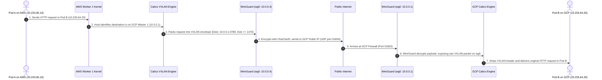

# Beginner's Guide to Kubespray Cluster Configuration (`group_vars/k8s_cluster/`)

> **Who this guide is for**: If you are new to Kubernetes, networking, or infrastructure, and computer shortcuts/acronyms (like CNI, CIDR, MTU, VXLAN, IPAM) sound confusing, this document explains everything in plain English with everyday analogies.

All configuration files covered in this guide are located in:
`terraform/ansible_kubespray_k8s/kubespray/inventory/sample/group_vars/k8s_cluster/`

---

## 📖 Chapter 1: The Jargon Buster (Translating the Shortcuts)

Before diving into configuration files, here is an everyday translation of all technical shortcuts and acronyms used in this project:

| Shortcut | Full Technical Name | Plain English Translation | Real-World Analogy |
| :--- | :--- | :--- | :--- |
| **VM** | Virtual Machine | A rented computer running in the cloud (Google Cloud or Amazon AWS). | A rented apartment inside a high-rise building. |
| **K8s** | Kubernetes ("K" + 8 letters + "s") | Software that automatically runs, organizes, and heals your application containers across many computers. | The head conductor of an orchestra, making sure all musicians play on cue. |
| **Kubespray** | *(Tool Name)* | An automated installer that downloads and builds a production Kubernetes cluster using Ansible. | An automated robotic construction team that builds a factory from blueprints. |
| **Ansible** | *(Tool Name)* | A remote-control tool that logs into your cloud computers over SSH and runs setup commands. | A master checklist and remote-control operator. |
| **Pod** | *(Kubernetes concept)* | The smallest unit in Kubernetes: one or more running containers sharing an IP address. | A shipping container holding your application code. |
| **Node** | *(Kubernetes concept)* | A computer in your cluster. Either a **Master** (brain) or a **Worker** (muscle). | A factory building where shipping containers are placed. |
| **IP** | Internet Protocol Address | A unique number given to a computer or container so others can send messages to it. | A phone number or street house address. |
| **CIDR** | Classless Inter-Domain Routing | A shorthand notation to describe a whole range of IP addresses (e.g. `10.0.0.0/24`). | An area code or postal ZIP code that covers an entire neighborhood. |
| **Subnet** | Sub-Network | A smaller slice of an IP address range carved out for a specific team or purpose. | A specific street inside a postal ZIP code. |
| **CNI** | Container Network Interface | The network plugin software responsible for giving each Pod an IP address and connecting pods across machines. | The postal delivery truck fleet that moves packages between shipping containers. |
| **IPAM** | IP Address Management | The feature inside the CNI that allocates unique IP addresses to Pods without duplicates. | The city clerk who assigns house numbers to newly built houses. |
| **MTU** | Maximum Transmission Unit | The maximum size (in bytes) of a single data packet that can travel across a network cable without breaking apart. | The maximum weight a single postal envelope is allowed to have before the post office rejects it. |
| **Overlay / Tunnel** | *(Networking concept)* | A virtual road built on top of the public internet to connect computers securely. | An underground tunnel connecting two cities so cars do not have to drive through public traffic. |
| **VXLAN** | Virtual Extensible Local Area Network | A technology that wraps Pod traffic inside normal UDP packets so they can cross any network. | Putting a private letter inside a FedEx envelope so it can travel across any postal system. |
| **WireGuard** | *(VPN Software)* | High-speed, encrypted tunnel software running directly inside the Linux kernel. | An armored, bulletproof glass tunnel connecting Google Cloud and Amazon AWS. |
| **NAT / SNAT** | (Source) Network Address Translation | Rewriting a private IP to a public IP so that machines on private networks can access the internet. | An office receptionist who dials outside phone numbers on behalf of employees at private desk extensions. |
| **RBAC** | Role-Based Access Control | A security system that restricts what actions a user or application can perform in the cluster. | Keycard access levels in an office building (e.g., interns cannot enter the server room). |

---

## 🏛️ Chapter 2: The Big Picture (Our Hybrid GCP + AWS Cluster)

Our cluster consists of **7 computers (nodes)** split across two completely different cloud providers:

```
┌────────────────────────────────────────────────────────┐       ┌────────────────────────────────────────────────────────┐
│                  Google Cloud (GCP)                    │       │                   Amazon AWS                           │
│                                                        │       │                                                        │
│     Master 1              Master 2            Master 3 │       │     Worker 1            Worker 2            Worker 3   │
│    (10.0.0.1)            (10.0.0.2)          (10.0.0.3)│       │    (10.0.0.4)          (10.0.0.5)          (10.0.0.6)  │
│                                                        │       │                                             Worker 4   │
│    THE "BRAINS" (Control Plane)                        │       │                                            (10.0.0.7)  │
│    Make decisions, schedule pods, maintain state       │       │    THE "MUSCLE" (Worker Nodes)                         │
│    Store data in the etcd database                     │       │    Run your actual web apps, APIs, and databases       │
└───────────────────────────┬────────────────────────────┘       └───────────────────────────┬────────────────────────────┘
                            │                                                                │
                            └──────────────────── [ WIREGUARD TUNNEL ] ──────────────────────┘
                                                 Flat Highway: 10.0.0.0/24
```

### Why WireGuard is Required
* Google Cloud and Amazon AWS are completely isolated networks.
* An AWS VM cannot talk to a Google Cloud private IP address (`10.10.x.x`) without an expensive dedicated fiber connection.
* **WireGuard** creates an encrypted virtual highway (`10.0.0.1` – `10.0.0.7`).
* Every node talks to every other node over this flat private road, keeping all Kubernetes traffic 100% encrypted and off the open internet.

---

## 🗂️ Chapter 3: The Address Book (`inventory.ini`)

All configuration variables in `group_vars/k8s_cluster/` are applied to the computers listed in [`inventory.ini`](file:///home/seang/kubernete-aws-gcp/terraform/ansible_kubespray_k8s/kubespray/inventory/sample/inventory.ini):

```ini
[kube_control_plane]
master01 ansible_host=34.128.10.15  ip=10.0.0.1 access_ip=10.0.0.1 etcd_member_name=etcd-1
master02 ansible_host=34.128.10.16  ip=10.0.0.2 access_ip=10.0.0.2 etcd_member_name=etcd-2
master03 ansible_host=34.128.10.17  ip=10.0.0.3 access_ip=10.0.0.3 etcd_member_name=etcd-3

[etcd:children]
kube_control_plane

[kube_node]
worker01 ansible_host=54.255.40.101 ip=10.0.0.4 access_ip=10.0.0.4
worker02 ansible_host=54.255.40.102 ip=10.0.0.5 access_ip=10.0.0.5
worker03 ansible_host=54.255.40.103 ip=10.0.0.6 access_ip=10.0.0.6
worker04 ansible_host=54.255.40.104 ip=10.0.0.7 access_ip=10.0.0.7

[k8s_cluster:children]
kube_control_plane
kube_node
```

### The 3 IP Settings Explained:
1. **`ansible_host` (Public IP)**:
   * Used **only by your workstation / deployer** to open an SSH terminal and install software on each VM over the internet.
2. **`ip` (WireGuard IP: `10.0.0.x`)**:
   * The IP address that internal Kubernetes programs on this machine (kubelet, etcd, kube-proxy) bind to and listen on.
3. **`access_ip` (WireGuard IP: `10.0.0.x`)**:
   * The IP address that **other cluster computers** use to call this machine. For example, Worker 1 dials `10.0.0.1:6443` to reach Master 1 securely over WireGuard.

Because `kube_control_plane` and `kube_node` are grouped under `[k8s_cluster:children]`, **any file placed inside `group_vars/k8s_cluster/` automatically applies to all 7 machines**.

---

## 📄 Chapter 4: The 4 Active Configuration Files

```
inventory/sample/group_vars/k8s_cluster/
├── k8s-cluster.yml          <-- 1. Core cluster settings (K8s version, CIDRs, runtime, CNI)
├── k8s-net-calico.yml       <-- 2. Calico CNI (Active container networking & MTU clamping)
├── addons.yml               <-- 3. Ingress, Cert-Manager, Metrics Server, Helm
└── kube_control_plane.yml   <-- 4. RAM & CPU emergency reservations for Master nodes
```

---

### File 1: [`k8s-cluster.yml`](file:///home/seang/kubernete-aws-gcp/terraform/ansible_kubespray_k8s/kubespray/inventory/sample/group_vars/k8s_cluster/k8s-cluster.yml) — "The Master Rulebook"

This is the main steering wheel for the cluster installation.

#### 1. Kubernetes Version
```yaml
kube_version: v1.31.0
```
* **Plain English**: Tells Kubespray which release of Kubernetes to download and install.

#### 2. Network Plugin Selector
```yaml
kube_network_plugin: calico
```
* **Plain English**: Chooses which CNI postal delivery service to install. We pick **Calico**.
* **How it works**: Because this is set to `calico`, Kubespray only reads `k8s-net-calico.yml` and ignores `k8s-net-cilium.yml`, `k8s-net-flannel.yml`, etc.

#### 3. Pod IP Subnet Range (`kube_pods_subnet`)
```yaml
kube_pods_subnet: 10.233.64.0/18
kube_network_node_prefix: 24
```
* **Plain English**: The pool of IP addresses reserved exclusively for application Pods.
* **Analogy**: Imagine a brand-new planned city with **16,384 street address numbers** (`10.233.64.0/18`).
* **`kube_network_node_prefix: 24`**: Calico divides the city into neighborhoods of **254 house numbers** each. Each of our 7 VMs gets its own neighborhood. When a Pod starts on Worker 1, it receives a unique address from Worker 1's neighborhood.
* **Zero Collision**: This range does not overlap with WireGuard (`10.0.0.0/24`) or cloud VPCs (`10.10.x.x` / `10.20.x.x`).

#### 4. Service IP Subnet Range (`kube_service_addresses`)
```yaml
kube_service_addresses: 10.233.0.0/18
```
* **Plain English**: The virtual IP addresses assigned to Kubernetes Services (internal load balancers).
* **Analogy**: A main company switchboard phone number. If you have 3 database pods, Kubernetes creates 1 single switchboard number from this pool. Any app dialing that switchboard number automatically reaches a working database.

#### 5. Container Runtime Engine
```yaml
container_manager: containerd
```
* **Plain English**: The low-level software that unpacks and runs container images. `containerd` is the modern industry standard that replaced Docker.

---

### File 2: [`k8s-net-calico.yml`](file:///home/seang/kubernete-aws-gcp/terraform/ansible_kubespray_k8s/kubespray/inventory/sample/group_vars/k8s_cluster/k8s-net-calico.yml) — "The Container Postal Service"

Because `kube_network_plugin: calico` was selected in `k8s-cluster.yml`, this file sets up container-to-container routing across clouds.

#### 1. WireGuard Interface Auto-Detection
```yaml
calico_ip_auto_method: "interface=wg.*"
```
* **Plain English**: "Calico, when you start on any VM, find the network card that starts with `wg` (`wg0`), and use its WireGuard IP (`10.0.0.x`) to communicate with other nodes."
* **What breaks if this is missing?**: Calico would default to the cloud provider's main network card (`eth0`). AWS nodes would try to send pod traffic to Google Cloud private IPs (`10.10.x.x`), which AWS cannot reach. Cross-cloud pod communication would completely fail!

#### 2. Envelope Size Clamping (MTU = 1370)
```yaml
calico_mtu: 1370
calico_veth_mtu: 1370
```
* **Plain English**: "Never allow any container to send a data package larger than 1370 bytes."
* **The "Envelope inside an Envelope" Problem**:
  - The standard internet cable limit is **1500 bytes**.
  - WireGuard encrypts each packet, adding an armored header of **80 bytes** &rarr; Leaves **1420 bytes** max for `wg0`.
  - Calico VXLAN adds another envelope header of **50 bytes**.
  - Calculation: `1420 (WireGuard) - 50 (VXLAN) = 1370 bytes`.
* **What breaks if this is missing?**: If MTU is left at 1440 or 1500, large packets (like web images, file downloads, or SSL certificates) exceed the 1420-byte WireGuard tunnel limit. The packets get silently dropped. Websites freeze or randomly time out.

#### 3. Outbound Internet for Pods
```yaml
nat_outgoing: true
```
* **Plain English**: Allows Pods to reach the outside internet (e.g. calling external APIs, downloading packages) by translating the Pod's internal IP to the node's public IP.

#### 4. Encapsulation Mode
```yaml
calico_network_backend: vxlan
calico_vxlan_mode: 'Always'
calico_vxlan_port: 4789
```
* **Plain English**: Always wrap Pod data into standard VXLAN UDP packets so they can cross our WireGuard tunnel seamlessly.

---

### Step-by-Step: The Journey of a Packet Across Clouds

Here is what happens when **Pod A on AWS Worker 1** talks to **Pod B on GCP Master 1**:



---

### File 3: [`addons.yml`](file:///home/seang/kubernete-aws-gcp/terraform/ansible_kubespray_k8s/kubespray/inventory/sample/group_vars/k8s_cluster/addons.yml) — "The Platform Toolbelt"

Controls pre-packaged official Kubernetes applications:

#### 1. Ingress NGINX (The Front Door Receptionist)
```yaml
ingress_nginx_enabled: true
ingress_nginx_service_type: NodePort
```
* **Plain English**: Deploys the NGINX web server as the cluster's gateway.
* **Analogy**: A hotel receptionist. When an outside user visits `https://app.example.com`, NGINX reads the domain name and guides the visitor to the right Pod inside the cluster.

#### 2. Metrics Server (The Cluster Thermometer)
```yaml
metrics_server_enabled: true
metrics_server_kubelet_insecure_tls: true
```
* **Plain English**: Measures CPU and Memory consumption across every node and container.
* **Why you need it**: Without this, `kubectl top nodes` and `kubectl top pods` commands will fail, and Kubernetes cannot automatically scale up pods when traffic surges (HPA autoscaling).

#### 3. Cert-Manager (The Automatic Locksmith)
```yaml
cert_manager_enabled: true
cert_manager_namespace: "cert-manager"
```
* **Plain English**: Automatically requests, installs, and renews free SSL/TLS certificates from Let's Encrypt so your applications always have a secure green padlock (`https://`).

#### 4. Helm (The Kubernetes App Store)
```yaml
helm_enabled: true
```
* **Plain English**: Installs the `helm` command-line tool on master nodes so you can deploy complex applications (like databases or monitoring systems) with a single command.

---

### File 4: [`kube_control_plane.yml`](file:///home/seang/kubernete-aws-gcp/terraform/ansible_kubespray_k8s/kubespray/inventory/sample/group_vars/k8s_cluster/kube_control_plane.yml) — "The Brain's Emergency Rations"

Controls resource protection on the 3 Google Cloud Master nodes:

```yaml
# Reserve memory and CPU for Kubernetes control plane daemons
kube_memory_reserved: 512Mi
kube_cpu_reserved: 200m

# Reserve memory and CPU for the Linux Operating System
system_memory_reserved: 512Mi
system_cpu_reserved: 250m
```
* **Plain English**: "Always keep 512 Megabytes of RAM and 25% of a CPU core locked away and protected for the Linux operating system and Kubernetes control plane."
* **Analogy**: Keeping a spare emergency tire and gas tank in your car.
* **Why it matters**: If an application pod on a master node leaks memory and tries to consume 100% of the RAM, these reservations prevent the master node's operating system from freezing, keeping the cluster stable.

---

## 💤 Chapter 5: The 6 Inactive Network Files (Why They Exist)

The remaining 6 files in this folder are alternative network plugins. They remain **dormant** because `kube_network_plugin: calico` was selected in `k8s-cluster.yml`:

1. **`k8s-net-cilium.yml`**: An advanced CNI that uses Linux **eBPF** programs to bypass iptables for extreme performance. Popular for massive clusters (thousands of nodes).
2. **`k8s-net-flannel.yml`**: A very old, simple network overlay. Easy to run, but lacks **NetworkPolicies** (pod firewalls), making it unsuitable for multi-tenant production setups.
3. **`k8s-net-kube-ovn.yml`**: An enterprise software-defined network based on Open vSwitch (OVS). Allows creating multiple virtual private clouds (VPCs) inside Kubernetes. Used mostly by telecom companies.
4. **`k8s-net-kube-router.yml`**: A lightweight all-in-one router used mainly in physical on-premise data centers with physical BGP switches.
5. **`k8s-net-macvlan.yml`**: Connects pods directly to physical office/home ethernet switches. **Cannot work on AWS or Google Cloud** because public cloud hypervisors block unapproved MAC addresses.
6. **`k8s-net-custom-cni.yml`**: A template used only if you want to deploy an unbundled CNI using raw YAML manifests or a custom Helm chart.

---

## 🚀 Chapter 6: How Deployment Executes (The 3-Step Flow)

Our deployment script [`apply-dev-and-run-ansible.sh`](file:///home/seang/kubernete-aws-gcp/terraform/k8s_infrastructure/scripts/apply-dev-and-run-ansible.sh) orchestrates the entire process in three logical steps:

```
┌────────────────────────────────────────────────────────────────────────┐
│ Step 1: Terraform Apply                                                │
│ Creates 3 GCP Master VMs + 4 AWS Worker VMs                            │
│ Opens Security Groups / Firewalls (Port 51820/UDP for WireGuard)       │
│ Auto-generates inventory.ini and wireguard hosts.ini                   │
└──────────────────────────────────┬─────────────────────────────────────┘
                                   │
                                   ▼
┌────────────────────────────────────────────────────────────────────────┐
│ Step 2: WireGuard Full Mesh (terraform/wiregurad/run-wireguard.sh)     │
│ Installs WireGuard on all 7 machines                                   │
│ Connects all machines over encrypted 10.0.0.1 - 10.0.0.7 highway (wg0) │
│ Verifies handshakes and mutual pings across clouds                     │
└──────────────────────────────────┬─────────────────────────────────────┘
                                   │
                                   ▼
┌────────────────────────────────────────────────────────────────────────┐
│ Step 3: Kubespray Installation (cluster.yml)                           │
│ Connects via public IPs (ansible_host)                                 │
│ Binds Kubernetes components to WireGuard IPs (10.0.0.x on wg0)         │
│ Calico activates, auto-detects wg0, clamps MTU to 1370                 │
│ Installs Ingress NGINX, Metrics Server, and Cert-Manager               │
└────────────────────────────────────────────────────────────────────────┘
```

### Manual Command Reference
If you ever want to run the steps manually:

```bash
# 1. Build VMs and generate inventories
cd /home/seang/kubernete-aws-gcp/terraform/k8s_infrastructure/live/dev/asia-southeast1/kubespray-k8s
terraform apply

# 2. Deploy and test the WireGuard tunnel
cd /home/seang/kubernete-aws-gcp/terraform/wiregurad
./run-wireguard.sh deploy
./run-wireguard.sh verify

# 3. Install Kubernetes with Kubespray
cd /home/seang/kubernete-aws-gcp/terraform/ansible_kubespray_k8s/kubespray
ansible-playbook -i inventory/sample/inventory.ini cluster.yml
```

---

## 🎛️ Chapter 7: Dynamic Multi-Cloud Sizing (Any Combination!)

Terraform is now configured with **full dynamic elasticity**. You can place any number of Master or Worker nodes on either cloud, or put 100% of everything on a single cloud, simply by editing [`terraform.tfvars`](file:///home/seang/kubernete-aws-gcp/terraform/k8s_infrastructure/live/dev/asia-southeast1/kubespray-k8s/terraform.tfvars):

```hcl
gcp_control_plane_count = 2  # Masters on Google Cloud
aws_control_plane_count = 1  # Masters on Amazon AWS
gcp_worker_count        = 0  # Workers on Google Cloud
aws_worker_count        = 4  # Workers on Amazon AWS
```

### Popular Topologies You Can Set:

#### Scenario A: Cross-Cloud HA Split (Recommended: 2 GCP + 1 AWS Master)
* **Configuration**:
  ```hcl
  gcp_control_plane_count = 2
  aws_control_plane_count = 1
  gcp_worker_count        = 0
  aws_worker_count        = 4
  ```
* **Result**:
  - `master-01`, `master-02` on Google Cloud.
  - `master-03` on Amazon AWS.
  - `worker-01` to `worker-04` on Amazon AWS.
  - WireGuard IPs: `10.0.0.1` – `10.0.0.7`.
  - **Fault Tolerance**: If AWS goes down, GCP still has 2 out of 3 masters (majority quorum), so the Kubernetes control plane survives!

#### Scenario B: 100% Google Cloud (Zero AWS costs)
* **Configuration**:
  ```hcl
  gcp_control_plane_count = 3
  aws_control_plane_count = 0
  gcp_worker_count        = 4
  aws_worker_count        = 0
  ```
* **Result**: All 7 machines run in GCP. AWS module creates 0 resources and incurs 0 cost.

#### Scenario C: 100% Amazon AWS (Zero GCP costs)
* **Configuration**:
  ```hcl
  gcp_control_plane_count = 0
  aws_control_plane_count = 3
  gcp_worker_count        = 0
  aws_worker_count        = 4
  ```
* **Result**: All 7 machines run in AWS. GCP module creates 0 resources and incurs 0 cost.

#### Scenario D: Full 50/50 Balanced Split
* **Configuration**:
  ```hcl
  gcp_control_plane_count = 2
  aws_control_plane_count = 1
  gcp_worker_count        = 2
  aws_worker_count        = 2
  ```
* **Result**: Masters and workers are balanced across both clouds, giving maximum redundancy for application workloads.

### How Terraform Automatically Handles It:
- **Sequential Node Names**: `master-01`, `master-02` on GCP, and `master-03` on AWS automatically offsets by GCP's count so there are never duplicate or missing names.
- **Dynamic WireGuard Mesh**: All active nodes automatically peer with each other over `wg0` with IPs assigned sequentially (`10.0.0.1` to `10.0.0.N`).
- **Conditional Firewalls**: Cross-cloud firewall rules only create when both clouds have active nodes. If a cloud has 0 nodes, no firewall rules or keys are wasted.
