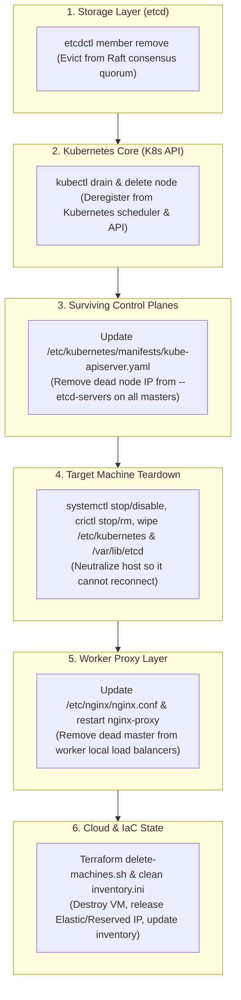

# Kubespray Manual Control Plane (Master) Node Removal Runbook

## Overview

This guide details the complete, production-tested manual procedure for cleanly removing a **Control Plane (Master)** node from a Kubernetes cluster installed via **Kubespray** (specifically in multi-cloud or hybrid topologies running etcd and WireGuard).

Removing a master node requires touching **6 architectural layers** to avoid etcd split-brain, API server dial timeouts, and worker traffic blackholing.



---

## Example Topology Reference

In this runbook, we illustrate the removal of **`master05`** (`10.0.0.5` / `54.179.132.52`) from a 5-master cluster:

| Host | WireGuard IP | Role | Cloud | Status |
| :--- | :--- | :--- | :--- | :--- |
| **`master01`** | `10.0.0.1` | Control Plane & etcd | GCP | Keep |
| **`master02`** | `10.0.0.2` | Control Plane & etcd | GCP | Keep |
| **`master03`** | `10.0.0.3` | Control Plane & etcd | GCP | Keep |
| **`master04`** | `10.0.0.4` | Control Plane & etcd | GCP | Keep |
| **`master05`** | `10.0.0.5` | Control Plane & etcd | AWS | **Remove** |
| **`worker01..04`** | `10.0.0.6..9` | Worker Nodes | AWS | Keep |

---

## Phase 1: Pre-flight Verification

> [!IMPORTANT]
> **Etcd Quorum Rule:**
> In an etcd cluster of $N=5$, quorum requires $\lfloor 5/2 \rfloor + 1 = 3$ nodes.
> Removing 1 node leaves $N=4$, which **still requires 3 nodes for quorum**.
> Ensure all surviving masters are 100% healthy before removing any member.

Log into an active master (e.g. `master01`):

### 1.1 Verify Kubernetes Node Status
```bash
kubectl get nodes -o wide
```
Confirm all nodes are in `Ready` status.

### 1.2 Verify etcd Cluster Health & Member List
```bash
# Check endpoint health
sudo ETCDCTL_API=3 etcdctl \
  --endpoints=https://127.0.0.1:2379 \
  --cacert=/etc/ssl/etcd/ssl/ca.pem \
  --cert=/etc/ssl/etcd/ssl/admin-master01.pem \
  --key=/etc/ssl/etcd/ssl/admin-master01-key.pem \
  endpoint health

# List current etcd members
sudo ETCDCTL_API=3 etcdctl \
  --endpoints=https://127.0.0.1:2379 \
  --cacert=/etc/ssl/etcd/ssl/ca.pem \
  --cert=/etc/ssl/etcd/ssl/admin-master01.pem \
  --key=/etc/ssl/etcd/ssl/admin-master01-key.pem \
  member list -w table
```
Note the **Hexadecimal Member ID** for the node you want to remove (e.g., `97a2fae2035ccf7a` for `master05`).

---

## Phase 2: Remove the Node from etcd Quorum

On **`master01`**:

```bash
sudo ETCDCTL_API=3 etcdctl \
  --endpoints=https://127.0.0.1:2379 \
  --cacert=/etc/ssl/etcd/ssl/ca.pem \
  --cert=/etc/ssl/etcd/ssl/admin-master01.pem \
  --key=/etc/ssl/etcd/ssl/admin-master01-key.pem \
  member remove <HEX_MEMBER_ID>
```
*Example:*
```bash
sudo ETCDCTL_API=3 etcdctl \
  --endpoints=https://127.0.0.1:2379 \
  --cacert=/etc/ssl/etcd/ssl/ca.pem \
  --cert=/etc/ssl/etcd/ssl/admin-master01.pem \
  --key=/etc/ssl/etcd/ssl/admin-master01-key.pem \
  member remove 97a2fae2035ccf7a
```
**Output:** `Member 97a2fae2035ccf7a removed from cluster <CLUSTER_ID>`

---

## Phase 3: Drain & Delete the Node Object from Kubernetes

On **`master01`**:

### 3.1 Drain Pods
```bash
kubectl drain <NODE_NAME> --delete-emptydir-data --force --ignore-daemonsets
```

### 3.2 Delete Node Registration
```bash
kubectl delete node <NODE_NAME>
```

### 3.3 Verify
```bash
kubectl get nodes
```
The node will no longer be listed.

---

## Phase 4: Neutralize the Target Host Machine

SSH directly into the node to be removed (e.g., `master05`):

```bash
ssh -i ~/.ssh/id_rsa seang@10.0.0.5
```

Execute host teardown commands:

```bash
# 1. Stop and disable local kubelet and etcd services
sudo systemctl stop kubelet etcd
sudo systemctl disable kubelet etcd

# 2. Stop and delete all running containers
sudo crictl stop $(sudo crictl ps -q) 2>/dev/null || true
sudo crictl rm $(sudo crictl ps -a -q) 2>/dev/null || true

# 3. Wipe Kubernetes, CNI, and etcd data & SSL certificates
sudo rm -rf /etc/kubernetes /var/lib/kubelet /var/lib/etcd /etc/ssl/etcd /var/lib/cni

# 4. Flush firewall and iptables rules
sudo iptables -F && sudo iptables -t nat -F && sudo iptables -t mangle -F && sudo iptables -X

# 5. Exit back to management terminal
exit
```

> [!NOTE]
> Deleting `/etc/ssl/etcd` invalidates the mTLS certificates for that node. Even if someone boots the machine, the remaining masters will permanently reject its connections.

---

## Phase 5: Update `kube-apiserver` on All Surviving Masters

`kube-apiserver` runs as a static pod. Its `--etcd-servers` flag is hardcoded on disk in `/etc/kubernetes/manifests/kube-apiserver.yaml`.

If you do not remove the deleted master's IP, `kube-apiserver` will attempt gRPC dials to the dead IP every few seconds, causing:
- Intermittent `504 Gateway Timeout` or latency in `kubectl` commands
- Log spam (`Failed to dial endpoint 10.0.0.5:2379: context deadline exceeded`)
- Degraded `/readyz` health check status

### 5.1 Update on Every Surviving Master (`master01` through `master04`)
Run this on each master:

```bash
# Remove the dead IP from --etcd-servers
sudo sed -i 's/,https:\/\/10.0.0.5:2379//g' /etc/kubernetes/manifests/kube-apiserver.yaml

# Verify the line contains only active masters
sudo grep "etcd-servers" /etc/kubernetes/manifests/kube-apiserver.yaml
```

*(Kubelet watches the manifests directory and automatically restarts `kube-apiserver` within 10 seconds).*

#### One-liner to update remote masters from `master01` or your workstation:
```bash
for ip in 10.0.0.2 10.0.0.3 10.0.0.4; do
  echo "=== Updating master at $ip ==="
  ssh -i ~/.ssh/id_rsa seang@$ip "sudo sed -i 's/,https:\/\/10.0.0.5:2379//g' /etc/kubernetes/manifests/kube-apiserver.yaml && sudo grep 'etcd-servers' /etc/kubernetes/manifests/kube-apiserver.yaml"
done
```

---

## Phase 6: Update Worker Node Proxies (`nginx-proxy`)

In Kubespray HA clusters, worker nodes do not talk to masters directly. Each worker runs a local `nginx-proxy` static pod listening on `127.0.0.1:6443` that load balances traffic across all masters.

If you don't remove `10.0.0.5` from `/etc/nginx/nginx.conf`:
- **~20% of worker API calls** hit a dead IP.
- Workers wait for a 1-second timeout before failing over, causing `kubelet` status reporting lags.

### 6.1 Run on All Worker Nodes (`worker01` .. `worker04`)

Run this loop from your terminal:

```bash
for ip in 10.0.0.6 10.0.0.7 10.0.0.8 10.0.0.9; do
  echo "=== Updating Worker at $ip ==="
  # 1. Remove master05 upstream line from nginx.conf
  ssh -i ~/.ssh/id_rsa seang@$ip "sudo sed -i '/10.0.0.5:6443/d' /etc/nginx/nginx.conf"
  
  # 2. Stop nginx-proxy so kubelet automatically restarts it with new config
  ssh -i ~/.ssh/id_rsa seang@$ip 'sudo crictl ps --name nginx-proxy -q | xargs -r sudo crictl stop'
done
```

### 6.2 Confirm Workers Are Clean
```bash
for ip in 10.0.0.6 10.0.0.7 10.0.0.8 10.0.0.9; do
  echo -n "Worker $ip: "
  ssh -i ~/.ssh/id_rsa seang@$ip 'sudo grep "10.0.0.5" /etc/nginx/nginx.conf || echo "Confirmed Clean!"'
done
```

---

## Phase 7: Post-Removal Validation

From `master01`:

### 7.1 Verify etcd Member Table
```bash
sudo ETCDCTL_API=3 etcdctl \
  --endpoints=https://127.0.0.1:2379 \
  --cacert=/etc/ssl/etcd/ssl/ca.pem \
  --cert=/etc/ssl/etcd/ssl/admin-master01.pem \
  --key=/etc/ssl/etcd/ssl/admin-master01-key.pem \
  member list -w table
```
Only the remaining masters must be listed.

### 7.2 Verify Health Across All Endpoints
```bash
sudo ETCDCTL_API=3 etcdctl \
  --endpoints=https://10.0.0.1:2379,https://10.0.0.2:2379,https://10.0.0.3:2379,https://10.0.0.4:2379 \
  --cacert=/etc/ssl/etcd/ssl/ca.pem \
  --cert=/etc/ssl/etcd/ssl/admin-master01.pem \
  --key=/etc/ssl/etcd/ssl/admin-master01-key.pem \
  endpoint health -w table
```
All endpoints should return `HEALTH: true`.

### 7.3 Check etcd Alarms
```bash
sudo ETCDCTL_API=3 etcdctl \
  --endpoints=https://127.0.0.1:2379 \
  --cacert=/etc/ssl/etcd/ssl/ca.pem \
  --cert=/etc/ssl/etcd/ssl/admin-master01.pem \
  --key=/etc/ssl/etcd/ssl/admin-master01-key.pem \
  alarm list
```
Should return empty (no alarms).

### 7.4 Verify Kubernetes Cluster State
```bash
kubectl get nodes -o wide
kubectl get pods -A
```

---

## Phase 8: Cloud IaC Decommissioning & Inventory Cleanup

To prevent cloud billing for the orphaned VM and prevent Terraform or Kubespray from attempting to manage it:

### 8.1 Terminate the Cloud VM in Terraform
From your local workstation:

```bash
cd /home/seang/kubernete-aws-gcp/terraform/k8s_infrastructure/scripts
./delete-machines.sh k8s-master05
```
*Or add `k8s-master05` to `exclude_nodes = ["k8s-master05"]` in `terraform.tfvars` and run `terraform apply`.*

### 8.2 Clean Up Ansible / Kubespray Inventories
Remove the `master05` line from:
- `terraform/ansible_kubespray_k8s/kubespray/inventory/sample/inventory.ini`
- `terraform/ansible_kubespray_k8s/inventory.ini`
- `single-cluster/inventory.ini` (if present)
