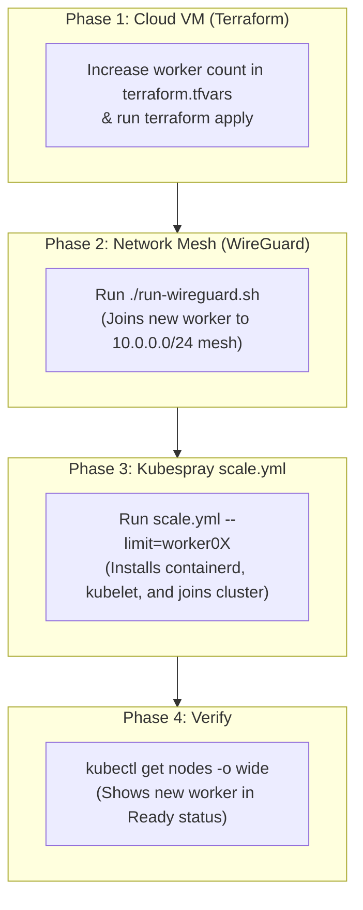
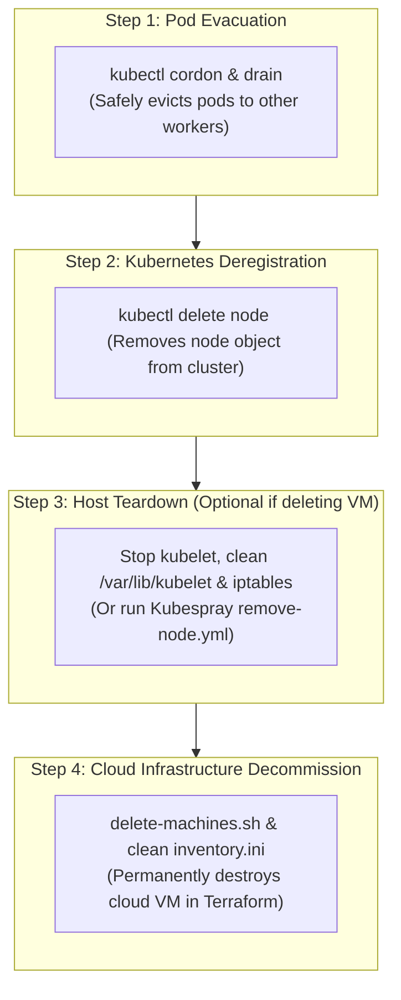

# Kubespray Worker Node Lifecycle Runbook (Add & Delete)

## Overview

This guide details the complete, production-tested procedure for **adding** and **deleting (removing)** Worker nodes in a Kubernetes cluster deployed with **Kubespray** across multi-cloud infrastructure (GCP + AWS) running a WireGuard overlay mesh network.

Unlike control plane (master) nodes, **worker nodes do not participate in etcd consensus quorum** and do not run static control plane pods. The lifecycle of a worker node focuses on:
- **Adding:** Fast provisioning using Kubespray's dedicated `scale.yml` playbook.
- **Deleting:** Gracefully evicting application pods (`drain`) and removing the node cleanly without disrupting workloads.

---

## Architecture Comparison: Master vs. Worker

| Lifecycle Step | Control Plane (Master) | Worker Node |
| :--- | :--- | :--- |
| **etcd quorum impact** | **Critical** (affects Raft voting) | **None** (workers don't run etcd) |
| **Playbook to Add** | `cluster.yml` | `scale.yml --limit=<node>` |
| **Playbook to Delete** | `remove-node.yml` + manual etcd/manifest fixes | `remove-node.yml` |
| **Primary Risk on Delete** | Split-brain & API server latency | Pod eviction & application downtime |
| **Proxy / LB updates** | Must update all worker proxies & apiservers | None required on other nodes |

---

# PART 1: How to Add a Worker Node



### Phase 1: Provision the VM with Terraform

1. **Update `terraform.tfvars`:**
   In [terraform.tfvars](file:///home/seang/kubernete-aws-gcp/terraform/k8s_infrastructure/live/dev/asia-southeast1/kubespray-k8s/terraform.tfvars), increase the desired worker count:
   ```hcl
   aws_worker_count = 5   # (or gcp_worker_count = 1)
   ```

2. **Apply Terraform:**
   ```bash
   cd /home/seang/kubernete-aws-gcp/terraform/k8s_infrastructure/live/dev/asia-southeast1/kubespray-k8s
   terraform apply
   ```
   Terraform creates the VM, attaches the IP, sets SSH keys, and automatically appends `worker05` to:
   - `terraform/wiregurad/inventory/hosts.ini`
   - `terraform/ansible_kubespray_k8s/kubespray/inventory/sample/inventory.ini`
   - `terraform/ansible_kubespray_k8s/inventory.ini`

---

### Phase 2: Connect the Worker to WireGuard Mesh

The worker must join the `10.0.0.0/24` WireGuard mesh to communicate with the GCP master nodes:

1. **Deploy WireGuard configuration:**
   ```bash
   cd /home/seang/kubernete-aws-gcp/terraform/wiregurad
   ./run-wireguard.sh
   ```

2. **Verify connectivity:**
   ```bash
   ./run-wireguard.sh verify
   ```
   Ensure ping between `10.0.0.1` (`master01`) and the new worker's WireGuard IP (e.g. `10.0.0.10`) succeeds.

---

### Phase 3: Run Kubespray's `scale.yml` Playbook

Run Kubespray's dedicated worker scaling playbook. Always pass `--limit` to ensure only the new worker is touched:

```bash
cd /home/seang/kubernete-aws-gcp/terraform/ansible_kubespray_k8s/kubespray

ANSIBLE_LOCAL_TEMP=/tmp TMPDIR=/tmp \
~/kubespray-venv/bin/ansible-playbook \
  -b -v \
  -i inventory/sample/inventory.ini \
  scale.yml \
  --limit=worker05
```

#### What `scale.yml` does automatically on the worker:
1. Installs the container runtime (`containerd`).
2. Configures the local `nginx-proxy` pointing to all active master nodes.
3. Retrieves a cluster token from `master01` and runs `kubeadm join`.
4. Configures CNI network routing (Calico/flannel) and starts `kubelet`.

---

### Phase 4: Verify the New Worker

On `master01`:
```bash
kubectl get nodes -o wide
```
**Expected:** The new worker appears with `STATUS: Ready` and role `<none>`.

---

# PART 2: How to Delete / Remove a Worker Node



---

### Option A: Automated Removal via Kubespray (`remove-node.yml`)

Kubespray includes the automated [remove-node.yml](file:///home/seang/kubernete-aws-gcp/terraform/ansible_kubespray_k8s/kubespray/remove-node.yml) playbook that automatically drains pods, cleans the node OS, and deletes the node from Kubernetes:

#### If the Worker is Online and Reachable via SSH:
```bash
cd /home/seang/kubernete-aws-gcp/terraform/ansible_kubespray_k8s/kubespray

~/kubespray-venv/bin/ansible-playbook \
  -i inventory/sample/inventory.ini \
  remove-node.yml \
  -b -v \
  -e "node=worker04"
```
*(Type `yes` when prompted for confirmation).*

#### If the Worker is Dead / Offline (Crashed VM):
```bash
cd /home/seang/kubernete-aws-gcp/terraform/ansible_kubespray_k8s/kubespray

~/kubespray-venv/bin/ansible-playbook \
  -i inventory/sample/inventory.ini \
  remove-node.yml \
  -b -v \
  -e "node=worker04" \
  -e "reset_nodes=false" \
  -e "allow_ungraceful_removal=true" \
  -e "skip_drain=true" \
  -e "ignore_errors=yes"
```

---

### Option B: Manual Step-by-Step Removal

If you want to perform the removal manually without running Ansible:

#### Step 1: Cordon the Worker
From `master01`, stop new pods from being scheduled onto this worker:
```bash
kubectl cordon worker04
```
*(Status changes to `Ready,SchedulingDisabled`).*

#### Step 2: Gracefully Drain All Workloads
Evict running pods so Kubernetes moves them to the remaining workers:
```bash
kubectl drain worker04 --delete-emptydir-data --force --ignore-daemonsets
```

#### Step 3: Delete Node Object from Kubernetes
```bash
kubectl delete node worker04
```
Verify with `kubectl get nodes` that `worker04` is no longer in the list.

#### Step 4: Host Machine Teardown (If keeping the VM)
If you are repurposing the VM rather than destroying it, SSH into `worker04`:
```bash
ssh -i ~/.ssh/id_rsa seang@<WORKER_IP>

# 1. Stop and disable kubelet
sudo systemctl stop kubelet
sudo systemctl disable kubelet

# 2. Stop and remove all containers
sudo crictl stop $(sudo crictl ps -q) 2>/dev/null || true
sudo crictl rm $(sudo crictl ps -a -q) 2>/dev/null || true

# 3. Wipe Kubernetes state and network configurations
sudo rm -rf /etc/kubernetes /var/lib/kubelet /var/lib/cni /run/flannel /etc/cni/net.d

# 4. Flush firewall and iptables rules
sudo iptables -F && sudo iptables -t nat -F && sudo iptables -t mangle -F && sudo iptables -X

exit
```

---

### Phase 4: Destroy Cloud VM in Terraform & Update Inventory

To permanently terminate the cloud VM so you are no longer billed:

1. **Delete the VM in Terraform:**
   From your local workstation:
   ```bash
   cd /home/seang/kubernete-aws-gcp/terraform/k8s_infrastructure/scripts
   ./delete-machines.sh k8s-worker04
   ```
   *(Or add `k8s-worker04` to `exclude_nodes = ["k8s-worker04"]` in `terraform.tfvars` and run `terraform apply`).*

2. **Clean up inventory files:**
   Remove the `worker04` line from:
   - [kubespray/inventory/sample/inventory.ini](file:///home/seang/kubernete-aws-gcp/terraform/ansible_kubespray_k8s/kubespray/inventory/sample/inventory.ini)
   - [terraform/ansible_kubespray_k8s/inventory.ini](file:///home/seang/kubernete-aws-gcp/terraform/ansible_kubespray_k8s/inventory.ini)

---

## Troubleshooting & FAQ

| Problem | Cause | Solution |
| :--- | :--- | :--- |
| `kubectl drain` hangs indefinitely | Pod has a PodDisruptionBudget (PDB) preventing eviction or uses local storage | Check blocking pods with `kubectl get pods -A -o wide \| grep <node>`. Use `--timeout=5m` or check the pod's PDB. |
| `scale.yml` attempts to reconfigure masters | Ran `scale.yml` without `--limit` | **Always** include `--limit=<WORKER_NAME>` when scaling workers. |
| `remove-node.yml` hangs waiting for SSH | Worker VM is already dead or stopped | Add `-e reset_nodes=false -e allow_ungraceful_removal=true -e skip_drain=true -e ignore_errors=yes`. |
| New worker stuck in `NotReady` | Calico / CNI pod initializing or WireGuard mtu mismatch | Run `kubectl describe node <worker>` and check `/var/log/syslog` on the worker. |
