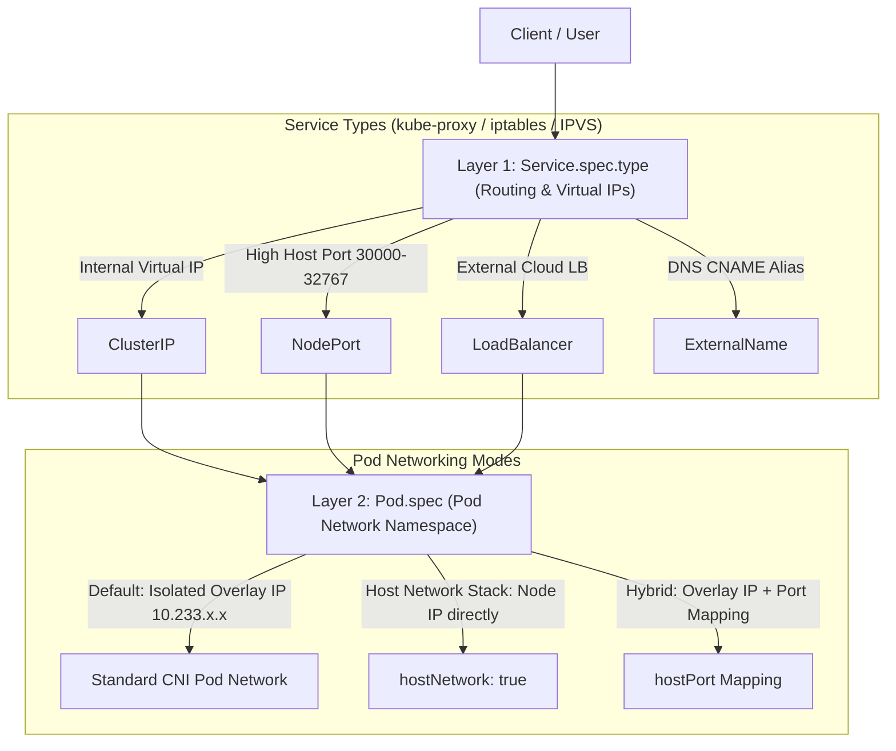
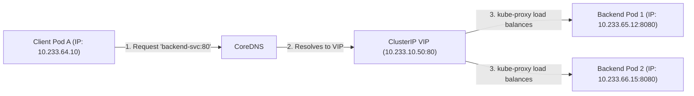
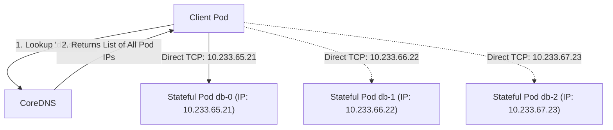
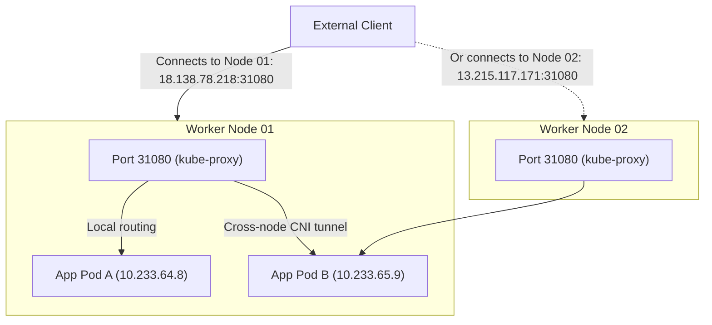
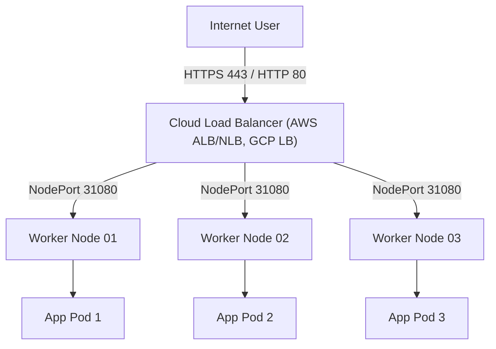
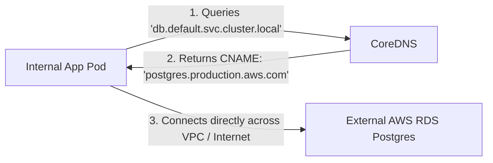
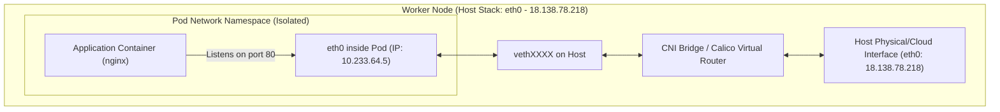
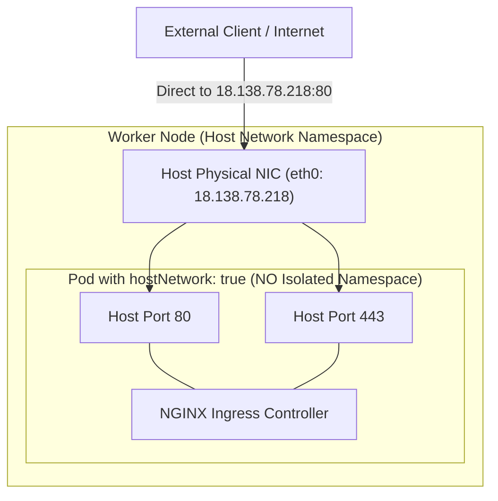
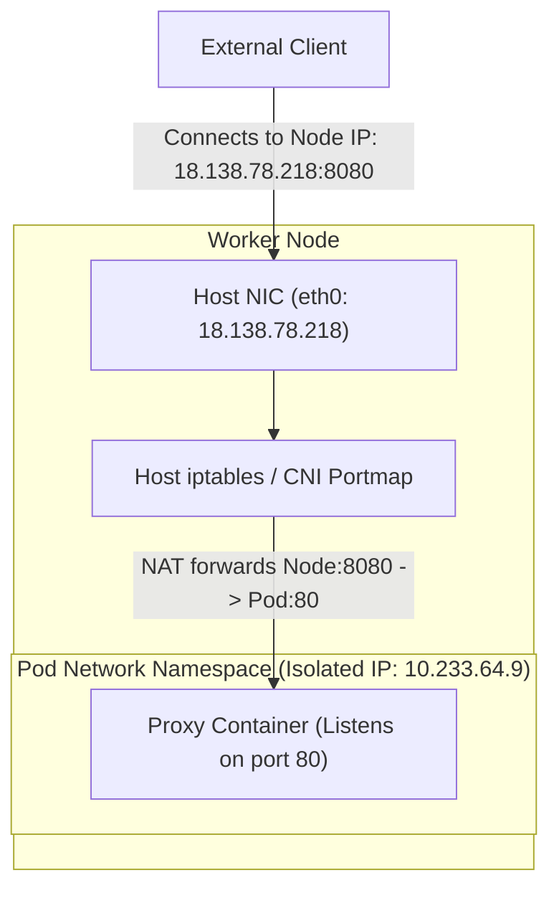

# Kubernetes Networking: `Pod.spec` Networking Modes vs. `Service.spec.type`

In Kubernetes, networking is divided into two distinct layers that are frequently confused:

1. **`Service.spec.type`**: Controls how traffic from inside or outside the cluster is routed and load-balanced to pods via `kube-proxy` and virtual IPs.
2. **`Pod.spec` Networking Modes**: Controls how an individual pod connects to the physical node's network stack (isolated CNI overlay vs. host interface).

---

## High-Level Architecture: Two-Layer Networking



---

# Part 1: Diagrams for Each `Service.spec.type`

---

### 1. `ClusterIP` (Standard Internal Virtual IP)

* **How it works:** A stable virtual IP (VIP) is allocated inside the cluster. `kube-proxy` programs `iptables` or IPVS on every node to load balance traffic across matching pod IPs. It is accessible **only within the cluster**.

#### Diagram: `ClusterIP` Traffic Flow



```yaml
apiVersion: v1
kind: Service
metadata:
  name: backend-service
spec:
  type: ClusterIP  # Default if omitted
  selector:
    app: backend
  ports:
    - protocol: TCP
      port: 80         # Port exposed by the Service
      targetPort: 8080 # Port where the app listens in the pod
```

---

### 2. Headless Service (`ClusterIP: None`)

* **How it works:** When `clusterIP: None` is set, Kubernetes does **not** allocate a virtual IP. CoreDNS directly returns the A records of the matching individual Pod IPs. Used for StatefulSets (Kafka brokers, Cassandra nodes, Redis clusters) where clients must connect directly to a specific instance.

#### Diagram: Headless Service (`ClusterIP: None`)



```yaml
apiVersion: v1
kind: Service
metadata:
  name: db-headless
spec:
  clusterIP: None  # Headless!
  selector:
    app: database
  ports:
    - port: 5432
      targetPort: 5432
```

---

### 3. `NodePort`

* **How it works:** Kubernetes opens a high-range port (`30000–32767`) on **every node in the cluster**. Traffic sent to `<Any-Node-IP>:<NodePort>` is forwarded to the matching backend pods, even if the target pod resides on a different node.

#### Diagram: `NodePort` Traffic Flow



```yaml
apiVersion: v1
kind: Service
metadata:
  name: web-nodeport
spec:
  type: NodePort
  selector:
    app: web
  ports:
    - port: 80
      targetPort: 8080
      nodePort: 31080  # Optional (auto-assigned if omitted)
```

---

### 4. `LoadBalancer`

* **How it works:** Extends `NodePort` by instructing a cloud provider (AWS, GCP, Azure) or a bare-metal controller (MetalLB) to provision an external hardware/software load balancer that distributes traffic to the cluster's NodePorts.

#### Diagram: `LoadBalancer` Traffic Flow



```yaml
apiVersion: v1
kind: Service
metadata:
  name: public-service
spec:
  type: LoadBalancer
  selector:
    app: web
  ports:
    - port: 80
      targetPort: 8080
```

---

### 5. `ExternalName`

* **How it works:** Does not define selectors or endpoints. Instead, it instructs internal CoreDNS to return a `CNAME` pointing to an external domain outside the Kubernetes cluster (such as an AWS RDS database or third-party API).

#### Diagram: `ExternalName` Resolution



```yaml
apiVersion: v1
kind: Service
metadata:
  name: external-database
spec:
  type: ExternalName
  externalName: postgres.production.aws.com
```

---

# Part 2: Diagrams for Each `Pod.spec` Networking Mode

---

### 1. Standard CNI Pod Network (Default)

* **How it works:** The Container Network Interface (Calico, Flannel, Cilium) gives the pod its own **isolated network namespace** and a dedicated cluster-internal IP (`10.233.x.x`). The pod communicates with the host through a virtual ethernet (`veth`) pair.

#### Diagram: Standard CNI Isolation



```yaml
apiVersion: v1
kind: Pod
metadata:
  name: standard-app-pod
spec:
  containers:
    - name: nginx
      image: nginx
      ports:
        - containerPort: 80
```

---

### 2. `hostNetwork: true`

* **How it works:** The pod **completely bypasses network isolation** and attaches directly to the **host node's network stack**. Its IP is literally the host node's IP. Ports opened by the container (e.g., `80`, `443`) are opened directly on the host VM's `eth0` interface.
* **Important:** You must use `dnsPolicy: ClusterFirstWithHostNet` so the pod can still resolve Kubernetes internal service names via CoreDNS.

#### Diagram: `hostNetwork: true` Architecture



```yaml
apiVersion: v1
kind: Pod
metadata:
  name: host-ingress-pod
spec:
  hostNetwork: true
  dnsPolicy: ClusterFirstWithHostNet  # Enables internal CoreDNS resolution
  containers:
    - name: ingress-controller
      image: registry.k8s.io/ingress-nginx/controller:v1.13.3
      ports:
        - name: http
          containerPort: 80
        - name: https
          containerPort: 443
```

---

### 3. `hostPort` (Hybrid Mode)

* **How it works:** The pod retains its **isolated pod namespace and private overlay IP (`10.233.x.x`)**, but the CNI installs an `iptables` DNAT rule on the host node mapping a specific host port directly to the container port.

#### Diagram: `hostPort` Mapping



```yaml
apiVersion: v1
kind: Pod
metadata:
  name: edge-proxy-pod
spec:
  containers:
    - name: proxy
      image: envoyproxy/envoy
      ports:
        - containerPort: 80
          hostPort: 8080       # Accessible at <Node-IP>:8080
```

---

# Part 3: Comparison Matrix

| Feature | `ClusterIP` | `NodePort` | `LoadBalancer` | `hostNetwork: true` | `hostPort` |
| :--- | :--- | :--- | :--- | :--- | :--- |
| **Config Layer** | `Service.spec.type` | `Service.spec.type` | `Service.spec.type` | `Pod.spec` | `Pod.spec.containers[].ports[]` |
| **IP Address** | Virtual Cluster IP | Node IPs | Cloud LB Public IP | Node IP directly | Isolated Pod IP |
| **Port Range** | Any port | `30000–32767` | Any (80, 443, etc.) | Standard (80, 443, etc.) | Any host port |
| **Requires Cloud LB?** | No | No | **Yes** | **No** | **No** |
| **Client IP Preserved?** | No (SNAT) | Only with `local` policy | Yes (Proxy Protocol/L4) | **Yes (Direct)** | Only with specific CNIs |
| **Performance / Overhead** | `kube-proxy` NAT | Double hop / NAT | Cloud LB + NodePort | **Zero NAT overhead** | CNI `iptables` NAT |
| **Port Conflict Risk** | None | None | None | **High** (1 pod per node per port) | **High** (1 pod per node per port) |

---

# Part 4: Real-World Ingress in Kubespray

When you deploy NGINX Ingress via Kubespray:
1. **DaemonSet with `hostNetwork: true`**: Ingress pods run on every worker node and bind directly to ports `80` and `443` of the host VM. External DNS (like `nginx.seang.shop`) points directly to your worker public IPs without needing a cloud load balancer.
2. **`Service.spec.type: LoadBalancer`**: Kubespray also generates a service that automatically assigns NodePorts (`31080` / `32725`) as a fallback routing mechanism.
