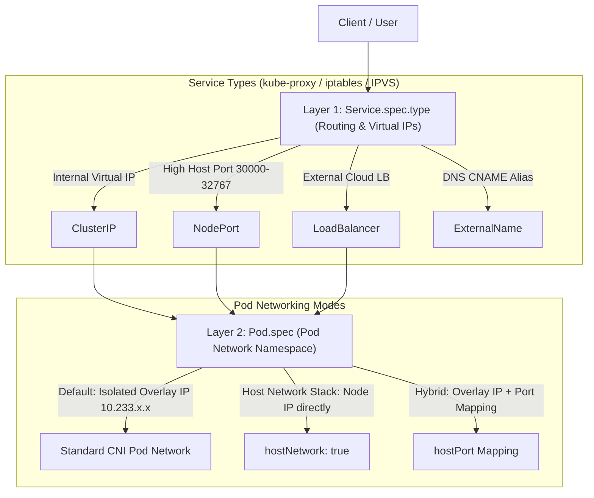
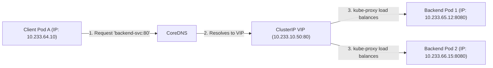
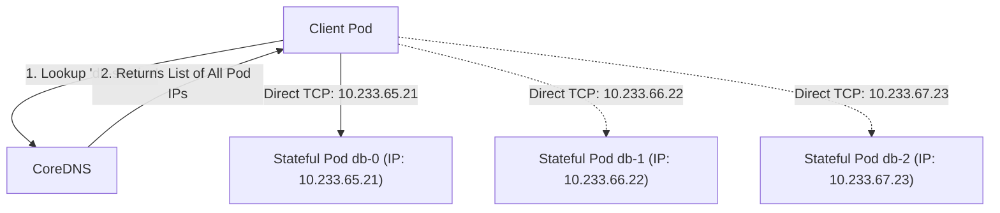
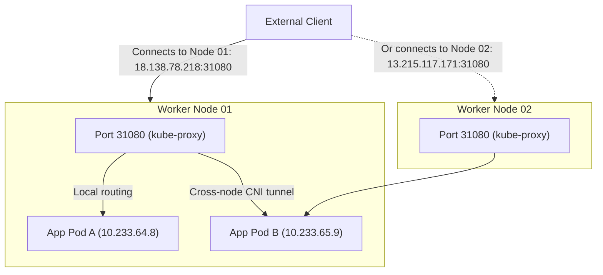
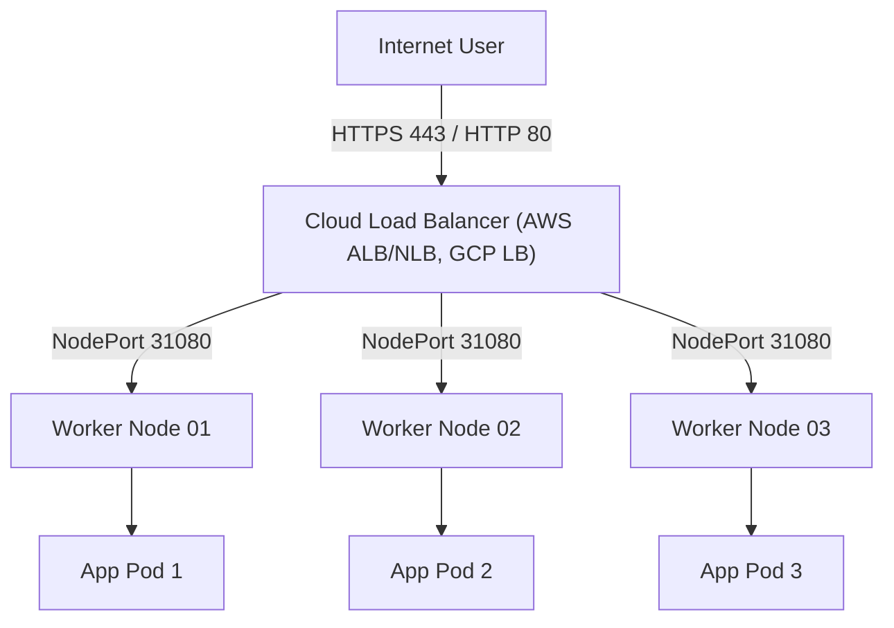
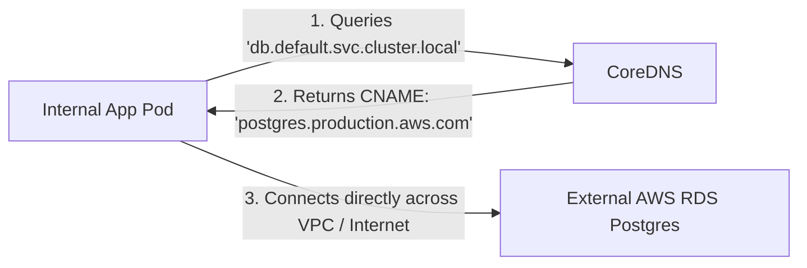
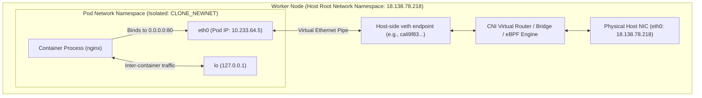
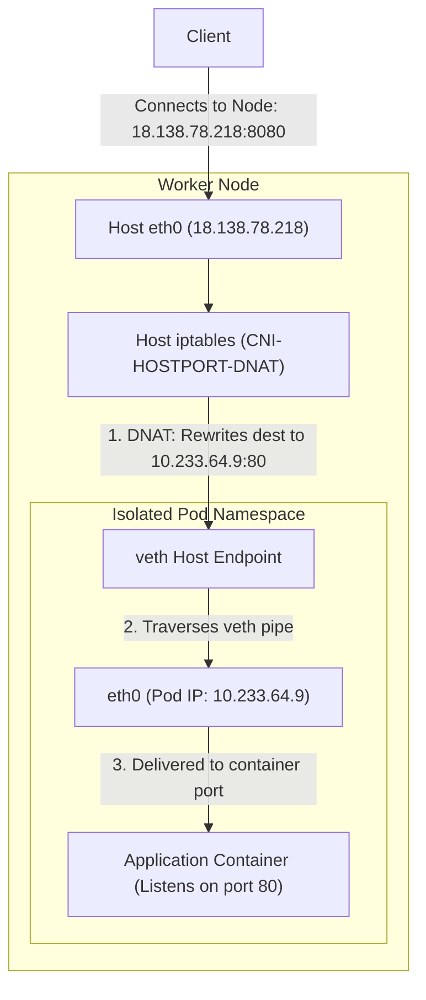

# Kubernetes Networking: `Pod.spec` Networking Modes vs. `Service.spec.type`

In Kubernetes, networking is divided into two distinct layers that are frequently confused:

1. **`Service.spec.type`**: Controls how traffic from inside or outside the cluster is routed and load-balanced to pods via `kube-proxy` and virtual IPs.
2. **`Pod.spec` Networking Modes**: Controls how an individual pod connects to the physical node's network stack (isolated CNI overlay vs. host interface).

---

## High-Level Architecture: Two-Layer Networking



---

# Part 1: Diagrams for Each `Service.spec.type`

---

### 1. `ClusterIP` (Standard Internal Virtual IP)

* **How it works:** A stable virtual IP (VIP) is allocated inside the cluster. `kube-proxy` programs `iptables` or IPVS on every node to load balance traffic across matching pod IPs. It is accessible **only within the cluster**.

#### Diagram: `ClusterIP` Traffic Flow



```yaml
apiVersion: v1
kind: Service
metadata:
  name: backend-service
spec:
  type: ClusterIP  # Default if omitted
  selector:
    app: backend
  ports:
    - protocol: TCP
      port: 80         # Port exposed by the Service
      targetPort: 8080 # Port where the app listens in the pod
```

---

### 2. Headless Service (`ClusterIP: None`)

* **How it works:** When `clusterIP: None` is set, Kubernetes does **not** allocate a virtual IP. CoreDNS directly returns the A records of the matching individual Pod IPs. Used for StatefulSets (Kafka brokers, Cassandra nodes, Redis clusters) where clients must connect directly to a specific instance.

#### Diagram: Headless Service (`ClusterIP: None`)



```yaml
apiVersion: v1
kind: Service
metadata:
  name: db-headless
spec:
  clusterIP: None  # Headless!
  selector:
    app: database
  ports:
    - port: 5432
      targetPort: 5432
```

---

### 3. `NodePort`

* **How it works:** Kubernetes opens a high-range port (`30000–32767`) on **every node in the cluster**. Traffic sent to `<Any-Node-IP>:<NodePort>` is forwarded to the matching backend pods, even if the target pod resides on a different node.

#### Diagram: `NodePort` Traffic Flow



```yaml
apiVersion: v1
kind: Service
metadata:
  name: web-nodeport
spec:
  type: NodePort
  selector:
    app: web
  ports:
    - port: 80
      targetPort: 8080
      nodePort: 31080  # Optional (auto-assigned if omitted)
```

---

### 4. `LoadBalancer`

* **How it works:** Extends `NodePort` by instructing a cloud provider (AWS, GCP, Azure) or a bare-metal controller (MetalLB) to provision an external hardware/software load balancer that distributes traffic to the cluster's NodePorts.

#### Diagram: `LoadBalancer` Traffic Flow



```yaml
apiVersion: v1
kind: Service
metadata:
  name: public-service
spec:
  type: LoadBalancer
  selector:
    app: web
  ports:
    - port: 80
      targetPort: 8080
```

---

### 5. `ExternalName`

* **How it works:** Does not define selectors or endpoints. Instead, it instructs internal CoreDNS to return a `CNAME` pointing to an external domain outside the Kubernetes cluster (such as an AWS RDS database or third-party API).

#### Diagram: `ExternalName` Resolution



```yaml
apiVersion: v1
kind: Service
metadata:
  name: external-database
spec:
  type: ExternalName
  externalName: postgres.production.aws.com
```

---

# Part 2: Deep-Dive into `Pod.spec` Networking Modes

---

### 1. Standard CNI Pod Network (Default)

#### Deep-Dive Architecture & Linux Kernel Implementation
In standard Kubernetes networking, every Pod runs inside its own isolated **Linux Network Namespace** (`netns`).

1. **Namespace Isolation:** When the container runtime (`containerd` / `CRI-O`) creates a pod sandbox, it issues a Linux kernel `clone()` system call with the `CLONE_NEWNET` flag. This gives the pod its own private routing table, iptables rules, loopback (`lo`), and socket list.
2. **Virtual Ethernet (`veth`) Pair:** The CNI plugin (Calico, Cilium, Flannel) creates a pair of virtual ethernet interfaces that act as a virtual patch cable:
   * **Pod end:** Moved inside the pod's namespace, renamed to `eth0`, and assigned the private Pod IP (e.g., `10.233.64.5/32`).
   * **Host end:** Remains in the host's root namespace (e.g., named `cali4a8b...` or `vethXXXX`).
3. **Inter-Pod Routing:** Packets leave the pod's `eth0`, cross the `veth` pair to the host namespace, and are routed by the host's Linux kernel routing table or CNI overlay (VXLAN / IP-in-IP / BGP) directly to the target pod's IP.

#### Diagram: Standard CNI Deep Dive



#### Key Technical Characteristics
* **Port Binding Freedom:** Two completely different pods running on the **same physical node** can both listen on port `80`. Because each pod has its own distinct IP and isolated network stack, there is **zero port conflict**.
* **DNS Resolution:** Uses `dnsPolicy: ClusterFirst`. Kubelet injects `/etc/resolv.conf` pointing to the cluster CoreDNS IP (e.g. `10.233.0.3`).
* **Security:** High isolation. A compromised container cannot sniff packets traversing other interfaces on the host and cannot bind to or probe host-level sockets.

---

### 2. `hostNetwork: true` (Direct Host Stack Attachment)

#### Deep-Dive Architecture & Linux Kernel Implementation
Setting `hostNetwork: true` instructs the container runtime **not** to create a separate network namespace for the pod.

1. **Shared Network Namespace:** The container process runs in the host VM's **root network namespace** (`/proc/1/ns/net`).
2. **No `veth` Overhead:** The pod does not get a `veth` pair or a private Pod IP (`10.233.x.x`). Running `ip addr` inside the pod shows the host VM's real interfaces (`eth0`, `lo`, `docker0`) and host IP (`18.138.78.218`).
3. **Direct Socket Binding:** When the container listens on port `80` or `443`, it binds directly to the host VM's kernel socket table. Incoming packets from the physical network wire hit the container process immediately without crossing bridge interfaces, iptables NAT, or CNI overlay tunnels.

#### Diagram: `hostNetwork: true` Deep Dive

```mermaid
flowchart TD
    Internet["External Internet Client"] -->|TCP SYN: 18.138.78.218:80| HostNIC["Host Physical NIC (eth0: 18.138.78.218)"]

    subgraph HostVM["Worker Node (Host Root Network Namespace)"]
        HostNIC --> KernelStack["Linux Kernel Socket Layer (Root NetNS)"]

        subgraph Pod["Pod (hostNetwork: true)"]
            IngressApp["NGINX Ingress Process (PID 4512)"]
            KernelStack -->|Direct Kernel Socket (No veth, No NAT)| IngressApp
        end

        subgraph LocalHostServices["Other Host Services"]
            Kubelet["Kubelet (10250)"]
            SSHD["sshd (22)"]
            KernelStack --> SSHD
            KernelStack --> Kubelet
        end
    end
```

#### Key Technical Characteristics
* **Port Conflict Restriction:** Because the pod binds directly to the host network stack, **only one pod can bind to a specific port per node**. If you schedule two pods with `hostNetwork: true` on the same worker node that both listen on port `80`, the second pod will fail to start with `EADDRINUSE (Address already in use)`.
* **The DNS Trap (`dnsPolicy`):** By default, a host-network pod inherits the host's `/etc/resolv.conf` (e.g. cloud VPC DNS like `169.254.169.253` or public `8.8.8.8`). This means the pod **cannot resolve internal Kubernetes services** like `kubernetes.default.svc.cluster.local`.  
  👉 **Must Use:** `dnsPolicy: ClusterFirstWithHostNet` to force Kubelet to inject internal CoreDNS addresses into the pod.
* **Security Risks:**
  * **Network Sniffing:** The pod has access to all raw network interfaces on the host and can sniff traffic destined for other pods using `tcpdump`.
  * **Loopback Access:** The pod can talk to host-only services listening on `127.0.0.1` (e.g., local etcd, local kubelet API).
* **Ideal Use Cases:** Ingress Controllers (NGINX Ingress in Kubespray), CNI agents (`calico-node`), node monitoring (`prometheus-node-exporter`).

---

### 3. `hostPort` (Hybrid Port Forwarding)

#### Deep-Dive Architecture & Linux Kernel Implementation
`hostPort` is a hybrid approach combining the network namespace isolation of the standard CNI with the direct host port accessibility of `hostNetwork`.

1. **Retains Isolated Namespace:** The pod runs in its own private network namespace with an isolated Pod IP (`10.233.64.9`) and a `veth` pair.
2. **CNI Portmap / iptables DNAT:** When the pod starts, the CNI plugin (via the `portmap` CNI plugin) inserts a Destination NAT (`DNAT`) rule into the host's `iptables` NAT table:
   ```text
   iptables -t nat -A CNI-HOSTPORT-DNAT -p tcp --dport 8080 -j DNAT --to-destination 10.233.64.9:80
   ```
3. **Traffic Traversal:** An external client connects to `<Host-Node-IP>:8080`. The host kernel intercepts the packet, applies DNAT to rewrite the destination IP to the Pod IP (`10.233.64.9:80`), and sends the packet across the `veth` pair into the pod.

#### Diagram: `hostPort` Deep Dive



#### Key Technical Characteristics
* **Kubernetes Scheduler Awareness:** Unlike `hostNetwork` (where scheduler unawareness can cause crashes if two pods land on the same node), the Kubernetes scheduler **actively tracks `hostPort` reservations**. If a worker node already has a pod utilizing `hostPort: 8080`, the scheduler will refuse to place another pod requesting `hostPort: 8080` on that same node.
* **Standard DNS Support:** Because the pod remains in its own isolated network namespace, normal `dnsPolicy: ClusterFirst` works out-of-the-box.
* **Overhead:** Incurs slight `iptables` connection-tracking (`conntrack`) and NAT overhead compared to `hostNetwork: true`.
* **Ideal Use Cases:** Standalone edge collectors, logging proxies, or specialized services requiring a fixed host port without granting full host network privileges.

---

# Part 3: Comparison Matrix

| Feature | `ClusterIP` | `NodePort` | `LoadBalancer` | `hostNetwork: true` | `hostPort` |
| :--- | :--- | :--- | :--- | :--- | :--- |
| **Config Layer** | `Service.spec.type` | `Service.spec.type` | `Service.spec.type` | `Pod.spec` | `Pod.spec.containers[].ports[]` |
| **IP Address** | Virtual Cluster IP | Node IPs | Cloud LB Public IP | Node IP directly | Isolated Pod IP |
| **Port Range** | Any port | `30000–32767` | Any (80, 443, etc.) | Standard (80, 443, etc.) | Any host port |
| **Requires Cloud LB?** | No | No | **Yes** | **No** | **No** |
| **Client IP Preserved?** | No (SNAT) | Only with `local` policy | Yes (Proxy Protocol/L4) | **Yes (Direct)** | Only with specific CNIs |
| **Performance / Overhead** | `kube-proxy` NAT | Double hop / NAT | Cloud LB + NodePort | **Zero NAT overhead** | CNI `iptables` NAT |
| **Port Conflict Risk** | None | None | None | **High** (1 pod per node per port) | **High** (1 pod per node per port) |

---

# Part 4: Real-World Ingress in Kubespray

When you deploy NGINX Ingress via Kubespray:
1. **DaemonSet with `hostNetwork: true`**: Ingress pods run on every worker node and bind directly to ports `80` and `443` of the host VM. External DNS (like `nginx.seang.shop`) points directly to your worker public IPs without needing a cloud load balancer.
2. **`Service.spec.type: LoadBalancer`**: Kubespray also generates a service that automatically assigns NodePorts (`31080` / `32725`) as a fallback routing mechanism.
