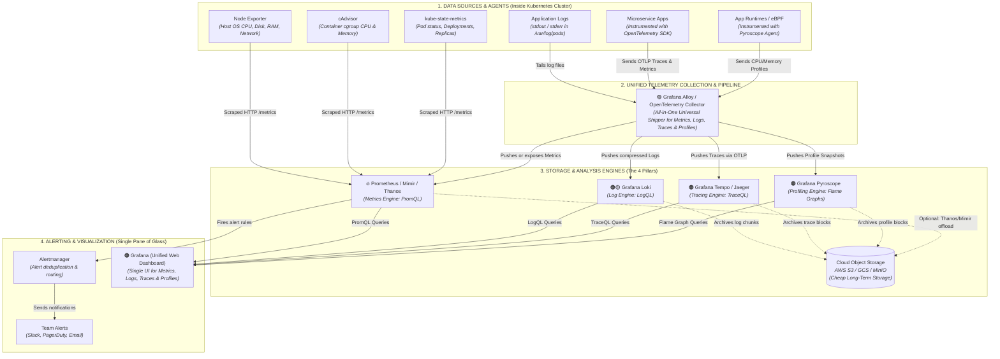
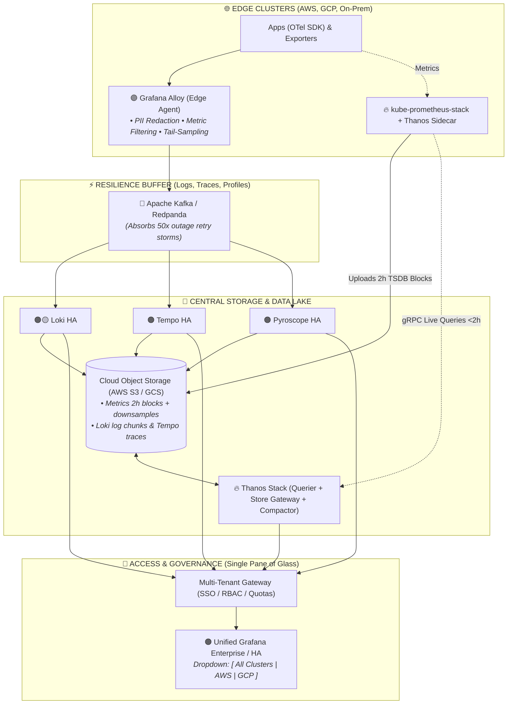

# 📊 Kubernetes Observability & Monitoring Ansible Project (`observ-monitory`)

This Ansible project automates the deployment, verification, and teardown of the complete cloud-native observability stack for Kubernetes, covering **Metrics**, **Logs**, and **Distributed Traces**.

For complete architecture diagrams and deep-dive explanations, see the [Observability Architecture Guide](./observability-architecture-guide.md).

---

## 🗺️ Master Observability Architecture



### 🧠 Unified Mental Model: How All 4 Pillars Connect

```text
                               ┌──────────────────────────────────────────────┐
                               │             🟠 GRAFANA (WEB UI)              │
                               │   "The Single Pane of Glass to see it all"   │
                               └──────┬──────────┬──────────┬──────────┬──────┘
                                      │          │          │          │
   ┌──────────────────────────────────┴──┐ ┌─────┴─────┐ ┌──┴───────┐ ┌┴─────────────────┐
   │        🔥 PROMETHEUS / MIMIR        │ │ 🟠🟡 LOKI │ │ 🟠 TEMPO │ │  🟠 PYROSCOPE    │
   │               METRICS               │ │   LOGS    │ │  TRACES  │ │     PROFILES     │
   │        "Is the server slow?"        │ │ "Any error│ │ "Which ms│ │ "Which exact line│
   │                                     │ │ message?" │ │ is slow?"│ │  of code burned  │
   │                                     │ │           │ │          │ │    the CPU?"     │
   └──────────────────▲──────────────────┘ └───▲───────┘ └───▲──────┘ └────────▲─────────┘
                      │                        │             │                 │
                      └────────────────────────┼─────────────┴─────────────────┘
                                               │
                                 ┌─────────────┴─────────────┐
                                 │     🟣 GRAFANA ALLOY      │
                                 │ "The All-in-One Collector"│
                                 └─────────────▲─────────────┘
                                               │
                                     [ YOUR APPLICATIONS ]
```

---

### 🏢 Enterprise / Big Project Scale Architecture

For high-scale multi-cluster environments, this architecture scales out into a distributed platform with streaming buffers and object storage:



> [!NOTE]
> **Why are the labels different between the Cluster and Enterprise diagrams? (The Camera Metaphor)**  
> The workloads are **100% identical under the hood**.
> - **In the Single-Cluster Diagram:** We zoom in (10x) to show every individual piece (`Microservice Apps (OTel SDK)`, `Node Exporter`, `cAdvisor`, `kube-state-metrics`, `Pyroscope`).
> - **In the Enterprise Diagram:** We zoom out (1x) across 50 clusters, summarizing those same 6 pieces into **`Microservices & Daemons`**, and labeling Grafana Alloy as **`🟣 Grafana Alloy (Edge Agent)`** to emphasize its role scrubbing PII and tail-sampling traces at the edge.

> 📖 **Deep Dive:** For the complete scaling blueprint, tail-sampling configuration, and distributed Helm values, see [Section 10: Enterprise Scaling Blueprint](./observability-architecture-guide.md#10-enterprise-scaling-blueprint-adapting-for-big-project-production-scale).

---

## 📁 Project Structure

```text
observ-monitory/
├── ansible.cfg                          # Ansible configuration with SSH keepalives
├── inventory.ini                        # Hybrid K8s Cluster Inventory (GCP + AWS)
├── site.yml                             # Master deploy playbook (Runs all roles + verify)
├── verify.yml                           # Automated health verification playbook
├── uninstall.yml                        # Teardown playbook wiping monitoring & freeing resources
├── group_vars/
│   └── all.yml                          # Global toggles, storage classes, credentials, domains
├── roles/
│   ├── prometheus_stack/                # Role 1: Metrics & Alerting Engine
│   ├── loki_stack/                      # Role 2: Log Aggregation Engine
│   ├── jaeger/                          # Role 3: Distributed Tracing Backend
│   ├── opentelemetry/                   # Role 4: Telemetry Pipeline Router
│   ├── grafana_dashboards/              # Role 5: Curated Visual Dashboards
│   ├── host_observability/              # Role 6: Non-K8s External Host Exporters (Alloy + Node Exporter)
│   └── ceph_observability/              # Role 7: External Ceph Cluster Exporter
└── observability-architecture-guide.md
```

---

## 📦 What Each Role Installs & When to Use It

### 1. `roles/prometheus_stack` (Inside Kubernetes)
* **What it installs:**
  * **Prometheus Operator**: Manages Prometheus and Alertmanager lifecycle via CRDs.
  * **Prometheus**: Time-series metrics database (`StatefulSet` with Longhorn PVC storage, port `9090`).
  * **Alertmanager**: Deduplicates and routes alerts to Slack/PagerDuty/Email (`StatefulSet`, port `9093`).
  * **Grafana**: Unified visualization dashboard UI (`Deployment`, port `3000`).
  * **Node Exporter**: DaemonSet pod running on **all 7 Kubernetes nodes** to collect host CPU, RAM, disk, and network stats (port `9100`).
  * **kube-state-metrics**: Deployment pod polling the Kubernetes API server for Pod, Deployment, and PVC health (port `8080`).
  * **cAdvisor integration**: Configures scraping of container cgroup metrics directly from `kubelet` on each node (port `10250`).
* **Deployment Method:** Helm chart `prometheus-community/kube-prometheus-stack`.
* **When to use:** Required for all Kubernetes metrics, hardware monitoring, and Grafana dashboards.

---

### 2. `roles/loki_stack` (Inside Kubernetes)
* **What it installs:**
  * **Loki**: Cloud-native log aggregation database (`StatefulSet` with Longhorn PVC storage, port `3100`).
  * **Promtail**: DaemonSet pod running on **all 7 Kubernetes nodes** tailing container stdout/stderr logs from `/var/log/pods/`.
  * **Grafana Datasource ConfigMap**: Auto-wires Loki as a data source into Grafana with label `grafana_datasource: "1"`.
* **Deployment Method:** Helm chart `grafana/loki-stack`.
* **When to use:** Required for centralized container and application log collection with LogQL search in Grafana.

---

### 3. `roles/jaeger` (Inside Kubernetes)
* **What it installs:**
  * **Jaeger All-in-One**: Distributed tracing backend and query engine (`Deployment`, image `jaegertracing/all-in-one:1.64.0`).
  * **Jaeger Service**: Exposes port `16686` (Web Query UI), port `4317` (OTLP gRPC), and port `4318` (OTLP HTTP).
  * **Grafana Datasource ConfigMap**: Auto-wires Jaeger as a tracing data source into Grafana with label `grafana_datasource: "1"`.
* **Deployment Method:** Kubernetes native `Deployment` and `Service` manifests.
* **When to use:** Required for distributed microservice tracing, latency waterfall views, and service dependency maps.

---

### 4. `roles/opentelemetry` (Inside Kubernetes)
* **What it installs:**
  * **OpenTelemetry Collector**: Universal telemetry proxy and pipeline (`Deployment`, image `otel/opentelemetry-collector-contrib:0.118.0`).
  * **Pipeline Configuration**: Receives application traces and metrics over OTLP (`4317` gRPC / `4318` HTTP). Batches and routes traces to Jaeger and exposes metrics on port `8889` for Prometheus.
  * **OTel Service**: Exposes `otel-collector` inside the cluster so applications can send telemetry to `http://otel-collector.monitoring.svc:4317`.
* **Deployment Method:** Kubernetes native `Deployment`, `ConfigMap`, and `Service` manifests.
* **When to use:** Required when microservices instrumented with OpenTelemetry SDK need a central collector to receive and route telemetry.

---

### 5. `roles/grafana_dashboards` (Inside Kubernetes)
* **What it installs:**
  * Curated, pre-built visual dashboards deployed as Kubernetes `ConfigMaps` with the label `grafana_dashboard: "1"`.
  * Grafana's dashboard sidecar automatically detects these ConfigMaps and imports them into Grafana:
    * **Loki Log Engine Dashboard**
    * **Ingress / Web Traffic Dashboard**
    * **Ceph Storage Cluster Dashboard** (if Ceph is enabled)
    * **NFS-Ganesha Storage Dashboard** (if Ganesha is enabled)
    * **MinIO S3 Storage Dashboard** (if MinIO is enabled)
* **Deployment Method:** Kubernetes `ConfigMap` resources.
* **When to use:** Provides instant out-of-the-box visualization without manual JSON dashboard imports.

---

### 6. `roles/host_observability` (OUTSIDE Kubernetes — Standalone VMs)
* **What it installs:**
  * **prometheus-node-exporter**: Installs Node Exporter via `apt` as a Linux background `systemd` service on port `9100`.
  * **Grafana Alloy**: Installs Alloy via `apt` as a Linux background `systemd` service to tail `/var/log/syslog` on the host VM and stream logs into Loki.
* **Deployment Method:** Linux APT package management and systemd service management.
* **When to use:** Only used for **external, bare-metal, or standalone servers OUTSIDE Kubernetes** (e.g. standalone database VMs, Ceph storage nodes) that cannot run Kubernetes pods. If all your servers are Kubernetes nodes, this role is not needed.

---

### 7. `roles/ceph_observability` (OUTSIDE Kubernetes — Ceph Storage)
* **What it installs:**
  * Enables the Ceph Manager Prometheus exporter module (`ceph mgr module enable prometheus`) on port `9283`.
* **Deployment Method:** Ceph administrative CLI commands.
* **When to use:** Only used if you run an external Ceph storage cluster and want Prometheus to scrape pool health, OSD status, and IOPS.

---

## ✅ The Complete Checklist: What Gets Installed

| Tool You Asked For | Installed By Which Role? | How It Runs in Kubernetes | Status |
| :--- | :--- | :--- | :---: |
| **1. Prometheus** | `prometheus_stack` | `StatefulSet` Pod + Longhorn Storage | ✅ **YES** |
| **2. Grafana** | `prometheus_stack` | `Deployment` Pod (Port 3000 Web UI) | ✅ **YES** |
| **3. Alertmanager** | `prometheus_stack` | `StatefulSet` Pod (Slack / Email alerts) | ✅ **YES** |
| **4. Node Exporter** | `prometheus_stack` | `DaemonSet` (Runs on **all 7 nodes**) | ✅ **YES** |
| **5. cAdvisor** | `prometheus_stack` | Scrapes **`kubelet` on all 7 nodes** | ✅ **YES** |
| **6. kube-state-metrics** | `prometheus_stack` | `Deployment` Pod (Cluster object stats) | ✅ **YES** |
| **7. Loki** | `loki_stack` | `StatefulSet` Pod + Longhorn Storage | ✅ **YES** |
| **8. Promtail** | `loki_stack` | `DaemonSet` (Tails logs on **all 7 nodes**) | ✅ **YES** |
| **9. Jaeger** | `jaeger` | `Deployment` Pod + Service (Tracing UI) | ✅ **YES** |
| **10. OpenTelemetry Collector** | `opentelemetry` | `Deployment` Pod (OTLP Ports 4317/4318) | ✅ **YES** |
| **11. Elasticsearch + Kibana** | Replaced by **Loki + Grafana** | Cloud-Native Log Engine in Grafana | 💡 **Optimized** |

---

### Why Loki + Grafana Instead of Elasticsearch + Kibana?

* **Resource Footprint:** Elasticsearch + Kibana requires **8GB to 16GB+ of RAM** just to idle. Because your worker nodes are lightweight cloud instances (`t3.small`), running Elasticsearch would cause immediate **Out-Of-Memory (OOM) crashes**.
* **Efficiency:** Loki + Grafana gives you the exact same log aggregation, search, and dashboard capabilities using **less than 1GB of RAM**.
* **Unified UI:** All logs collected by Promtail go directly into Loki, and you search them inside **Grafana** right next to your Prometheus metrics and Jaeger traces (single pane of glass)!

---

## 🚀 Execution Instructions

### 1. Deploy the Complete Monitoring Stack
Deploys Prometheus, Alertmanager, Grafana, Node Exporter, kube-state-metrics, Loki, Promtail, Jaeger, and OpenTelemetry Collector:
```bash
cd ~/kubernete-aws-gcp/observ-monitory
ansible-playbook -i inventory.ini site.yml
```

### 2. Verify System Health & Pod Status
Checks that all 10 observability components, DaemonSets on all 7 nodes, and datasources are running:
```bash
cd ~/kubernete-aws-gcp/observ-monitory
ansible-playbook -i inventory.ini verify.yml
```

### 3. Uninstall & Clean Up Cluster
Uninstalls all Helm releases, deletes the `monitoring` namespace, and frees up all CPU, RAM, and storage:
```bash
cd ~/kubernete-aws-gcp/observ-monitory
ansible-playbook -i inventory.ini uninstall.yml
```
