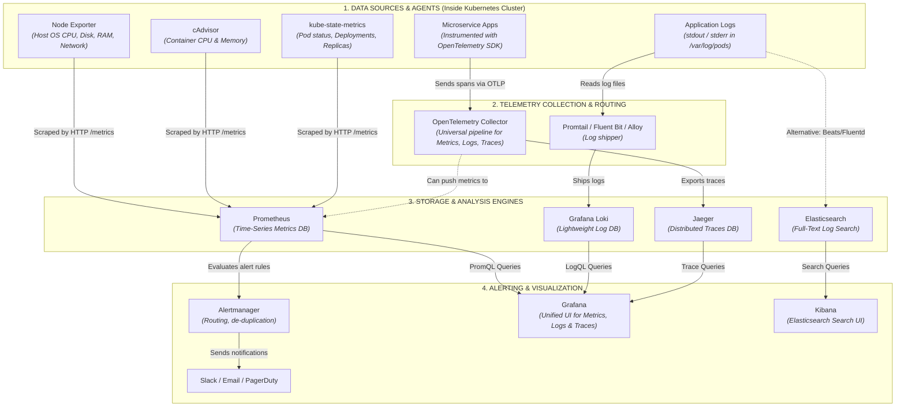

# 🔭 Kubernetes Observability & Monitoring Architecture Guide

This guide documents the end-to-end observability and monitoring stack for Kubernetes, covering the **Three Pillars of Observability**:
1. **Metrics** *(Numbers over time: "How much CPU? How many requests?")*
2. **Logs** *(Text events: "Why did it fail? What error message was printed?")*
3. **Traces** *(Request journeys: "Where is the bottleneck across microservices?")*

---

## 1. High-Level Architecture Diagram

---

## 2. The Three Pipelines in Detail

### Pipeline A: Metrics (Prometheus + Exporters)
* **Objective:** Answer *"Is the infrastructure healthy, and are resources running out?"*
* **Workflow:**
  1. **Node Exporter** runs as a `DaemonSet` on every cluster node, reading raw Linux kernel metrics (`/proc`, `/sys`) on port `9100`.
  2. **cAdvisor** runs built into the `kubelet` process on each node, tracking container cgroup resource consumption on port `10250`.
  3. **kube-state-metrics** listens to the Kubernetes API server, converting high-level Kubernetes objects (Pods, Deployments, StatefulSets, Nodes) into numerical metrics on port `8080`.
  4. **Prometheus** periodically scrapes these targets via HTTP every 15–30 seconds, storing them in its local time-series database (TSDB).
  5. If an alert condition evaluates to true (e.g., node disk space > 85%), Prometheus triggers an alert to **Alertmanager**.
  6. **Alertmanager** deduplicates, groups, and routes the alert to channels like **Slack**, **PagerDuty**, or **Email**.
  7. Engineers inspect metrics dashboards and graphs in **Grafana** using PromQL.

---

### Pipeline B: Logs (Loki vs. Elasticsearch)
* **Objective:** Answer *"Why did an application crash? What error trace was output?"*
* **Workflow:**
  1. Containerized applications write log events to standard output (`stdout`) and standard error (`stderr`).
  2. The container runtime (e.g., `containerd`) writes these streams to host files under `/var/log/pods/`.
  3. A log agent (**Promtail**, **Grafana Alloy**, or **Fluent Bit**) tails these log files, appends Kubernetes metadata (namespace, pod name, container name), and streams them out.
  4. **Storage Options:**
     * **Grafana Loki (Cloud-Native / LGTM Stack):** Indexes only the metadata labels rather than full text. This keeps storage lightweight, fast, and cost-effective. Logs are queried via **LogQL** inside **Grafana**.
     * **Elasticsearch (ELK / EFK Stack):** Full-text indexes every word in the log stream using Lucene. Provides deep search capabilities at the expense of higher CPU/RAM usage. Searched and analyzed via **Kibana**.

---

### Pipeline C: Distributed Traces (OpenTelemetry + Jaeger)
* **Objective:** Answer *"A user clicked submit and it took 4 seconds. Which microservice or database query caused the delay?"*
* **Workflow:**
  1. Microservice code is instrumented with the **OpenTelemetry (OTel) SDK**.
  2. As incoming HTTP/gRPC requests travel across services (`Frontend` ➔ `Auth` ➔ `Order API` ➔ `Database`), a unique `TraceID` and child `SpanID` headers are injected and propagated.
  3. The microservices send spans via OTLP (OpenTelemetry Protocol, gRPC port `4317` / HTTP port `4318`) to the **OpenTelemetry Collector**.
  4. The Collector batches, filters, and forwards the trace data to **Jaeger**.
  5. Engineers view the trace waterfall diagram in **Grafana** or the Jaeger UI to see exact millisecond latencies for each downstream hop.

---

## 3. Comprehensive Tool Matrix

| Tool | Category | Primary Focus | Default Port | What You Monitor |
| :--- | :--- | :--- | :--- | :--- |
| **Node Exporter** | Host Agent | Host OS Metrics | `9100` | CPU utilization, RAM usage, disk I/O, network bandwidth, filesystem health. |
| **cAdvisor** | Container Agent | Container Metrics | `10250` (via kubelet) | Per-container CPU limit throttling, memory RSS/working set, container restarts. |
| **kube-state-metrics** | Cluster Agent | K8s Object State | `8080` | Pod statuses (CrashLoopBackOff, Pending), Deployment replica counts, PVC binding. |
| **OpenTelemetry** | Framework & Pipeline | Telemetry Collection | `4317` (gRPC), `4318` (HTTP) | Universal collector and router for metrics, logs, and distributed traces. |
| **Prometheus** | Time-Series DB | Metrics Storage & Alert Rules | `9090` | Evaluates PromQL queries, stores time-series metrics, evaluates alert triggers. |
| **Alertmanager** | Alert Engine | Alert Routing & Silencing | `9093` | Deduplicates alerts, manages silence windows, notifies Slack/Teams/PagerDuty/Email. |
| **Loki** | Log Storage | Lightweight Log Storage | `3100` | Application stdout/stderr logs indexed by Kubernetes labels. |
| **Elasticsearch** | Search / Log DB | Full-Text Log Analytics | `9200` | Deep indexing, complex search aggregations, structured application log queries. |
| **Jaeger** | Trace Storage | Distributed Traces | `16686` (UI), `4317` (OTLP) | Microservice call trees, request latency waterfalls, service dependency graphs. |
| **Grafana** | Unified Dashboard | Visualization UI | `3000` | Single pane of glass dashboard combining Prometheus, Loki, and Jaeger. |
| **Kibana** | Analytics UI | Elasticsearch Dashboard | `5601` | Dedicated search UI and visualization interface for Elasticsearch clusters. |

---

## 4. How the Two Primary Stacks Compare

### 1. The Modern Cloud-Native Stack (LGTM Stack)
* **Components:** **L**oki (Logs), **G**rafana (UI), **T**empo / Jaeger (Traces), **M**IMIR / Prometheus (Metrics).
* **Advantages:**
  * Consistent label model: A single label set (e.g., `namespace=dev, pod=order-api-xxx`) links metrics directly to logs and traces inside Grafana.
  * Low resource footprint (especially Loki vs. Elasticsearch).
  * Industry standard for Kubernetes.

### 2. The Classic ELK / EFK Stack
* **Components:** **E**lasticsearch, **L**ogstash / Fluentd, **K**ibana.
* **Advantages:**
  * Rich, full-text free-form search capabilities.
  * Mature enterprise security, machine learning anomaly detection, and SIEM features.
  * Higher storage and memory requirements due to inverted indices.
