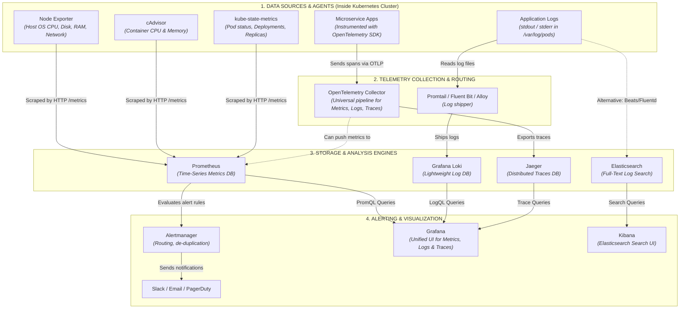
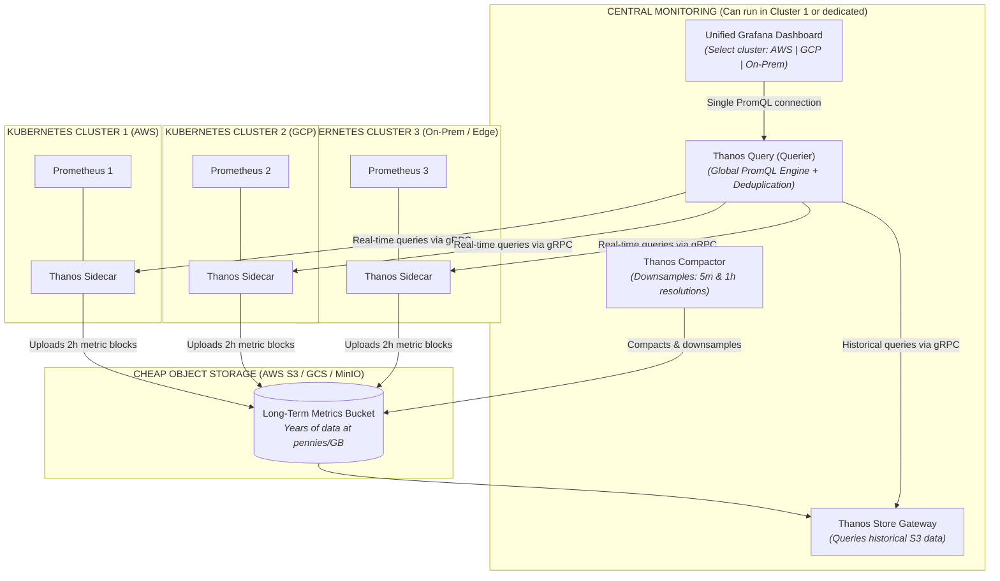

# 🔭 Kubernetes Observability & Monitoring Architecture Guide

This guide documents the end-to-end observability and monitoring stack for Kubernetes, covering the **Three Pillars of Observability**:
1. **Metrics** *(Numbers over time: "How much CPU? How many requests?")*
2. **Logs** *(Text events: "Why did it fail? What error message was printed?")*
3. **Traces** *(Request journeys: "Where is the bottleneck across microservices?")*

---

## 1. High-Level Architecture Diagram



---

## 2. The Three Pipelines in Detail

### Pipeline A: Metrics (Prometheus + Exporters)
* **Objective:** Answer *"Is the infrastructure healthy, and are resources running out?"*
* **Workflow:**
  1. **Node Exporter** runs as a `DaemonSet` on every cluster node, reading raw Linux kernel metrics (`/proc`, `/sys`) on port `9100`.
  2. **cAdvisor** runs built into the `kubelet` process on each node, tracking container cgroup resource consumption on port `10250`.
  3. **kube-state-metrics** listens to the Kubernetes API server, converting high-level Kubernetes objects (Pods, Deployments, StatefulSets, Nodes) into numerical metrics on port `8080`.
  4. **Prometheus** periodically scrapes these targets via HTTP every 15–30 seconds, storing them in its local time-series database (TSDB).
  5. If an alert condition evaluates to true (e.g., node disk space > 85%), Prometheus triggers an alert to **Alertmanager**.
  6. **Alertmanager** deduplicates, groups, and routes the alert to channels like **Slack**, **PagerDuty**, or **Email**.
  7. Engineers inspect metrics dashboards and graphs in **Grafana** using PromQL.

---

### Pipeline B: Logs (Loki vs. Elasticsearch)
* **Objective:** Answer *"Why did an application crash? What error trace was output?"*
* **Workflow:**
  1. Containerized applications write log events to standard output (`stdout`) and standard error (`stderr`).
  2. The container runtime (e.g., `containerd`) writes these streams to host files under `/var/log/pods/`.
  3. A log agent (**Promtail**, **Grafana Alloy**, or **Fluent Bit**) tails these log files, appends Kubernetes metadata (namespace, pod name, container name), and streams them out.
  4. **Storage Options:**
     * **Grafana Loki (Cloud-Native / LGTM Stack):** Indexes only the metadata labels rather than full text. This keeps storage lightweight, fast, and cost-effective. Logs are queried via **LogQL** inside **Grafana**.
     * **Elasticsearch (ELK / EFK Stack):** Full-text indexes every word in the log stream using Lucene. Provides deep search capabilities at the expense of higher CPU/RAM usage. Searched and analyzed via **Kibana**.

---

### Pipeline C: Distributed Traces (OpenTelemetry + Jaeger)
* **Objective:** Answer *"A user clicked submit and it took 4 seconds. Which microservice or database query caused the delay?"*
* **Workflow:**
  1. Microservice code is instrumented with the **OpenTelemetry (OTel) SDK**.
  2. As incoming HTTP/gRPC requests travel across services (`Frontend` ➔ `Auth` ➔ `Order API` ➔ `Database`), a unique `TraceID` and child `SpanID` headers are injected and propagated.
  3. The microservices send spans via OTLP (OpenTelemetry Protocol, gRPC port `4317` / HTTP port `4318`) to the **OpenTelemetry Collector**.
  4. The Collector batches, filters, and forwards the trace data to **Jaeger**.
  5. Engineers view the trace waterfall diagram in **Grafana** or the Jaeger UI to see exact millisecond latencies for each downstream hop.

---

## 3. Comprehensive Tool Matrix

| Tool | Category | Primary Focus | Default Port | What You Monitor |
| :--- | :--- | :--- | :--- | :--- |
| **Node Exporter** | Host Agent | Host OS Metrics | `9100` | CPU utilization, RAM usage, disk I/O, network bandwidth, filesystem health. |
| **cAdvisor** | Container Agent | Container Metrics | `10250` (via kubelet) | Per-container CPU limit throttling, memory RSS/working set, container restarts. |
| **kube-state-metrics** | Cluster Agent | K8s Object State | `8080` | Pod statuses (CrashLoopBackOff, Pending), Deployment replica counts, PVC binding. |
| **OpenTelemetry** | Framework & Pipeline | Telemetry Collection | `4317` (gRPC), `4318` (HTTP) | Universal collector and router for metrics, logs, and distributed traces. |
| **Prometheus** | Time-Series DB | Metrics Storage & Alert Rules | `9090` | Evaluates PromQL queries, stores time-series metrics, evaluates alert triggers. |
| **Alertmanager** | Alert Engine | Alert Routing & Silencing | `9093` | Deduplicates alerts, manages silence windows, notifies Slack/Teams/PagerDuty/Email. |
| **Loki** | Log Storage | Lightweight Log Storage | `3100` | Application stdout/stderr logs indexed by Kubernetes labels. |
| **Elasticsearch** | Search / Log DB | Full-Text Log Analytics | `9200` | Deep indexing, complex search aggregations, structured application log queries. |
| **Jaeger** | Trace Storage | Distributed Traces | `16686` (UI), `4317` (OTLP) | Microservice call trees, request latency waterfalls, service dependency graphs. |
| **Grafana** | Unified Dashboard | Visualization UI | `3000` | Single pane of glass dashboard combining Prometheus, Loki, and Jaeger. |
| **Kibana** | Analytics UI | Elasticsearch Dashboard | `5601` | Dedicated search UI and visualization interface for Elasticsearch clusters. |

---

## 4. How the Two Primary Stacks Compare

### 1. The Modern Cloud-Native Stack (LGTM Stack)
* **Components:** **L**oki (Logs), **G**rafana (UI), **T**empo / Jaeger (Traces), **M**IMIR / Prometheus (Metrics).
* **Advantages:**
  * Consistent label model: A single label set (e.g., `namespace=dev, pod=order-api-xxx`) links metrics directly to logs and traces inside Grafana.
  * Low resource footprint (especially Loki vs. Elasticsearch).
  * Industry standard for Kubernetes.

### 2. The Classic ELK / EFK Stack
* **Components:** **E**lasticsearch, **L**ogstash / Fluentd, **K**ibana.
* **Advantages:**
  * Rich, full-text free-form search capabilities.
  * Mature enterprise security, machine learning anomaly detection, and SIEM features.
  * Higher storage and memory requirements due to inverted indices.

---

## 5. Where Everything Actually Lives in the Cluster

```text
┌─────────────────────────────────────────────────────────────────────────────────────────────────────────┐
│ YOUR KUBERNETES CLUSTER                                                                                │
│                                                                                                         │
│  ┌───────────────────────────────────────────────────────────────────────────────────────────────────┐  │
│  │ 🏢 APPLICATION NAMESPACES (e.g. "default", "production")                                          │  │
│  │   • Application Code (Microservices) ➔ Contains embedded OpenTelemetry SDK                        │  │
│  │   • Container stdout/stderr ➔ Writes logs to host disk (/var/log/pods/)                            │  │
│  └───────────────────────────────────────────────────────────────────────────────────────────────────┘  │
│                                                                                                         │
│  ┌───────────────────────────────────────────────────────────────────────────────────────────────────┐  │
│  │ 🛡️ "monitoring" NAMESPACE (Central Management Pods)                                              │  │
│  │   • Prometheus              ➔ StatefulSet Pod (stores metrics on PVC disk)                        │  │
│  │   • Alertmanager            ➔ StatefulSet Pod (handles alert rules & sends to Slack)              │  │
│  │   • Grafana                 ➔ Deployment Pod (Web UI on port 3000)                                │  │
│  │   • Loki                    ➔ StatefulSet Pod (stores logs on PVC/S3 disk)                        │  │
│  │   • Jaeger                  ➔ Deployment Pod (stores traces)                                      │  │
│  │   • kube-state-metrics      ➔ Deployment Pod (polls K8s API server)                               │  │
│  │   • OTel Collector          ➔ Deployment Pod (receives & routes telemetry)                        │  │
│  └───────────────────────────────────────────────────────────────────────────────────────────────────┘  │
│                                                                                                         │
│  ┌───────────────────────────────────────────────────────────────────────────────────────────────────┐  │
│  │ 🚚 RUNS ON EVERY SINGLE NODE (DaemonSets & Node Processes)                                        │  │
│  │   • Node Exporter           ➔ 1 Pod per Node (Mounts host /proc and /sys to read VM hardware)     │  │
│  │   • Promtail / Fluent Bit   ➔ 1 Pod per Node (Mounts host /var/log/pods to ship log files)       │  │
│  │   • cAdvisor                ➔ BUILT DIRECTLY INSIDE kubelet binary (Not even a pod!)              │  │
│  └───────────────────────────────────────────────────────────────────────────────────────────────────┘  │
└─────────────────────────────────────────────────────────────────────────────────────────────────────────┘
```

### Detailed Component Location Breakdown

| Component | Where It Actually Stays | Type of Workload | Why It Lives There |
| :--- | :--- | :--- | :--- |
| **cAdvisor** | **Inside `kubelet` binary** on each VM | System process | Compiled directly into Kubernetes `kubelet`. Monitors cgroups directly on the host. |
| **Node Exporter** | **Every VM Node** (GCP + AWS) | `DaemonSet` Pod | Must run on every node to read that specific machine's host CPU, RAM, disk, and network stats. |
| **Promtail / Fluent Bit** | **Every VM Node** (GCP + AWS) | `DaemonSet` Pod | Must run on every node to read `/var/log/pods/` from that node's physical disk. |
| **Microservice Apps** | **Application Namespace** (`default`, `prod`) | App Pods | The OpenTelemetry SDK is imported directly into app code (Go, Python, Java) to track requests. |
| **kube-state-metrics** | **`monitoring` Namespace** | `Deployment` (1-2 Pods) | Talks to the Kubernetes API server (`kube-apiserver`) to count pods, deployments, and replicas. |
| **OpenTelemetry Collector** | **`monitoring` Namespace** | `Deployment` Pod | Central gateway proxy that receives OTLP traces/metrics from apps and forwards them. |
| **Prometheus** | **`monitoring` Namespace** | `StatefulSet` Pod | The central metrics database. Needs a PersistentVolume (PVC) to store historical metric graphs. |
| **Alertmanager** | **`monitoring` Namespace** | `StatefulSet` Pod | Receives alert fires from Prometheus and notifies Slack / Email / PagerDuty. |
| **Loki** | **`monitoring` Namespace** | `StatefulSet` Pod | The central log database. Stores compressed logs on a PersistentVolume or MinIO/S3 bucket. |
| **Jaeger** | **`monitoring` Namespace** | `Deployment` Pod | The central distributed tracing database and query engine. |
| **Grafana** | **`monitoring` Namespace** | `Deployment` Pod | The web dashboard (port `3000`). Exposed to your browser via Ingress or NodePort. |
| **Elasticsearch + Kibana** | **`monitoring` Namespace** OR **Separate VM** | Heavy `StatefulSet` / External VMs | *Alternative to Loki/Grafana.* Placed on separate, heavy VMs due to high memory requirements. |

---

## 6. What About Multiple Clusters in the Future? Enter Thanos!

### The Multi-Cluster Problem with Standard Prometheus:
1. **No Global View:** If you have 3 clusters (e.g. `cluster-aws`, `cluster-gcp`, `cluster-onprem`), standard Prometheus in Cluster A cannot query metrics in Cluster B or C. You would need 3 separate Grafana dashboards!
2. **Short Data Retention:** Prometheus stores data on local SSD/PVC disks. Keeping 1 year of metrics would require terabytes of expensive block storage and slow Prometheus down.
3. **No Cross-Cluster Deduplication:** If you run two Prometheus replicas for High Availability (HA), you get duplicate metrics.

---

### How Thanos Solves It (Global View + Unlimited Object Storage)



---

### The 5 Core Thanos Components Explained

| Thanos Component | Where It Runs | What It Does |
| :--- | :--- | :--- |
| **Thanos Sidecar** | Alongside Prometheus in **EVERY cluster** | 1. Watches Prometheus local TSDB and uploads completed 2-hour blocks to Object Storage (S3/GCS/MinIO).<br>2. Implements the gRPC Store API so Thanos Querier can fetch live/recent metrics directly. |
| **Thanos Query (Querier)** | Central Monitoring / Cluster | The "Single Pane of Glass" query engine. Evaluates PromQL queries, talks to all Sidecars (for live data) and Store Gateways (for historical data), and **deduplicates metrics from HA Prometheus pairs**. |
| **Thanos Store Gateway** | Central Monitoring / Cluster | Serves historical queries by reading old TSDB metric blocks from Object Storage without downloading the entire bucket. |
| **Thanos Compactor** | Central Monitoring (Single replica) | Runs background jobs on the Object Storage bucket to merge blocks and **downsample raw metrics** into 5-minute and 1-hour intervals. This makes 1-year graphs load in seconds! |
| **Thanos Ruler** | Central Monitoring / Cluster | Evaluates alerting and recording rules across all clusters globally. If an alert spans multiple clusters, Thanos Ruler catches it and sends it to Alertmanager. |

---

### Why Thanos is the Industry Standard for Multi-Cluster:
1. **Seamless Migration:** You don't replace Prometheus. You just add the `Thanos Sidecar` to your existing `kube-prometheus-stack` Helm values:
   ```yaml
   prometheus:
     prometheusSpec:
       thanos:
         version: v0.34.0
         objectStorageConfig:
           key: thanos.yaml
           name: thanos-objstore-secret
   ```
2. **Infinite Retention at Low Cost:** Metric blocks go directly to S3 / GCS / MinIO. You can keep 3 years of metrics for pennies per month.
3. **Single Grafana View:** In Grafana, you add a single Prometheus Data Source pointing to `http://thanos-querier:9090`. In your dashboard dropdown, you get a cluster selector: `cluster="aws"`, `cluster="gcp"`, or `cluster="all"`.

---

## 7. Complete Deployment Checklist: What Gets Installed

All components from the requested architecture are deployed via modular Ansible roles in [`observ-monitory`](./README.md), with one intentional, smart optimization for Elasticsearch/Kibana:

### ✅ The Complete Checklist: What Gets Installed

| Tool You Asked For | Installed By Which Role? | How It Runs in Kubernetes | Status |
| :--- | :--- | :--- | :---: |
| **1. Prometheus** | `prometheus_stack` | `StatefulSet` Pod + Longhorn Storage | ✅ **YES** |
| **2. Grafana** | `prometheus_stack` | `Deployment` Pod (Port 3000 Web UI) | ✅ **YES** |
| **3. Alertmanager** | `prometheus_stack` | `StatefulSet` Pod (Slack / Email alerts) | ✅ **YES** |
| **4. Node Exporter** | `prometheus_stack` | `DaemonSet` (Runs on **all 7 nodes**) | ✅ **YES** |
| **5. cAdvisor** | `prometheus_stack` | Scrapes **`kubelet` on all 7 nodes** | ✅ **YES** |
| **6. kube-state-metrics** | `prometheus_stack` | `Deployment` Pod (Cluster object stats) | ✅ **YES** |
| **7. Loki** | `loki_stack` | `StatefulSet` Pod + Longhorn Storage | ✅ **YES** |
| **8. Promtail** | `loki_stack` | `DaemonSet` (Tails logs on **all 7 nodes**) | ✅ **YES** |
| **9. Jaeger** | `jaeger` | `Deployment` Pod + Service (Tracing UI) | ✅ **YES** |
| **10. OpenTelemetry Collector** | `opentelemetry` | `Deployment` Pod (OTLP Ports 4317/4318) | ✅ **YES** |
| **11. Elasticsearch + Kibana** | Replaced by **Loki + Grafana** | Cloud-Native Log Engine in Grafana | 💡 **Optimized** |

---

### Why Loki + Grafana Instead of Elasticsearch + Kibana?

* **Resource Footprint:** Elasticsearch + Kibana requires **8GB to 16GB+ of RAM** just to idle. Because your worker nodes are lightweight cloud instances (`t3.small`), running Elasticsearch would cause immediate **Out-Of-Memory (OOM) crashes**.
* **Efficiency:** Loki + Grafana gives you the exact same log aggregation, search, and dashboard capabilities using **less than 1GB of RAM**.
* **Unified UI:** All logs collected by Promtail go directly into Loki, and you search them inside **Grafana** right next to your Prometheus metrics and Jaeger traces (single pane of glass)!

---

### How to Run the Installation Right Now:

```bash
cd ~/kubernete-aws-gcp/observ-monitory
ansible-playbook -i inventory.ini site.yml
```

Once it completes, run the verification playbook to confirm all 10 components and DaemonSets are healthy:

```bash
ansible-playbook -i inventory.ini verify.yml
```

---

## 8. Role-by-Role Technical Specification: What Each Role Installs

This section details the exact binaries, containers, ports, and deployment mechanisms for every role in the [`observ-monitory`](./README.md) project:

### 1. `roles/prometheus_stack` (Inside Kubernetes)
* **Components Installed:**
  * **Prometheus Operator** (`Deployment`): Controller managing Prometheus and Alertmanager resources.
  * **Prometheus** (`StatefulSet`): Metrics database with Longhorn PVC storage (`15Gi`, 15-day retention), port `9090`.
  * **Alertmanager** (`StatefulSet`): Alert deduplication and routing engine, port `9093`.
  * **Grafana** (`Deployment`): Dashboard UI on port `3000`, with sidecars for automatic datasource and dashboard discovery.
  * **Node Exporter** (`DaemonSet`): Host OS hardware metrics collector on all 7 nodes, port `9100`.
  * **kube-state-metrics** (`Deployment`): Kubernetes object health translator, port `8080`.
  * **cAdvisor Scraping**: Scrapes container cgroup stats directly from node `kubelet` processes, port `10250`.
* **Deployment Mechanism:** Helm chart `prometheus-community/kube-prometheus-stack`.

### 2. `roles/loki_stack` (Inside Kubernetes)
* **Components Installed:**
  * **Loki** (`StatefulSet`): Cloud-native log database with Longhorn PVC storage (`15Gi`, 7-day retention), port `3100`.
  * **Promtail** (`DaemonSet`): Log shipper running on all 7 nodes tailing `/var/log/pods/`.
  * **Grafana Datasource ConfigMap**: Labeled `grafana_datasource: "1"` so Grafana auto-detects Loki.
* **Deployment Mechanism:** Helm chart `grafana/loki-stack`.

### 3. `roles/jaeger` (Inside Kubernetes)
* **Components Installed:**
  * **Jaeger All-in-One** (`Deployment`): In-memory distributed tracing storage and query backend (image `jaegertracing/all-in-one:1.64.0`).
  * **Jaeger Service**: Exposes port `16686` (Query UI), port `4317` (OTLP gRPC), and port `4318` (OTLP HTTP).
  * **Grafana Datasource ConfigMap**: Labeled `grafana_datasource: "1"` so Grafana auto-detects Jaeger.
* **Deployment Mechanism:** Kubernetes native `Deployment` and `Service` manifests.

### 4. `roles/opentelemetry` (Inside Kubernetes)
* **Components Installed:**
  * **OpenTelemetry Collector** (`Deployment`): Universal telemetry router (image `otel/opentelemetry-collector-contrib:0.118.0`).
  * **Collector Pipelines**:
    * **Traces**: Receives OTLP (`4317`/`4318`) ➔ batches ➔ exports to Jaeger (`jaeger.monitoring.svc:4317`).
    * **Metrics**: Receives OTLP (`4317`/`4318`) ➔ batches ➔ exposes on port `8889` for Prometheus scraping.
  * **OTel Service**: ClusterIP service exposing ports `4317`, `4318`, and `8889`.
* **Deployment Mechanism:** Kubernetes native `Deployment`, `ConfigMap`, and `Service` manifests.

### 5. `roles/grafana_dashboards` (Inside Kubernetes)
* **Components Installed:**
  * Curated dashboard ConfigMaps labeled `grafana_dashboard: "1"`:
    * **Loki Log Engine Dashboard**
    * **Ingress / Web Traffic Dashboard**
    * **Ceph Storage Cluster Dashboard**
    * **NFS-Ganesha Storage Dashboard**
    * **MinIO S3 Storage Dashboard**
* **Deployment Mechanism:** Kubernetes `ConfigMap` resources auto-loaded by Grafana sidecar.

### 6. `roles/host_observability` (OUTSIDE Kubernetes — Standalone VMs)
* **Components Installed:**
  * **Node Exporter**: Installed via `apt install prometheus-node-exporter` as a systemd service on port `9100`.
  * **Grafana Alloy**: Installed via `apt install alloy` as a systemd service on port `12345` to tail `/var/log/syslog`.
* **Deployment Mechanism:** Linux APT package management and systemd service control.
* **When to use:** Only for external bare-metal/VM servers outside Kubernetes.

### 7. `roles/ceph_observability` (OUTSIDE Kubernetes — Ceph Storage)
* **Components Installed:**
  * Enables Ceph Manager Prometheus exporter module on port `9283`.
* **Deployment Mechanism:** Ceph CLI command on Ceph manager nodes.
* **When to use:** Only for external Ceph storage clusters.

---

## 9. The Complete Grafana Labs Ecosystem & The 4 Pillars of Observability

Modern observability expands beyond the classic 3 pillars into **4 Pillars of Observability**:
1. **Metrics** *(Numbers over time)*
2. **Logs** *(Text event records)*
3. **Traces** *(Request path across microservices)*
4. **Profiles** *(Code-level CPU/memory function analysis)*

---

### 🗺️ The Big Picture: How the Full Suite Connects

```text
                               ┌──────────────────────────────────────────────┐
                               │             🟠 GRAFANA (WEB UI)              │
                               │   "The Single Pane of Glass to see it all"   │
                               └──────┬──────────┬──────────┬──────────┬──────┘
                                      │          │          │          │
   ┌──────────────────────────────────┴──┐ ┌─────┴─────┐ ┌──┴───────┐ ┌┴─────────────────┐
   │        🔥 PROMETHEUS / MIMIR        │ │ 🟠🟡 LOKI │ │ 🟠 TEMPO │ │  🟠 PYROSCOPE    │
   │               METRICS               │ │   LOGS    │ │  TRACES  │ │     PROFILES     │
   │        "Is the server slow?"        │ │ "Any error│ │ "Which ms│ │ "Which exact line│
   │                                     │ │ message?" │ │ is slow?"│ │  of code burned  │
   │                                     │ │           │ │          │ │    the CPU?"     │
   └──────────────────▲──────────────────┘ └───▲───────┘ └───▲──────┘ └────────▲─────────┘
                      │                        │             │                 │
                      └────────────────────────┼─────────────┴─────────────────┘
                                               │
                                 ┌─────────────┴─────────────┐
                                 │     🟣 GRAFANA ALLOY      │
                                 │ "The All-in-One Collector"│
                                 └─────────────▲─────────────┘
                                               │
                                     [ YOUR APPLICATIONS ]
```

---

### Deep-Dive: What Each Component is Used For

#### 1. 🟠 Grafana (Visualization & Dashboards)
* **What it is:** The central web dashboard (UI) where you view graphs, create visual dashboards, run search queries, and set up alert rules.
* **The Question it Answers:** *"Show me everything happening in my infrastructure in one place."*
* **Real-World Scenario:** You open your browser to `https://grafana.yourdomain.com`. On a single screen, you see a live graph of cluster CPU usage, a window streaming live error logs from your pods, and a latency chart of your API calls.

#### 2. 🔥 Prometheus (Real-Time Metrics)
* **What it is:** A time-series database that pulls numeric statistics (counters, gauges) from servers, containers, and databases every 15–30 seconds.
* **The Question it Answers:** *"Is something wrong? How high is CPU, RAM, or latency?"*
* **Real-World Scenario:** Your payment service suddenly gets 10,000 requests/second. Prometheus records that CPU hit 92% and HTTP 500 errors jumped from 0% to 15%. It triggers **Alertmanager**, which sends an alert to your Slack channel.

#### 3. 🟠🟡 Grafana Loki (Log Aggregation)
* **What it is:** A high-speed, lightweight database built specifically for text logs (like Prometheus, but for logs).
* **The Question it Answers:** *"What specific error was printed when the crash happened?"*
* **Real-World Scenario:** Prometheus alerted you that the payment service is failing. You click on the spike in Grafana, and **Loki** shows the exact log line:  
  `[ERROR] Connection refused: Database postgresql-prod:5432 is unreachable`.

#### 4. 🟠 Grafana Tempo (Distributed Tracing)
* **What it is:** A distributed tracing engine that tracks a single user's request as it jumps across multiple microservices.
* **The Question it Answers:** *"A user clicked 'Checkout' and it took 5 seconds. Which microservice caused the delay?"*
* **Real-World Scenario:** A checkout request took 5,200 ms. In **Tempo**, you see a visual waterfall breakdown:
  * `Frontend`: 10 ms
  * `Auth Service`: 50 ms
  * `Payment Gateway`: 120 ms
  * `Inventory Database Query`: **5,020 ms** ⚠️ *(Tempo pinpointed the exact database query that froze!).*

#### 5. 🟠 Grafana Pyroscope (Continuous Profiling)
* **What it is:** A code-level profiler that analyzes the CPU and memory consumption of your application functions line-by-line using visual **Flame Graphs**.
* **The Question it Answers:** *"Which exact function or line of code is consuming 95% CPU?"*
* **Real-World Scenario:** Your Go or Python API pod is burning 100% CPU. Prometheus says CPU is high, but doesn't know why. You open **Pyroscope**, look at the flame graph, and immediately see that function `generateInvoicePDF()` line 142 has an inefficient regular expression loop taking up 88% of all CPU cycles.

#### 6. 🔵🟠 Grafana Mimir (Massive Long-Term Metrics Storage)
* **What it is:** An enterprise-scale, multi-tenant storage backend for Prometheus metrics.
* **The Question it Answers:** *"How do I store 1 billion Prometheus metrics across 100 clusters for 3 years without running out of disk?"*
* **Real-World Scenario:** Standard Prometheus stores metrics on local SSDs, which become full after a few weeks. **Mimir** splits the work across microservices and offloads long-term data to cheap cloud Object Storage (AWS S3 / GCS).  
  *(⚠️ Note: Mimir requires at least 8GB–16GB+ RAM. For small/medium clusters, standard Prometheus or Thanos is far more lightweight!).*

#### 7. 🟣 Grafana Alloy (The All-In-One Telemetry Collector)
* **What it is:** Grafana's modern, open-source, OpenTelemetry-compatible **collector agent** (the successor to Promtail and Grafana Agent).
* **The Question it Answers:** *"Why install 4 different collection agents when 1 agent can collect everything?"*
* **Real-World Scenario:** Instead of running four separate agents:
  - Agent 1 for Prometheus metrics (Node Exporter)
  - Agent 2 for Loki logs (Promtail)
  - Agent 3 for Tempo traces (OTel Agent)
  - Agent 4 for Pyroscope profiles (Pyroscope Agent)

  You run **one single lightweight process: Grafana Alloy**. Alloy collects **Metrics + Logs + Traces + Profiles** and ships them to Prometheus, Loki, Tempo, and Pyroscope simultaneously!

---

### Summary Cheat Sheet: The Full Suite

| Tool | Pillar | What It Monitors | When Do You Use It? |
| :--- | :--- | :--- | :--- |
| 🟠 **Grafana** | **Dashboard** | Everything | Every day to view graphs, dashboards, and alerts. |
| 🔥 **Prometheus** | **Metrics** | Numbers (CPU, RAM, Requests/sec) | To know **IF** the system is healthy or running out of resources. |
| 🟠🟡 **Grafana Loki** | **Logs** | Text (stdout, syslog, exceptions) | To find **WHAT** error message was thrown during an incident. |
| 🟠 **Grafana Tempo** | **Traces** | Request Spans across Microservices | To find **WHERE** a bottleneck or slow service is located. |
| 🟠 **Pyroscope** | **Profiles** | Function CPU/Memory Flame Graphs | To find **WHICH LINE OF CODE** is wasting CPU or leaking memory. |
| 🔵🟠 **Grafana Mimir** | **Metrics DB** | Millions of Prometheus Time Series | When you have 50+ clusters and need to store years of metrics in S3. |
| 🟣 **Grafana Alloy** | **Collector** | Gathers Metrics, Logs, Traces, Profiles | The unified shipping agent that runs on servers to gather all data. |
