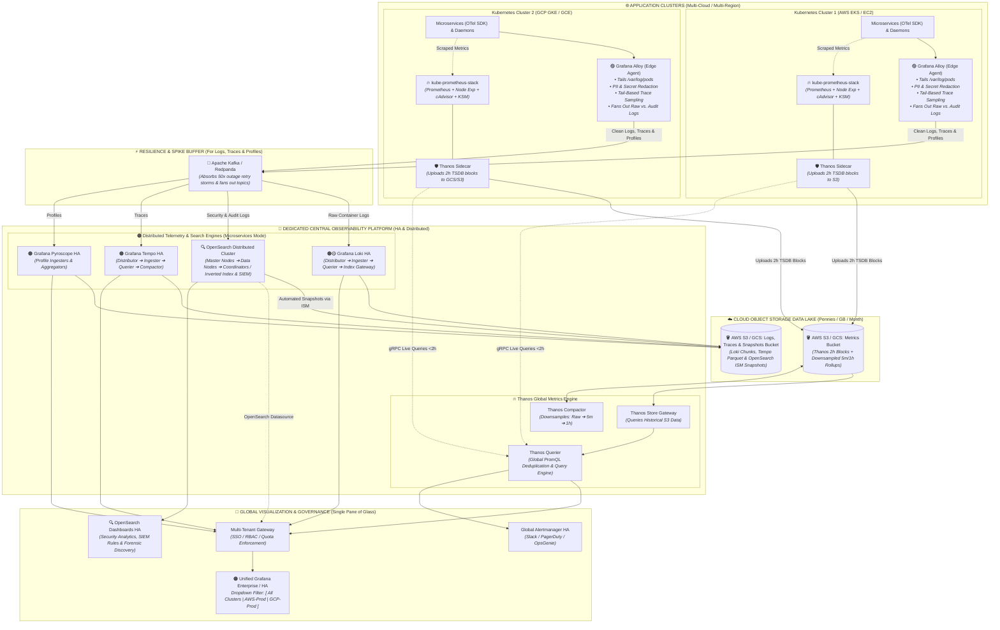
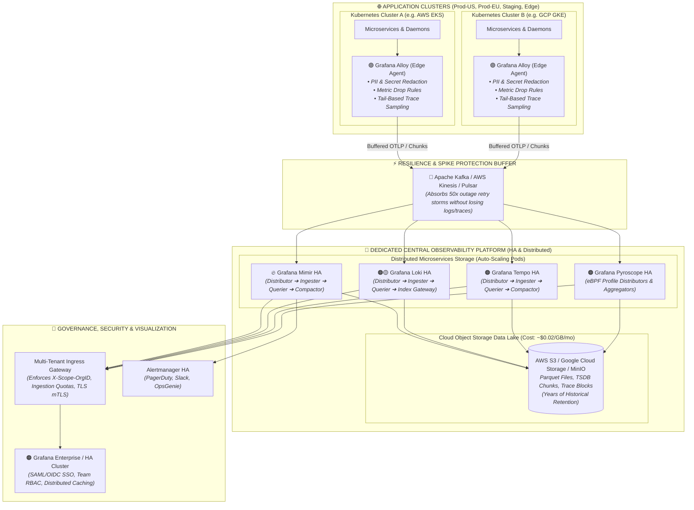
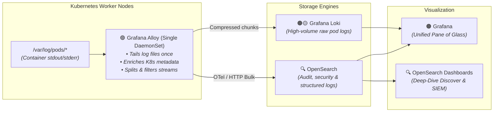
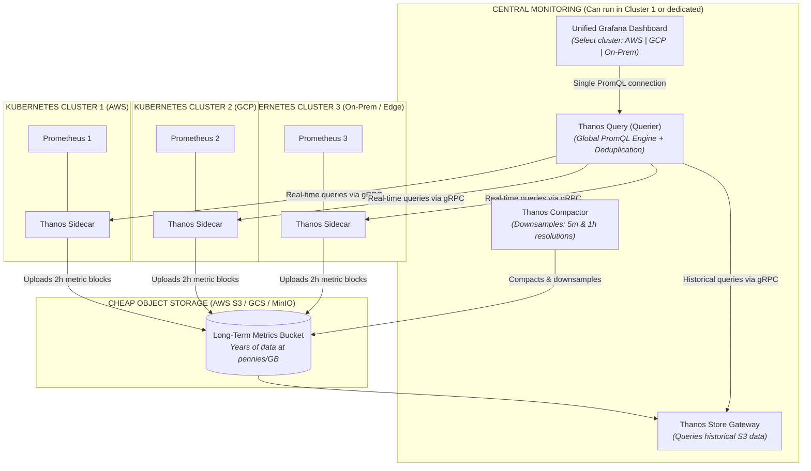
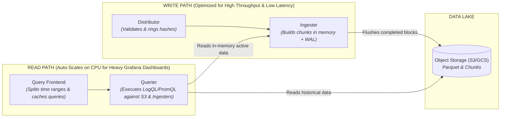
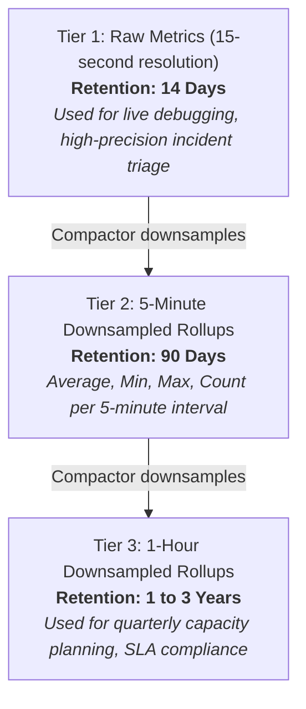

# 🔭 Kubernetes Observability & Monitoring Architecture Guide

This guide documents the end-to-end observability and monitoring stack for Kubernetes, covering the **Three Pillars of Observability**:
1. **Metrics** *(Numbers over time: "How much CPU? How many requests?")*
2. **Logs** *(Text events: "Why did it fail? What error message was printed?")*
3. **Traces** *(Request journeys: "Where is the bottleneck across microservices?")*

---

## 1. High-Level Master Architecture Diagrams

### 1.1 Cluster-Level Master Architecture (Single & Hybrid Clusters)

This diagram shows how all 4 observability pillars (**Metrics, Logs, Traces, Profiles**) run inside a single or hybrid cluster (our current setup), using **Grafana Alloy** as the universal agent and **Grafana** as the single pane of glass:

```mermaid
flowchart TD
    subgraph Sources["1. DATA SOURCES & AGENTS (Inside Kubernetes Cluster)"]
        nodeExp["Node Exporter<br><i>(Host OS CPU, Disk, RAM, Network)</i>"]
        cadvisor["cAdvisor<br><i>(Container cgroup CPU & Memory)</i>"]
        ksm["kube-state-metrics<br><i>(Pod status, Deployments, Replicas)</i>"]
        appLogs["Application Logs<br><i>(stdout / stderr in /var/log/pods)</i>"]
        appOTel["Microservice Apps<br><i>(Instrumented with OpenTelemetry SDK)</i>"]
        appPyro["App Runtimes / eBPF<br><i>(Instrumented with Pyroscope Agent)</i>"]
    end

    subgraph Pipeline["2. UNIFIED TELEMETRY COLLECTION & PIPELINE"]
        alloy["🟣 Grafana Alloy / OpenTelemetry Collector<br><i>(All-in-One Universal Shipper for Metrics, Logs, Traces & Profiles)</i>"]
    end

    subgraph Storage["3. STORAGE & ANALYSIS ENGINES (The 4 Pillars + Full-Text Search)"]
        prom["🔥 Prometheus / Mimir / Thanos<br><i>(Metrics Engine: PromQL)</i>"]
        loki["🟠🟡 Grafana Loki<br><i>(Log Engine: LogQL)</i>"]
        opensearch["🔍 OpenSearch<br><i>(Search & Log Engine: Lucene / DQL)</i>"]
        tempo["🟠 Grafana Tempo / Jaeger<br><i>(Tracing Engine: TraceQL)</i>"]
        pyro["🟠 Grafana Pyroscope<br><i>(Profiling Engine: Flame Graphs)</i>"]
        s3[("Cloud Object Storage<br><i>AWS S3 / GCS / MinIO / Longhorn<br>(Cheap Long-Term Storage)</i>")]
    end

    subgraph Actions["4. ALERTING & VISUALIZATION (Single Pane of Glass + Specialized SIEM)"]
        alertmgr["Alertmanager<br><i>(Alert deduplication & routing)</i>"]
        grafana["🟠 Grafana (Unified Web Dashboard)<br><i>(Single UI for Metrics, Logs, Traces & Profiles)</i>"]
        osDash["🔍 OpenSearch Dashboards<br><i>(Specialized Log Discovery, SIEM & Anomaly Detection)</i>"]
        notifications["Team Alerts<br><i>(Slack, PagerDuty, Email)</i>"]
    end

    %% Ingestion into Collection Pipeline
    nodeExp -->|Scraped HTTP /metrics| prom
    cadvisor -->|Scraped HTTP /metrics| prom
    ksm -->|Scraped HTTP /metrics| prom
    appLogs -->|Tails log files| alloy
    appOTel -->|Sends OTLP Traces & Metrics| alloy
    appPyro -->|Sends CPU/Memory Profiles| alloy

    %% Pipeline routing to Storage
    alloy -->|Pushes or exposes Metrics| prom
    alloy -->|Pushes compressed Pod Logs| loki
    alloy -->|Pushes Structured / Audit Logs| opensearch
    alloy -->|Pushes Traces via OTLP| tempo
    alloy -->|Pushes Profile Snapshots| pyro

    %% Long-term Object Storage offload
    loki -.->|Archives log chunks| s3
    opensearch -.->|Stores index shards on PV / S3| s3
    tempo -.->|Archives trace blocks| s3
    pyro -.->|Archives profile blocks| s3
    prom -.->|Optional: Thanos/Mimir offload| s3

    %% Alerting Flow
    prom -->|Fires alert rules| alertmgr
    alertmgr -->|Sends notifications| notifications

    %% Visualization Queries from Grafana & Dashboards
    prom -->|PromQL Queries| grafana
    loki -->|LogQL Queries| grafana
    opensearch -->|OpenSearch Datasource| grafana
    opensearch -->|DQL / Lucene Queries| osDash
    tempo -->|TraceQL Queries| grafana
    pyro -->|Flame Graph Queries| grafana
```



##### 🧠 Unified Mental Model: How All 4 Pillars Connect

```text
                                       ┌────────────────────────────────────────────────────────────────────────┐
                                       │                          🟠 GRAFANA (WEB UI)                           │
                                       │                "The Single Pane of Glass to see it all"                │
                                       └───────────┬─────────────┬─────────────┬─────────────┬────────────┬─────┘
                                                   │             │             │             │            │
    ┌───────────────────────────────┐ ┌────────────┴───┐ ┌───────┴──────────┐ ┌┴──────────┐ ┌┴───────────┴───┐
    │     🔥 PROMETHEUS / MIMIR     │ │  🟠🟡 LOKI     │ │  🔍 OPENSEARCH   │ │ 🟠 TEMPO │ │  🟠 PYROSCOPE     │
    │            METRICS            │ │    RAW LOGS    │ │ FULL-TEXT & SIEM │ │  TRACES  │ │     PROFILES      │
    │     "Is the server slow?"     │ │  "Any crash?"  │ │ "Who accessed?"  │ │"Which ms?│ │"Which code line?" │
    └───────────────▲───────────────┘ └────────▲───────┘ └───────▲──────────┘ └────▲─────┘ └─────────▲─────────┘
                    │                          │                 │                 │                 │
                    └──────────────────────────┼─────────────────┴─────────────────┼─────────────────┘
                                               │                                   │
                                 ┌─────────────┴───────────────────────────────────┴─┐
                                 │                 🟣 GRAFANA ALLOY                  │
                                 │   "The All-in-One Collector & Telemetry Router"   │
                                 └─────────────────────────▲─────────────────────────┘
                                                           │
                                                 [ YOUR APPLICATIONS ]
```

---

### 1.1.1 Architectural Layer Taxonomy: What Every Component is Formally Called

In enterprise cloud architecture and systems engineering, every component in Diagram 1.1 belongs to one of **4 Architectural Layers**, each with a precise, formal industry classification:

#### Layer 1: Data Sources & Exporters *(The Producers)*
*These run inside the cluster and generate or extract raw telemetry signals from the operating system, containers, and applications.*

| Component | Formal Architectural Classification | What It Is Called in Industry | Core Role |
| :--- | :--- | :--- | :--- |
| **Node Exporter** | **Host Metrics Exporter / Agent** | *Infrastructure Metric Exporter* | Extracts raw Linux kernel statistics (CPU, RAM, Disk I/O, Network interfaces) and exposes them over HTTP `/metrics`. |
| **cAdvisor** | **Container Resource Agent** | *Container Metric Collector* | Embedded inside the Kubernetes `kubelet`; measures container cgroup resource consumption and limits. |
| **kube-state-metrics (KSM)** | **Kubernetes State Exporter** | *Cluster Object Metrics Exporter* | Listens to the Kubernetes API server to generate metrics about Kubernetes resources (Pod health, Deployments, ReplicaSets, PVC status). |
| **Application Logs** | **Raw Telemetry Stream** | *Container Stdout / Stderr Stream* | Raw text and JSON events written by containers to the host filesystem at `/var/log/pods/`. |
| **Microservice Apps** | **Instrumented Application** | *Telemetry Producer (SDK-Instrumented)* | Your custom microservice code equipped with the OpenTelemetry SDK to emit HTTP/gRPC request spans and traces. |
| **App Runtimes / eBPF** | **Continuous Profiling Agent** | *Runtime / Kernel Profiler* | Hooks into application runtimes (JVM, Go, Python, Node.js) or the Linux kernel via eBPF to continuously sample call stacks. |

#### Layer 2: Unified Collection Pipeline *(The Shippers)*
*The single data pipe that collects, parses, transforms, filters, and routes data from producers to the storage engines.*

| Component | Formal Architectural Classification | What It Is Called in Industry | Core Role |
| :--- | :--- | :--- | :--- |
| **Grafana Alloy / OpenTelemetry Collector** | **Unified Telemetry Pipeline** | *Universal Telemetry Shipper & Router* | A single DaemonSet/agent that tails logs, scrapes metrics, receives traces, transforms data (redacting secrets, adding labels), and fans out streams to multiple backends simultaneously. |

#### Layer 3: Storage & Query Engines *(The Backends)*
*Specialized data engines that index, compress, persist, and execute distributed queries for specific signal types.*

| Component | Formal Architectural Classification | What It Is Called in Industry | Core Role |
| :--- | :--- | :--- | :--- |
| **Prometheus / Mimir / Thanos** | **Time-Series Metrics Engine** | *Metrics Storage & PromQL Engine* | Stores numeric, timestamped floating-point values; evaluates PromQL queries, thresholds, and alert rules. |
| **Grafana Loki** | **Log Aggregation Engine** | *Label-Indexed Log Engine* | Compresses raw log chunks without building heavy inverted text indexes; enables fast, cost-effective grep-style LogQL queries. |
| **OpenSearch** | **Search & Log Engine** | *Distributed Full-Text Search Engine* | Builds Apache Lucene inverted indices across every word and JSON field; enables sub-second text search, aggregations, and SIEM security analysis. |
| **Grafana Tempo / Jaeger** | **Distributed Tracing Engine** | *Trace Storage & Query Engine* | Reassembles distributed microservice spans by `TraceID` into waterfall latency trees using TraceQL. |
| **Grafana Pyroscope** | **Continuous Profiling Engine** | *Call-Stack Profiling Engine* | Aggregates millions of runtime function stack traces into interactive visual Flame Graphs. |

#### Layer 4: Alerting & Visualization *(The Consumers & UIs)*
*The human and machine interfaces used to alert engineers, investigate incidents, and visualize data.*

| Component | Formal Architectural Classification | What It Is Called in Industry | Core Role |
| :--- | :--- | :--- | :--- |
| **Alertmanager** | **Alert Notification Manager** | *Alert Routing & Deduplication Engine* | Receives alert fires from Prometheus, groups duplicate alerts, handles mute/silence maintenance windows, and dispatches to Slack, PagerDuty, or Email. |
| **Grafana** | **Unified Observability Platform** | *Single Pane of Glass UI* | The central web dashboard that connects to all backends (Prometheus + Loki + OpenSearch + Tempo/Jaeger) in one shared visual interface. |
| **OpenSearch Dashboards** | **Search & SIEM Analytics Interface** | *Dedicated Log Discovery & Security UI* | The specialized web console (open-source Kibana fork) for deep-dive log discovery, index management (ISM), Dev Tools, and security anomaly detection. |

#### 💡 Quick Summary Cheat Sheet: The 4 Questions

| Layer | The Question it Answers | Standard Industry Term |
| :--- | :--- | :--- |
| **Layer 1: Sources** | *"Where does telemetry originate?"* | **Exporters & Instrumentation Agents** |
| **Layer 2: Pipeline** | *"How does telemetry get moved?"* | **Unified Collector / Telemetry Shipper** |
| **Layer 3: Storage** | *"Where is telemetry stored & calculated?"* | **Telemetry Engines** |
| **Layer 4: Actions** | *"How do humans see & react to telemetry?"* | **Alert Router & Visualization UIs** |

---

### 1.2 Enterprise & Big Project Architecture (Multi-Cluster, Queued & Distributed)

When scaling to a **Big Project** (e.g., hundreds of microservices, multiple Kubernetes clusters across regions, thousands of nodes, terabytes of telemetry/day), the conceptual architecture remains identical, but the deployment model evolves into an **Enterprise Distributed Observability Platform**:



---

### 1.3 Alternative Enterprise Architecture: Pure Push Model with Grafana Mimir

While **Architecture 1.2 (Thanos Sidecar)** is recommended for hybrid environments and clusters needing local resilience, some large enterprises prefer a **Pure Push Architecture** where **all metrics, logs, and traces are pushed centrally** to **Grafana Mimir** via `remote_write` without running local Prometheus storage pods on edge clusters:



#### ⚖️ When to Choose 1.2 (Thanos) vs. 1.3 (Mimir):

| Decision Criteria | Choose 1.2 (Thanos Model) | Choose 1.3 (Pure Mimir Model) |
| :--- | :--- | :--- |
| **Existing Stack** | You already run **`kube-prometheus-stack`** (zero rewrite). | You want completely stateless edge clusters with **no local TSDB disk**. |
| **Cluster Survivability** | ✅ **High** (Local Prometheus alerts still fire if cloud link dies). | ⚠️ **Dependent on WAN** (Alerting stops if cross-cloud network drops). |
| **Central Cluster RAM** | **Low to Medium** (Thanos Store Gateway is lightweight). | **Heavy** (Mimir Distributors + Ingesters require 16GB–32GB+ RAM). |
| **Multi-Cloud Hybrid** | **Ideal for AWS + GCP** with WireGuard mesh. | Best when all clusters are in the same cloud region or have direct fiber links. |

---

#### 📊 Architectural Differences: Small/Medium vs. Big Project

| Architectural Dimension | Small/Medium Project (Current Setup) | Enterprise / Big Project Scale |
| :--- | :--- | :--- |
| **Deployment Mode** | Monolithic Single-Binary (`StatefulSet`) | **Microservices Mode** (Separate Distributors, Ingesters, Queriers) |
| **Cluster Topology** | Single or Hybrid Kubernetes Cluster | **Multi-Cluster Federation** across Cloud Providers & Regions |
| **Storage Architecture** | Local PersistentVolumes (Longhorn / EBS / Persistent Disk) | **Cloud Object Storage (AWS S3 / GCS / Ceph)** for 95% of data |
| **Outage Spike Handling**| Direct push (risks pod OOM during cascading crashes) | **Message Streaming Buffer (Kafka / Kinesis / Pulsar)** |
| **Trace Retention** | 100% of all traces kept | **Tail-Based Sampling** (100% errors/slow, 1% healthy 200 OKs) |
| **Data Privacy / Compliance**| Raw log strings recorded | **Edge PII Masking** (auto-strip passwords, credit cards, JWTs) |
| **Data Isolation** | Single tenant / single namespace | **Multi-Tenancy** (`X-Scope-OrgID` tenant isolation with RBAC) |
| **Metric Retention** | 15–30 days raw data | **Downsampled Metrics**: 14d raw $\to$ 90d 5m $\to$ 3yr 1h downsampled |

#### 💡 Key Note: Connecting Diagram 1.1 with Diagrams 1.2 & 1.3 (The Camera Metaphor)

> [!NOTE]
> **The workloads are 100% identical under the hood.** The only difference is the **Zoom Level of the camera**:
> 
> ```text
> DIAGRAM 1.1: ZOOMED-IN (10x Microscope View)
> Looking inside 1 single cluster to see every individual component:
> ┌─────────────────────────────────────────────────────────────────┐
> │ 1. Microservice Apps (Instrumented with OpenTelemetry SDK)      │
> │ 2. Node Exporter (Host Linux daemon)                            │
> │ 3. cAdvisor (Kubelet container daemon)                          │
> │ 4. kube-state-metrics (API server daemon)                       │
> │ 5. App Runtimes / eBPF (Pyroscope profiling agent)              │
> │ 6. Application Logs (stdout / stderr log files)                 │
> └─────────────────────────────────────────────────────────────────┘
>                                  │
>                                  ▼ (Condensed into 1 box)
> DIAGRAMS 1.2 & 1.3: ZOOMED-OUT (1x Satellite View)
> Looking at multi-cluster fleets across AWS, GCP, and On-Prem:
> ┌─────────────────────────────────────────────────────────────────┐
> │                   "Microservices & Daemons"                     │
> └─────────────────────────────────────────────────────────────────┘
> ```
> 
> | Label in Diagrams 1.2 & 1.3 | What it contains from Diagram 1.1 | Role in Diagram 1.2 (Thanos) vs. Diagram 1.3 (Mimir) |
> | :--- | :--- | :--- |
> | **"Microservices"** | **`Microservice Apps (Instrumented with OpenTelemetry SDK)`** *(Your backend applications emitting traces, spans, and metrics).* | • **In 1.2:** Ships traces/logs to Alloy; metrics scraped locally by Prometheus.<br>• **In 1.3:** Ships all traces, logs, and metrics directly to Alloy. |
> | **"& Daemons"** | **`Node Exporter` + `cAdvisor` + `kube-state-metrics` + `Pyroscope Agent`** *(All the background Linux processes and system agents running on the host).* | • **In 1.2:** Scraped locally by `kube-prometheus-stack` (Thanos Sidecar uploads 2h blocks to S3).<br>• **In 1.3:** Scraped by Alloy and pushed centrally to Kafka/Mimir. |
> | **"🟣 Grafana Alloy (Edge Agent)"** | **`🟣 Grafana Alloy`** *(Deployed as a DaemonSet at the cluster edge).* | • **In 1.2:** Tails logs, filters PII, samples traces, and forwards to Kafka buffer.<br>• **In 1.3:** Universal collector and shipper for all 4 telemetry signals. |
> 
> **Key Takeaway:** In all architectures, your applications are **still instrumented with the OpenTelemetry SDK**, and your nodes **still run the same exporters and daemons**. Diagrams 1.2 and 1.3 simply group them into `"Microservices & Daemons"` so the multi-cluster view remains clean and readable!

#### 💡 Key Note: Scraping vs. Sidecars vs. Universal Push (Comparing Diagrams 1.1, 1.2 & 1.3)

> [!NOTE]
> How telemetry flows from your nodes to storage differs depending on whether you run a single cluster or an enterprise multi-cloud fleet:
> 
> ### 1. Diagram 1.1: Classic Pull & Hybrid Model (Single/Hybrid Cluster)
> In traditional Kubernetes setups (`kube-prometheus-stack`), Prometheus operates via **HTTP PULL (Scraping)**:
> 
> ```text
>                ┌──────────────────────────────┐
>                │         🔥 PROMETHEUS        │
>                └──────┬──────┬──────┬─────────┘
>                       │      │      │  (Prometheus reaches out & scrapes HTTP)
>                       ▼      ▼      ▼
>                  NodeExp  cAdvisor  ksm
> ```
> 
> - **Direct Pull:** Prometheus periodically pulls `/metrics` over the local cluster network every 15–30s.
> - **Hybrid Agent:** **Grafana Alloy** runs alongside Prometheus to collect **Logs, Traces, and Profiles** (which Prometheus cannot natively ingest).
> - **Storage:** All metrics stay in Prometheus's local PersistentVolume TSDB disk (~15–30 days retention).
> - **Best for:** Single clusters or small environments with standard `kube-prometheus-stack`.
> 
> ---
> 
> ### 2. Diagram 1.2: Autonomous Thanos Sidecar Model (Recommended Enterprise Multi-Cluster)
> In multi-cluster production (e.g. AWS EKS + GCP GKE), pure central pulling fails across firewalls and NAT gateways. Diagram 1.2 solves this with **Thanos Sidecars**:
> - **Local Island Survival:** `kube-prometheus-stack` continues scraping locally. If the cross-cloud network or VPN disconnects for 2 hours, local Prometheus keeps alerting your DevOps team without interruption.
> - **2-Hour TSDB Offloading:** Every 2 hours, Prometheus seals a completed TSDB block. The Thanos Sidecar uploads it directly to cheap Cloud Object Storage (AWS S3 / GCS).
> - **Alloy Role:** Grafana Alloy tails logs, redacts PII, tail-samples traces, and streams them into **Kafka** for resilient ingestion into Loki HA and Tempo HA.
> - **Best for:** Multi-cloud enterprise setups needing high resilience, zero rewrite of existing Prometheus setups, and long-term historical querying.
> 
> ---
> 
> ### 3. Diagram 1.3: Pure Push Model with Grafana Mimir (Stateless Edge Alternative)
> In some large enterprises with high-speed fiber inter-region links or single-cloud setups, teams eliminate local Prometheus TSDB disks entirely:
> - **Stateless Edge Clusters:** Edge clusters run no Prometheus storage pods or PersistentVolumes.
> - **Alloy as Universal Shipper:** Grafana Alloy scrapes local exporters, drops unwanted metrics at the edge, redacts log PII, and **pushes all 4 signals** via remote-write over Kafka into central **Grafana Mimir HA**, **Loki HA**, and **Tempo HA**.
> - **Trade-off:** If cross-cloud connectivity drops, edge clusters cannot evaluate metric alerts locally until connectivity is restored.
> - **Best for:** Hundreds of lightweight edge clusters (e.g. retail stores, IoT, ephemeral dev/staging clusters) managed by a central observability team.
> 
> ---
> 
> ### 4. Architectural Comparison of Collection Strategies:
> 
> | Architectural Model | Metrics Collection Flow | How Telemetry Leaves Edge Cluster | Logs, Traces & Profiles | Edge Disk Footprint | WAN Outage Resilience | Recommended In |
> | :--- | :--- | :--- | :--- | :--- | :--- | :--- |
> | **Classic Hybrid** | Prometheus scrapes HTTP `/metrics` locally | Telemetry stays in local cluster | Alloy ➔ Local Loki/Tempo | Standard PV (~20–50GB) | ✅ Full local alerting | **Diagram 1.1** (Single Cluster) |
> | **Thanos Sidecar** | Prometheus scrapes HTTP `/metrics` locally | Thanos Sidecar uploads 2h blocks to S3/GCS | Alloy ➔ Kafka ➔ Central Loki/Tempo | Minimal 2h buffer PV (~10–20GB) | ✅ Full local alerting ("Island Survival") | **Diagram 1.2** (Multi-Cloud / Hybrid Enterprise) |
> | **Pure Push** | Grafana Alloy scrapes HTTP `/metrics` | Alloy pushes remote-write to Kafka ➔ Mimir | Alloy ➔ Kafka ➔ Central Loki/Tempo | **Zero TSDB disk** (Stateless pods) | ⚠️ Dependent on central platform WAN | **Diagram 1.3** (Stateless Edge Model) |
> 
> ---
> 
> ### 5. Universal Pipeline Flow: How Grafana Alloy Unifies All 4 Signals
> When Grafana Alloy is configured as the universal shipper (as in Diagram 1.3 or unified edge setups), all 4 signals pass through a single, consistent pipeline:
> 
> ```mermaid
> flowchart TD
>     subgraph Sources["1. DATA SOURCES"]
>         nodeExp["Node Exporter (Host Metrics)"]
>         cadvisor["cAdvisor (Container Metrics)"]
>         ksm["kube-state-metrics (K8s State)"]
>         appLogs["Application Logs"]
>         appOTel["Microservices (OTel Traces)"]
>         appPyro["App Profiles (Pyroscope)"]
>     end
> 
>     subgraph Pipeline["2. UNIFIED COLLECTOR"]
>         alloy["🟣 Grafana Alloy<br><i>(Single Universal Shipper for all 4 Signals)</i>"]
>     end
> 
>     subgraph Storage["3. STORAGE ENGINES"]
>         prom["🔥 Prometheus / Mimir (Metrics)"]
>         loki["🟠🟡 Grafana Loki (Logs)"]
>         tempo["🟠 Grafana Tempo (Traces)"]
>         pyro["🟠 Grafana Pyroscope (Profiles)"]
>     end
> 
>     %% Everything goes to Alloy!
>     nodeExp --> alloy
>     cadvisor --> alloy
>     ksm --> alloy
>     appLogs --> alloy
>     appOTel --> alloy
>     appPyro --> alloy
> 
>     %% Alloy distributes to the right database!
>     alloy -->|Metrics: PromQL| prom
>     alloy -->|Logs: LogQL| loki
>     alloy -->|Traces: TraceQL| tempo
>     alloy -->|Profiles: Flame Graphs| pyro
> ```
> 
> | Model | How Metrics Flow | When to Use It? |
> | :--- | :--- | :--- |
> | **Model A: Classic Hybrid** *(Diagram 1.1)* | • Prometheus scrapes Node Exporter directly.<br>• Alloy only handles Logs, Traces, and Profiles. | Great for **small, single-cluster** setups running the default `kube-prometheus-stack`. |
> | **Model B: Thanos Sidecar Hybrid** *(Diagram 1.2)* | • Prometheus scrapes Node Exporter locally.<br>• Thanos Sidecar uploads 2h blocks to S3/GCS.<br>• Alloy handles Logs, Traces, and Profiles to Kafka. | **Recommended Enterprise Model** for multi-cloud Kubernetes fleets requiring local alerting autonomy and zero stack rewrite. |
> | **Model C: Fully Unified Alloy Push** *(Diagram 1.3)* | • **Grafana Alloy collects all 4 signals** (Metrics, Logs, Traces, Profiles).<br>• Alloy routes each signal via Kafka to central Mimir, Loki, Tempo, and Pyroscope. | **Alternative Enterprise Model** for stateless edge clusters where all storage and alerting are centralized in Mimir HA. |

#### 💡 Key Note: Why Do We Use Apache Kafka / AWS Kinesis as a Buffer in Diagrams 1.2 & 1.3?

> [!NOTE]
> In **both Diagram 1.2 and Diagram 1.3 (Enterprise Architectures)**, **Apache Kafka / AWS Kinesis / Redpanda** acts as a **Shock Absorber (Flood Dam)** between your edge clusters and the central storage engines:
> 
> - In **Diagram 1.2 (Thanos Architecture)**: Kafka specifically buffers high-burst streams (**Logs, Traces, and Profiles** from Grafana Alloy) while metrics are safely batched into S3 by Thanos Sidecars.
> - In **Diagram 1.3 (Pure Push Architecture)**: Kafka buffers **all incoming streams** (including OTLP metrics and logs) before ingestion into Grafana Mimir HA and Loki HA.
> 
> ### 🌊 The Disaster Scenario: Outage Retry Storms
> - **Normal Traffic:** 500 pods generate 1,000 logs/sec. Loki handles this with low memory.
> - **Database Outage at 2:00 AM:** 500 pods fail and retry 10 times/second, each dumping a 100-line stack trace. In **3 seconds**, log volume explodes to **50,000 logs/second (a 50x flood)**!
> 
> ```mermaid
> flowchart TD
>     subgraph WithoutKafka["❌ WITHOUT KAFKA (Direct Push: Outage Crash)"]
>         apps1["💥 Outage! 50,000 logs/sec"] -->|Direct HTTP Flooding| loki1["🟠🟡 Loki Ingester Pods<br><i>(Memory Spikes to 100%)</i>"]
>         loki1 --> oom["💀 OUT OF MEMORY (OOMKilled)"]
>         oom --> lost["🚨 Logs lost during incident triage!"]
>     end
> 
>     subgraph WithKafka["✅ WITH KAFKA (Resilience Buffer: Zero Data Loss)"]
>         apps2["💥 Outage! 50,000 logs/sec"] -->|High-speed Append| kafka["⚡ Kafka / Kinesis Buffer<br><i>(Absorbs surge on disk)</i>"]
>         kafka -->|Controlled stream: 5,000 logs/sec| loki2["🟠🟡 Loki Ingester Pods<br><i>(Steady, never crashes)</i>"]
>         loki2 --> s3[("AWS S3 / GCS Storage")]
>     end
> ```
> 
> ### 🎯 The 4 Big Reasons Enterprises Use Kafka / Kinesis in Diagrams 1.2 & 1.3:
> 1. **Outage Surge Protection:** Absorbs 50x retry storms during cascading microservice failures without crashing your monitoring pods.
> 2. **Zero-Downtime Maintenance:** You can shut down Loki or Tempo for **2 hours** to upgrade versions or apply patches. When they boot back up, they resume reading from Kafka right where they stopped—with **zero data loss**.
> 3. **Cross-Cloud Disconnect Resilience:** If the internet connection between your AWS cluster and your GCP central cluster flickers, Kafka safely queues all messages on disk.
> 4. **Fan-Out ("Write Once, Read Many"):** Ship telemetry to Kafka once, then multiple tools consume in parallel:
>    - Consumer 1: **Grafana Loki** (DevOps fast grep & container log debugging)
>    - Consumer 2: **OpenSearch / SIEM** (Cyber Security, compliance audits & full-text discovery via OpenSearch Dashboards)
>    - Consumer 3: **AI Anomaly Detection Model**
> 
> **The Water Dam Analogy:** Kafka is like a **Hydroelectric Dam**. When a torrential hurricane hits (an outage), the dam absorbs the massive floodwaters and releases them through the spillway at a safe, controlled speed so the city below never drowns!

#### 💡 Key Note: Where are Distributor, Ingester, Querier, and Compactor in Diagram 1.1?

> [!NOTE]
> Those components (**Distributor, Ingester, Querier, Compactor**) **DO exist in Diagram 1.1 too!**
> 
> The difference is:
> - **In Diagram 1.1 (Single-Binary Mode):** They are all **crammed into ONE single pod** as internal threads to keep resource usage low (<500MB RAM).
> - **In Diagrams 1.2 & 1.3 (Microservices Mode):** They are **split into separate, independent Kubernetes pods** that auto-scale independently (e.g., Loki HA, OpenSearch Distributed Cluster & Tempo HA in 1.2/1.3; Mimir HA in 1.3; and Thanos Querier/Store Gateway/Compactor in 1.2).
> 
> ```text
> IN ARCHITECTURE 1.1 (The "All-in-One" Swiss Army Knife):
> ┌─────────────────────────────────────────────────────────────┐
> │ 📦 ONE SINGLE LOKI / MIMIR / TEMPO POD                      │
> │                                                             │
> │   [ Distributor Thread ]  <-- Validates incoming data       │
> │   [ Ingester Thread ]     <-- Writes data to disk           │
> │   [ Querier Thread ]      <-- Searches data for Grafana     │
> │   [ Compactor Thread ]    <-- Cleans old files & organizes  │
> └─────────────────────────────────────────────────────────────┘
>   All 4 run inside the SAME process and share the same CPU & RAM!
> 
> 
> IN ARCHITECTURES 1.2 & 1.3 (The Enterprise Microservices Split):
> ┌───────────────────────────┐    ┌───────────────────────────┐
> │ 📦 POD 1: Distributors    │    │ 📦 POD 2: Ingesters       │
> │   (Auto-scales on writes) │    │   (High Disk & RAM cache) │
> └───────────────────────────┘    └───────────────────────────┘
> ┌───────────────────────────┐    ┌───────────────────────────┐
> │ 📦 POD 3: Queriers        │    │ 📦 POD 4: Compactor       │
> │   (Auto-scales on reads)  │    │   (Background S3 cleanup) │
> └───────────────────────────┘    └───────────────────────────┘
>   Each one is an INDEPENDENT Kubernetes Deployment that scales on its own!
> ```
> 
> ### 🚨 Why Must You Split Them in Diagrams 1.2 & 1.3 (Enterprise Scale)?
> At enterprise scale, packing all 4 functions into one pod is dangerous because of **Heavy Query Outages**:
> - **Scenario:** An engineer opens Grafana and runs a massive search across 90 days of logs: `{app="payment"} |= "error"`.
> - **In 1.1 (Single Pod):** The query thread spikes CPU and RAM to 100%. The entire pod freezes and crashes (`OOMKilled`). While the pod is dead, **all incoming logs and metrics are lost**!
> - **In 1.2 & 1.3 (Split Microservices):** Only the **Querier pod** spikes. The **Distributor** and **Ingester** pods run on completely different servers and keep saving data at full speed with **zero interruption**.
> 
> | Architecture | Analogy | Why? |
> | :--- | :--- | :--- |
> | **1.1 (Cluster-Level)** | **Swiss Army Knife** | Knife, scissors, and screwdriver folded into **one pocket tool**. Compact, lightweight (<500MB RAM), perfect for 1–10 nodes. |
> | **1.2 & 1.3 (Enterprise)** | **Professional Workshop** | Dedicated workbench with separate saws, drills, and hammers. 50 workers can work simultaneously without blocking each other. |

---

## 2. The Three Pipelines in Detail

### Pipeline A: Metrics (Prometheus + Exporters)
* **Objective:** Answer *"Is the infrastructure healthy, and are resources running out?"*
* **Workflow:**
  1. **Node Exporter** runs as a `DaemonSet` on every cluster node, reading raw Linux kernel metrics (`/proc`, `/sys`) on port `9100`.
  2. **cAdvisor** runs built into the `kubelet` process on each node, tracking container cgroup resource consumption on port `10250`.
  3. **kube-state-metrics** listens to the Kubernetes API server, converting high-level Kubernetes objects (Pods, Deployments, StatefulSets, Nodes) into numerical metrics on port `8080`.
  4. **Prometheus** periodically scrapes these targets via HTTP every 15–30 seconds, storing them in its local time-series database (TSDB).
  5. If an alert condition evaluates to true (e.g., node disk space > 85%), Prometheus triggers an alert to **Alertmanager**.
  6. **Alertmanager** deduplicates, groups, and routes the alert to channels like **Slack**, **PagerDuty**, or **Email**.
  7. Engineers inspect metrics dashboards and graphs in **Grafana** using PromQL.

---

### Pipeline B: Logs (Loki vs. OpenSearch / Elasticsearch)
* **Objective:** Answer *"Why did an application crash? What error trace was output? Who accessed the database?"*
* **Workflow:**
  1. Containerized applications write log events to standard output (`stdout`) and standard error (`stderr`).
  2. The container runtime (e.g., `containerd`) writes these streams to host files under `/var/log/pods/`.
  3. A log agent (**Grafana Alloy**, **Promtail**, or **Fluent Bit**) tails these log files, appends Kubernetes metadata (namespace, pod name, container name), and streams them out.
  4. **Storage Options:**
     * **Grafana Loki (Cloud-Native / LGTM Stack):** Indexes only the metadata labels (`namespace`, `app`, `container`) rather than full text. Raw log text is compressed into chunks. This keeps storage ultra-lightweight (~200MB RAM), fast, and cost-effective. Logs are queried via **LogQL** inside **Grafana**.
     * **OpenSearch (Modern Open-Source Analytics / Apache 2.0):** Full-text indexes every word and field in the log stream using Lucene. Provides sub-second free-text search, complex aggregations, security analytics (SIEM with Sigma rules), and anomaly detection. Managed and visualized via **OpenSearch Dashboards** (port `5601`) and directly inside **Grafana** via the OpenSearch datasource plugin.
     * **Elasticsearch (ELK / EFK Stack):** The legacy upstream predecessor to OpenSearch.

#### 💡 Architectural Decision: Should You Use Grafana Alloy as the Log Collector for OpenSearch?

**Yes! Using Grafana Alloy as the single unified collector is the recommended modern architecture.**



##### 🎯 4 Reasons Why Using Alloy for OpenSearch is Superior:
1. **Zero Duplicate Overhead on Small Nodes:** Your cluster has worker nodes on `t3.small` (2GB RAM). If you run both **Promtail/Alloy** (for Loki) AND **Fluent Bit/Filebeat** (for OpenSearch), you run two separate agent DaemonSets on every node reading the exact same files. **Alloy tails the file once** and splits the stream, cutting disk I/O and memory usage in half.
2. **Intelligent "Fan-Out" Routing:** Alloy allows you to route logs based on criteria:
   - Send all standard application debug/info logs to **Loki** (low storage cost).
   - Route error stack traces, security audit events, or specific namespaces to **OpenSearch** (instant full-text search).
3. **OpenTelemetry-Native Integration:** OpenSearch natively supports OpenTelemetry data schemas. Alloy's native `otelcol` components export OTLP directly to OpenSearch.
4. **Single Configuration Syntax:** Engineers maintain one declarative configuration file rather than learning multiple conflicting config syntaxes.

---

### Pipeline C: Distributed Traces (OpenTelemetry + Jaeger)
* **Objective:** Answer *"A user clicked submit and it took 4 seconds. Which microservice or database query caused the delay?"*
* **Workflow:**
  1. Microservice code is instrumented with the **OpenTelemetry (OTel) SDK**.
  2. As incoming HTTP/gRPC requests travel across services (`Frontend` ➔ `Auth` ➔ `Order API` ➔ `Database`), a unique `TraceID` and child `SpanID` headers are injected and propagated.
  3. The microservices send spans via OTLP (OpenTelemetry Protocol, gRPC port `4317` / HTTP port `4318`) to the **OpenTelemetry Collector**.
  4. The Collector batches, filters, and forwards the trace data to **Jaeger**.
  5. Engineers view the trace waterfall diagram in **Grafana** or the Jaeger UI to see exact millisecond latencies for each downstream hop.

---

## 3. Comprehensive Tool Matrix

| Tool | Category | Primary Focus | Default Port | What You Monitor |
| :--- | :--- | :--- | :--- | :--- |
| **Node Exporter** | Host Agent | Host OS Metrics | `9100` | CPU utilization, RAM usage, disk I/O, network bandwidth, filesystem health. |
| **cAdvisor** | Container Agent | Container Metrics | `10250` (via kubelet) | Per-container CPU limit throttling, memory RSS/working set, container restarts. |
| **kube-state-metrics** | Cluster Agent | K8s Object State | `8080` | Pod statuses (CrashLoopBackOff, Pending), Deployment replica counts, PVC binding. |
| **OpenTelemetry** | Framework & Pipeline | Telemetry Collection | `4317` (gRPC), `4318` (HTTP) | Universal collector and router for metrics, logs, and distributed traces. |
| **Prometheus** | Time-Series DB | Metrics Storage & Alert Rules | `9090` | Evaluates PromQL queries, stores time-series metrics, evaluates alert triggers. |
| **Alertmanager** | Alert Engine | Alert Routing & Silencing | `9093` | Deduplicates alerts, manages silence windows, notifies Slack/Teams/PagerDuty/Email. |
| **Loki** | Log Storage | Lightweight Log Storage | `3100` | Application stdout/stderr logs indexed by Kubernetes labels. |
| **Elasticsearch** | Search / Log DB | Full-Text Log Analytics | `9200` | Deep indexing, complex search aggregations, structured application log queries. |
| **OpenSearch** | Log & Full-Text Search | Distributed search, log analytics, security event auditing | `9200` (REST), `9300` (Transport) | Full inverted index on Longhorn PV, Lucene / DQL / SQL queries. |
| **Jaeger** | Trace Storage | Distributed Traces | `16686` (UI), `4317` (OTLP) | Microservice call trees, request latency waterfalls, service dependency graphs. |
| **Grafana** | Unified Dashboard | Visualization UI | `3000` | Single pane of glass dashboard combining Prometheus, Loki, OpenSearch, and Jaeger. |
| **Kibana** | Analytics UI | Elasticsearch Dashboard | `5601` | Dedicated search UI and visualization interface for Elasticsearch clusters. |
| **OpenSearch Dashboards** | UI & Visualization | Log discovery, search queries, dashboards, and SIEM | `5601` | Stateless web interface connecting to OpenSearch cluster for search, SIEM, and ISM. |

---

### 3.1 Dedicated Specification: OpenSearch & OpenSearch Dashboards

| Tool | Category | Primary Function | Storage Engine | Query Language | Default Port |
| :--- | :--- | :--- | :--- | :--- | :--- |
| **OpenSearch** | Log & Full-Text Search | Distributed search, log analytics, security event auditing | Lucene inverted index on Persistent Volume (Longhorn) | Lucene / DQL / OpenSearch SQL | `9200` (REST) / `9300` (Transport) |
| **OpenSearch Dashboards** | UI & Visualization | Log discovery, search queries, dashboards, and SIEM | Stateless (connects to OpenSearch cluster) | Web UI / Kibana-compatible | `5601` |

---

## 4. How the Two Primary Stacks Compare

### 1. The Modern Cloud-Native Stack (LGTM Stack)
* **Components:** **L**oki (Logs), **G**rafana (UI), **T**empo / Jaeger (Traces), **M**IMIR / Prometheus (Metrics).
* **Advantages:**
  * Consistent label model: A single label set (e.g., `namespace=dev, pod=order-api-xxx`) links metrics directly to logs and traces inside Grafana.
  * Low resource footprint (especially Loki vs. Elasticsearch).
  * Industry standard for Kubernetes.

### 2. The Classic ELK / EFK Stack
* **Components:** **E**lasticsearch, **L**ogstash / Fluentd, **K**ibana.
* **Advantages:**
  * Rich, full-text free-form search capabilities.
  * Mature enterprise security, machine learning anomaly detection, and SIEM features.
  * Higher storage and memory requirements due to inverted indices.

### 3. The Modern OpenSearch Observability Stack (Apache 2.0 Open-Source)
* **Components:** **OpenSearch**, **OpenSearch Dashboards**, **Grafana Alloy / Data Prepper / Fluent Bit**.
* **Advantages:**
  * 100% open-source (Apache 2.0 license) community successor to Elasticsearch & Kibana without commercial license restrictions.
  * Native OpenTelemetry trace & log integration (Trace Analytics in Dashboards).
  * Built-in Security Analytics plugin (pre-packaged Sigma detection rules for container and Kubernetes audit logs).
  * **Unified Visualization:** Can be queried natively in **OpenSearch Dashboards** AND integrated into **Grafana** alongside Prometheus and Loki using the official OpenSearch Grafana plugin.

---

## 5. Where Everything Actually Lives in the Cluster

```text
┌─────────────────────────────────────────────────────────────────────────────────────────────────────────┐
│ YOUR KUBERNETES CLUSTER                                                                                │
│                                                                                                         │
│  ┌───────────────────────────────────────────────────────────────────────────────────────────────────┐  │
│  │ 🏢 APPLICATION NAMESPACES (e.g. "default", "production")                                          │  │
│  │   • Application Code (Microservices) ➔ Contains embedded OpenTelemetry SDK                        │  │
│  │   • Container stdout/stderr ➔ Writes logs to host disk (/var/log/pods/)                            │  │
│  └───────────────────────────────────────────────────────────────────────────────────────────────────┘  │
│                                                                                                         │
│  ┌───────────────────────────────────────────────────────────────────────────────────────────────────┐  │
│  │ 🛡️ "monitoring" NAMESPACE (Central Management Pods)                                              │  │
│  │   • Prometheus              ➔ StatefulSet Pod (stores metrics on PVC disk)                        │  │
│  │   • Alertmanager            ➔ StatefulSet Pod (handles alert rules & sends to Slack)              │  │
│  │   • Grafana                 ➔ Deployment Pod (Web UI on port 3000)                                │  │
│  │   • Loki                    ➔ StatefulSet Pod (stores logs on PVC/S3 disk)                        │  │
│  │   • Jaeger                  ➔ Deployment Pod (stores traces)                                      │  │
│  │   • kube-state-metrics      ➔ Deployment Pod (polls K8s API server)                               │  │
│  │   • OTel Collector          ➔ Deployment Pod (receives & routes telemetry)                        │  │
│  └───────────────────────────────────────────────────────────────────────────────────────────────────┘  │
│                                                                                                         │
│  ┌───────────────────────────────────────────────────────────────────────────────────────────────────┐  │
│  │ 🚚 RUNS ON EVERY SINGLE NODE (DaemonSets & Node Processes)                                        │  │
│  │   • Node Exporter           ➔ 1 Pod per Node (Mounts host /proc and /sys to read VM hardware)     │  │
│  │   • Promtail / Fluent Bit   ➔ 1 Pod per Node (Mounts host /var/log/pods to ship log files)       │  │
│  │   • cAdvisor                ➔ BUILT DIRECTLY INSIDE kubelet binary (Not even a pod!)              │  │
│  └───────────────────────────────────────────────────────────────────────────────────────────────────┘  │
└─────────────────────────────────────────────────────────────────────────────────────────────────────────┘
```

### Detailed Component Location Breakdown

| Component | Where It Actually Stays | Type of Workload | Why It Lives There |
| :--- | :--- | :--- | :--- |
| **cAdvisor** | **Inside `kubelet` binary** on each VM | System process | Compiled directly into Kubernetes `kubelet`. Monitors cgroups directly on the host. |
| **Node Exporter** | **Every VM Node** (GCP + AWS) | `DaemonSet` Pod | Must run on every node to read that specific machine's host CPU, RAM, disk, and network stats. |
| **Promtail / Fluent Bit** | **Every VM Node** (GCP + AWS) | `DaemonSet` Pod | Must run on every node to read `/var/log/pods/` from that node's physical disk. |
| **Microservice Apps** | **Application Namespace** (`default`, `prod`) | App Pods | The OpenTelemetry SDK is imported directly into app code (Go, Python, Java) to track requests. |
| **kube-state-metrics** | **`monitoring` Namespace** | `Deployment` (1-2 Pods) | Talks to the Kubernetes API server (`kube-apiserver`) to count pods, deployments, and replicas. |
| **OpenTelemetry Collector** | **`monitoring` Namespace** | `Deployment` Pod | Central gateway proxy that receives OTLP traces/metrics from apps and forwards them. |
| **Prometheus** | **`monitoring` Namespace** | `StatefulSet` Pod | The central metrics database. Needs a PersistentVolume (PVC) to store historical metric graphs. |
| **Alertmanager** | **`monitoring` Namespace** | `StatefulSet` Pod | Receives alert fires from Prometheus and notifies Slack / Email / PagerDuty. |
| **Loki** | **`monitoring` Namespace** | `StatefulSet` Pod | The central log database. Stores compressed logs on a PersistentVolume or MinIO/S3 bucket. |
| **Jaeger** | **`monitoring` Namespace** | `Deployment` Pod | The central distributed tracing database and query engine. |
| **Grafana** | **`monitoring` Namespace** | `Deployment` Pod | The web dashboard (port `3000`). Exposed to your browser via Ingress or NodePort. |
| **Elasticsearch + Kibana** | **`monitoring` Namespace** OR **Separate VM** | Heavy `StatefulSet` / External VMs | *Alternative to Loki/Grafana.* Placed on separate, heavy VMs due to high memory requirements. |

---

## 6. What About Multiple Clusters in the Future? Enter Thanos!

### The Multi-Cluster Problem with Standard Prometheus:
1. **No Global View:** If you have 3 clusters (e.g. `cluster-aws`, `cluster-gcp`, `cluster-onprem`), standard Prometheus in Cluster A cannot query metrics in Cluster B or C. You would need 3 separate Grafana dashboards!
2. **Short Data Retention:** Prometheus stores data on local SSD/PVC disks. Keeping 1 year of metrics would require terabytes of expensive block storage and slow Prometheus down.
3. **No Cross-Cluster Deduplication:** If you run two Prometheus replicas for High Availability (HA), you get duplicate metrics.

---

### How Thanos Solves It (Global View + Unlimited Object Storage)



---

### The 5 Core Thanos Components Explained

| Thanos Component | Where It Runs | What It Does |
| :--- | :--- | :--- |
| **Thanos Sidecar** | Alongside Prometheus in **EVERY cluster** | 1. Watches Prometheus local TSDB and uploads completed 2-hour blocks to Object Storage (S3/GCS/MinIO).<br>2. Implements the gRPC Store API so Thanos Querier can fetch live/recent metrics directly. |
| **Thanos Query (Querier)** | Central Monitoring / Cluster | The "Single Pane of Glass" query engine. Evaluates PromQL queries, talks to all Sidecars (for live data) and Store Gateways (for historical data), and **deduplicates metrics from HA Prometheus pairs**. |
| **Thanos Store Gateway** | Central Monitoring / Cluster | Serves historical queries by reading old TSDB metric blocks from Object Storage without downloading the entire bucket. |
| **Thanos Compactor** | Central Monitoring (Single replica) | Runs background jobs on the Object Storage bucket to merge blocks and **downsample raw metrics** into 5-minute and 1-hour intervals. This makes 1-year graphs load in seconds! |
| **Thanos Ruler** | Central Monitoring / Cluster | Evaluates alerting and recording rules across all clusters globally. If an alert spans multiple clusters, Thanos Ruler catches it and sends it to Alertmanager. |

---

### Why Thanos is the Industry Standard for Multi-Cluster:
1. **Seamless Migration:** You don't replace Prometheus. You just add the `Thanos Sidecar` to your existing `kube-prometheus-stack` Helm values:
   ```yaml
   prometheus:
     prometheusSpec:
       thanos:
         version: v0.34.0
         objectStorageConfig:
           key: thanos.yaml
           name: thanos-objstore-secret
   ```
2. **Infinite Retention at Low Cost:** Metric blocks go directly to S3 / GCS / MinIO. You can keep 3 years of metrics for pennies per month.
3. **Single Grafana View:** In Grafana, you add a single Prometheus Data Source pointing to `http://thanos-querier:9090`. In your dashboard dropdown, you get a cluster selector: `cluster="aws"`, `cluster="gcp"`, or `cluster="all"`.

---

## 7. Complete Deployment Checklist: What Gets Installed

All components from the requested architecture are deployed via modular Ansible roles in [`observ-monitory`](./README.md), with one intentional, smart optimization for Elasticsearch/Kibana:

### ✅ The Complete Checklist: What Gets Installed

| Tool You Asked For | Installed By Which Role? | How It Runs in Kubernetes | Status |
| :--- | :--- | :--- | :---: |
| **1. Prometheus** | `prometheus_stack` | `StatefulSet` Pod + Longhorn Storage | ✅ **YES** |
| **2. Grafana** | `prometheus_stack` | `Deployment` Pod (Port 3000 Web UI) | ✅ **YES** |
| **3. Alertmanager** | `prometheus_stack` | `StatefulSet` Pod (Slack / Email alerts) | ✅ **YES** |
| **4. Node Exporter** | `prometheus_stack` | `DaemonSet` (Runs on **all 7 nodes**) | ✅ **YES** |
| **5. cAdvisor** | `prometheus_stack` | Scrapes **`kubelet` on all 7 nodes** | ✅ **YES** |
| **6. kube-state-metrics** | `prometheus_stack` | `Deployment` Pod (Cluster object stats) | ✅ **YES** |
| **7. Loki** | `loki_stack` | `StatefulSet` Pod + Longhorn Storage | ✅ **YES** |
| **8. Promtail** | `loki_stack` | `DaemonSet` (Tails logs on **all 7 nodes**) | ✅ **YES** |
| **9. Jaeger** | `jaeger` | `Deployment` Pod + Service (Tracing UI) | ✅ **YES** |
| **10. OpenTelemetry Collector** | `opentelemetry` | `Deployment` Pod (OTLP Ports 4317/4318) | ✅ **YES** |
| **11. Elasticsearch + Kibana** | Replaced by **Loki + Grafana** | Cloud-Native Log Engine in Grafana | 💡 **Optimized** |

---

### Why Loki + Grafana Instead of Elasticsearch + Kibana?

* **Resource Footprint:** Elasticsearch + Kibana requires **8GB to 16GB+ of RAM** just to idle. Because your worker nodes are lightweight cloud instances (`t3.small`), running Elasticsearch would cause immediate **Out-Of-Memory (OOM) crashes**.
* **Efficiency:** Loki + Grafana gives you the exact same log aggregation, search, and dashboard capabilities using **less than 1GB of RAM**.
* **Unified UI:** All logs collected by Promtail go directly into Loki, and you search them inside **Grafana** right next to your Prometheus metrics and Jaeger traces (single pane of glass)!

---

### How to Run the Installation Right Now:

```bash
cd ~/kubernete-aws-gcp/observ-monitory
ansible-playbook -i inventory.ini site.yml
```

Once it completes, run the verification playbook to confirm all 10 components and DaemonSets are healthy:

```bash
ansible-playbook -i inventory.ini verify.yml
```

---

## 8. Role-by-Role Technical Specification: What Each Role Installs

This section details the exact binaries, containers, ports, and deployment mechanisms for every role in the [`observ-monitory`](./README.md) project:

### 1. `roles/prometheus_stack` (Inside Kubernetes)
* **Components Installed:**
  * **Prometheus Operator** (`Deployment`): Controller managing Prometheus and Alertmanager resources.
  * **Prometheus** (`StatefulSet`): Metrics database with Longhorn PVC storage (`15Gi`, 15-day retention), port `9090`.
  * **Alertmanager** (`StatefulSet`): Alert deduplication and routing engine, port `9093`.
  * **Grafana** (`Deployment`): Dashboard UI on port `3000`, with sidecars for automatic datasource and dashboard discovery.
  * **Node Exporter** (`DaemonSet`): Host OS hardware metrics collector on all 7 nodes, port `9100`.
  * **kube-state-metrics** (`Deployment`): Kubernetes object health translator, port `8080`.
  * **cAdvisor Scraping**: Scrapes container cgroup stats directly from node `kubelet` processes, port `10250`.
* **Deployment Mechanism:** Helm chart `prometheus-community/kube-prometheus-stack`.

### 2. `roles/loki_stack` (Inside Kubernetes)
* **Components Installed:**
  * **Loki** (`StatefulSet`): Cloud-native log database with Longhorn PVC storage (`15Gi`, 7-day retention), port `3100`.
  * **Promtail** (`DaemonSet`): Log shipper running on all 7 nodes tailing `/var/log/pods/`.
  * **Grafana Datasource ConfigMap**: Labeled `grafana_datasource: "1"` so Grafana auto-detects Loki.
* **Deployment Mechanism:** Helm chart `grafana/loki-stack`.

### 3. `roles/jaeger` (Inside Kubernetes)
* **Components Installed:**
  * **Jaeger All-in-One** (`Deployment`): In-memory distributed tracing storage and query backend (image `jaegertracing/all-in-one:1.64.0`).
  * **Jaeger Service**: Exposes port `16686` (Query UI), port `4317` (OTLP gRPC), and port `4318` (OTLP HTTP).
  * **Grafana Datasource ConfigMap**: Labeled `grafana_datasource: "1"` so Grafana auto-detects Jaeger.
* **Deployment Mechanism:** Kubernetes native `Deployment` and `Service` manifests.

### 4. `roles/opentelemetry` (Inside Kubernetes)
* **Components Installed:**
  * **OpenTelemetry Collector** (`Deployment`): Universal telemetry router (image `otel/opentelemetry-collector-contrib:0.118.0`).
  * **Collector Pipelines**:
    * **Traces**: Receives OTLP (`4317`/`4318`) ➔ batches ➔ exports to Jaeger (`jaeger.monitoring.svc:4317`).
    * **Metrics**: Receives OTLP (`4317`/`4318`) ➔ batches ➔ exposes on port `8889` for Prometheus scraping.
  * **OTel Service**: ClusterIP service exposing ports `4317`, `4318`, and `8889`.
* **Deployment Mechanism:** Kubernetes native `Deployment`, `ConfigMap`, and `Service` manifests.

### 5. `roles/grafana_dashboards` (Inside Kubernetes)
* **Components Installed:**
  * Curated dashboard ConfigMaps labeled `grafana_dashboard: "1"`:
    * **Loki Log Engine Dashboard**
    * **Ingress / Web Traffic Dashboard**
    * **Ceph Storage Cluster Dashboard**
    * **NFS-Ganesha Storage Dashboard**
    * **MinIO S3 Storage Dashboard**
* **Deployment Mechanism:** Kubernetes `ConfigMap` resources auto-loaded by Grafana sidecar.

### 6. `roles/host_observability` (OUTSIDE Kubernetes — Standalone VMs)
* **Components Installed:**
  * **Node Exporter**: Installed via `apt install prometheus-node-exporter` as a systemd service on port `9100`.
  * **Grafana Alloy**: Installed via `apt install alloy` as a systemd service on port `12345` to tail `/var/log/syslog`.
* **Deployment Mechanism:** Linux APT package management and systemd service control.
* **When to use:** Only for external bare-metal/VM servers outside Kubernetes.

### 7. `roles/ceph_observability` (OUTSIDE Kubernetes — Ceph Storage)
* **Components Installed:**
  * Enables Ceph Manager Prometheus exporter module on port `9283`.
* **Deployment Mechanism:** Ceph CLI command on Ceph manager nodes.
* **When to use:** Only for external Ceph storage clusters.

---

## 9. The Complete Grafana Labs Ecosystem & The 4 Pillars of Observability

Modern observability expands beyond the classic 3 pillars into **4 Pillars of Observability**:
1. **Metrics** *(Numbers over time)*
2. **Logs** *(Text event records)*
3. **Traces** *(Request path across microservices)*
4. **Profiles** *(Code-level CPU/memory function analysis)*

---

### 🗺️ The Big Picture: How the Full Suite Connects

```text
                               ┌──────────────────────────────────────────────┐
                               │             🟠 GRAFANA (WEB UI)              │
                               │   "The Single Pane of Glass to see it all"   │
                               └──────┬──────────┬──────────┬──────────┬──────┘
                                      │          │          │          │
   ┌──────────────────────────────────┴──┐ ┌─────┴─────┐ ┌──┴───────┐ ┌┴─────────────────┐
   │        🔥 PROMETHEUS / MIMIR        │ │ 🟠🟡 LOKI │ │ 🟠 TEMPO │ │  🟠 PYROSCOPE    │
   │               METRICS               │ │   LOGS    │ │  TRACES  │ │     PROFILES     │
   │        "Is the server slow?"        │ │ "Any error│ │ "Which ms│ │ "Which exact line│
   │                                     │ │ message?" │ │ is slow?"│ │  of code burned  │
   │                                     │ │           │ │          │ │    the CPU?"     │
   └──────────────────▲──────────────────┘ └───▲───────┘ └───▲──────┘ └────────▲─────────┘
                      │                        │             │                 │
                      └────────────────────────┼─────────────┴─────────────────┘
                                               │
                                 ┌─────────────┴─────────────┐
                                 │     🟣 GRAFANA ALLOY      │
                                 │ "The All-in-One Collector"│
                                 └─────────────▲─────────────┘
                                               │
                                     [ YOUR APPLICATIONS ]
```

---

### Deep-Dive: What Each Component is Used For

#### 1. 🟠 Grafana (Visualization & Dashboards)
* **What it is:** The central web dashboard (UI) where you view graphs, create visual dashboards, run search queries, and set up alert rules.
* **The Question it Answers:** *"Show me everything happening in my infrastructure in one place."*
* **Real-World Scenario:** You open your browser to `https://grafana.yourdomain.com`. On a single screen, you see a live graph of cluster CPU usage, a window streaming live error logs from your pods, and a latency chart of your API calls.

#### 2. 🔥 Prometheus (Real-Time Metrics)
* **What it is:** A time-series database that pulls numeric statistics (counters, gauges) from servers, containers, and databases every 15–30 seconds.
* **The Question it Answers:** *"Is something wrong? How high is CPU, RAM, or latency?"*
* **Real-World Scenario:** Your payment service suddenly gets 10,000 requests/second. Prometheus records that CPU hit 92% and HTTP 500 errors jumped from 0% to 15%. It triggers **Alertmanager**, which sends an alert to your Slack channel.

#### 3. 🟠🟡 Grafana Loki (Log Aggregation)
* **What it is:** A high-speed, lightweight database built specifically for text logs (like Prometheus, but for logs).
* **The Question it Answers:** *"What specific error was printed when the crash happened?"*
* **Real-World Scenario:** Prometheus alerted you that the payment service is failing. You click on the spike in Grafana, and **Loki** shows the exact log line:  
  `[ERROR] Connection refused: Database postgresql-prod:5432 is unreachable`.

#### 4. 🟠 Grafana Tempo (Distributed Tracing)
* **What it is:** A distributed tracing engine that tracks a single user's request as it jumps across multiple microservices.
* **The Question it Answers:** *"A user clicked 'Checkout' and it took 5 seconds. Which microservice caused the delay?"*
* **Real-World Scenario:** A checkout request took 5,200 ms. In **Tempo**, you see a visual waterfall breakdown:
  * `Frontend`: 10 ms
  * `Auth Service`: 50 ms
  * `Payment Gateway`: 120 ms
  * `Inventory Database Query`: **5,020 ms** ⚠️ *(Tempo pinpointed the exact database query that froze!).*

#### 5. 🟠 Grafana Pyroscope (Continuous Profiling)
* **What it is:** A code-level profiler that analyzes the CPU and memory consumption of your application functions line-by-line using visual **Flame Graphs**.
* **The Question it Answers:** *"Which exact function or line of code is consuming 95% CPU?"*
* **Real-World Scenario:** Your Go or Python API pod is burning 100% CPU. Prometheus says CPU is high, but doesn't know why. You open **Pyroscope**, look at the flame graph, and immediately see that function `generateInvoicePDF()` line 142 has an inefficient regular expression loop taking up 88% of all CPU cycles.

#### 6. 🔵🟠 Grafana Mimir (Massive Long-Term Metrics Storage)
* **What it is:** An enterprise-scale, multi-tenant storage backend for Prometheus metrics.
* **The Question it Answers:** *"How do I store 1 billion Prometheus metrics across 100 clusters for 3 years without running out of disk?"*
* **Real-World Scenario:** Standard Prometheus stores metrics on local SSDs, which become full after a few weeks. **Mimir** splits the work across microservices and offloads long-term data to cheap cloud Object Storage (AWS S3 / GCS).  
  *(⚠️ Note: Mimir requires at least 8GB–16GB+ RAM. For small/medium clusters, standard Prometheus or Thanos is far more lightweight!).*

#### 7. 🟣 Grafana Alloy (The All-In-One Telemetry Collector)
* **What it is:** Grafana's modern, open-source, OpenTelemetry-compatible **collector agent** (the successor to Promtail and Grafana Agent).
* **The Question it Answers:** *"Why install 4 different collection agents when 1 agent can collect everything?"*
* **Real-World Scenario:** Instead of running four separate agents:
  - Agent 1 for Prometheus metrics (Node Exporter)
  - Agent 2 for Loki logs (Promtail)
  - Agent 3 for Tempo traces (OTel Agent)
  - Agent 4 for Pyroscope profiles (Pyroscope Agent)

  You run **one single lightweight process: Grafana Alloy**. Alloy collects **Metrics + Logs + Traces + Profiles** and ships them to Prometheus, Loki, Tempo, and Pyroscope simultaneously!

---

### Summary Cheat Sheet: The Full Suite

| Tool | Pillar | What It Monitors | When Do You Use It? |
| :--- | :--- | :--- | :--- |
| 🟠 **Grafana** | **Dashboard** | Everything | Every day to view graphs, dashboards, and alerts. |
| 🔥 **Prometheus** | **Metrics** | Numbers (CPU, RAM, Requests/sec) | To know **IF** the system is healthy or running out of resources. |
| 🟠🟡 **Grafana Loki** | **Logs** | Text (stdout, syslog, exceptions) | To find **WHAT** error message was thrown during an incident. |
| 🟠 **Grafana Tempo** | **Traces** | Request Spans across Microservices | To find **WHERE** a bottleneck or slow service is located. |
| 🟠 **Pyroscope** | **Profiles** | Function CPU/Memory Flame Graphs | To find **WHICH LINE OF CODE** is wasting CPU or leaking memory. |
| 🔵🟠 **Grafana Mimir** | **Metrics DB** | Millions of Prometheus Time Series | When you have 50+ clusters and need to store years of metrics in S3. |
| 🟣 **Grafana Alloy** | **Collector** | Gathers Metrics, Logs, Traces, Profiles | The unified shipping agent that runs on servers to gather all data. |

---

## 10. Enterprise Scaling Blueprint: Adapting for "Big Project" Production Scale

When taking this observability architecture from a single 7-node cluster to an **enterprise environment** (thousands of nodes, hundreds of microservices, billions of daily events), the conceptual foundation stays identical, but the infrastructure undergoes **six key architectural transformations**.

---

### 10.1 The 6 Critical Upgrades for Big Projects

```text
 ┌─────────────────────────────────────────────────────────────────────────────────────────────┐
 │                         ENTERPRISE OBSERVABILITY UPGRADE MATRIX                             │
 ├────────────────────────────┬─────────────────────────────────┬──────────────────────────────┤
 │ Upgrade Area               │ What Fails at Scale?            │ The Enterprise Solution      │
 ├────────────────────────────┼─────────────────────────────────┼──────────────────────────────┤
 │ 1. Trace Volume & Cost     │ Storing 100% traces bankrupts   │ Tail-Based Sampling          │
 │                            │ storage budgets                 │ (Keep 100% errors, 1% OKs)   │
 ├────────────────────────────┼─────────────────────────────────┼──────────────────────────────┤
 │ 2. Outage Retries & Spikes │ Cascading crash spams 50x logs, │ Kafka / Event Buffer         │
 │                            │ OOMs collectors                 │ (Decouples ingestion rate)   │
 ├────────────────────────────┼─────────────────────────────────┼──────────────────────────────┤
 │ 3. Read/Write Interference │ Heavy user query crashes log/   │ Microservices Architecture   │
 │                            │ metric ingestion                │ (Separate Ingesters/Queriers)│
 ├────────────────────────────┼─────────────────────────────────┼──────────────────────────────┤
 │ 4. Regulatory Compliance   │ Accidental credit card / token  │ Edge PII Redaction           │
 │    (GDPR / HIPAA / PCI)    │ logged into plaintext database  │ (Regex masking before wire)  │
 ├────────────────────────────┼─────────────────────────────────┼──────────────────────────────┤
 │ 5. Storage Economics       │ Millions of raw data points     │ Downsampling (15s ➔ 5m ➔ 1h) │
 │                            │ fill disks in weeks             │ + S3/GCS Object Storage Lake │
 ├────────────────────────────┼─────────────────────────────────┼──────────────────────────────┤
 │ 6. Multi-Team Governance   │ Rogue team cardinality bomb     │ Multi-Tenancy & Quotas       │
 │                            │ crashes cluster for everyone    │ (X-Scope-OrgID + Rate Limits)│
 └────────────────────────────┴─────────────────────────────────┴──────────────────────────────┘
```

---

### 1. Tail-Based Trace Sampling (Saving 80%+ Storage Cost)

* **The Problem:** In a high-traffic system (e.g. 50,000 req/sec), collecting every trace generates terabytes of trace data daily—99.9% of which is boring, successful `200 OK` traffic. Traditional "Head Sampling" (flipping a coin at the client) often accidentally drops the rare `500 Internal Server Error` traces you desperately need!
* **The Enterprise Solution:** **Tail-Based Sampling** in **Grafana Alloy / OpenTelemetry Collector**:
  - The collector buffers spans in memory for 10–30 seconds until the entire trace finishes.
  - If the trace contains **HTTP 5xx**, an **exception**, or latency **> 1,500 ms**, the collector keeps **100%** of it.
  - If the trace is a fast, successful `200 OK`, the collector retains only **1%** for baseline performance comparison.

#### 📄 Production OTel / Alloy Tail Sampling Configuration:
```yaml
processors:
  tail_sampling:
    decision_wait: 10s
    num_traces: 50000
    expected_new_traces_per_sec: 2000
    policies:
      # Rule 1: Always keep errors and exceptions
      - name: errors-policy
        type: status_code
        status_code: { status_codes: [ ERROR ] }
      # Rule 2: Always keep slow requests (> 1.5 seconds)
      - name: latency-policy
        type: numeric_attribute
        numeric_attribute: { key: "http.status_code", value_condition: { min_value: 500 } }
      - name: slow-requests-policy
        type: latency
        latency: { threshold_ms: 1500 }
      # Rule 3: Sample only 1% of normal fast 200 OK traffic
      - name: probabilistic-sample-fast
        type: probabilistic
        probabilistic: { sampling_percentage: 1.0 }
```

---

### 2. Message Streaming Ingestion Buffer (Apache Kafka / AWS Kinesis)

* **The Problem (Cascading Outage Retry Storms):** During a major incident (e.g., database connection pool exhaustion), every service simultaneously retries 10x/sec and dumps millions of error stack traces. In 3 seconds, log volume jumps by 50x (e.g., from 1,000 to 50,000 logs/sec). Direct HTTP push overwhelms Loki or Tempo ingesters, leading to memory exhaustion (`OOMKilled`) and dropping critical logs right when engineers need them most.
* **The Enterprise Solution:** Decouple ingestion using **Apache Kafka** or **AWS Kinesis** as a resilient shock absorber:
  - Edge collectors (Alloy) write high-speed telemetry directly into Kafka topics. Kafka stores messages sequentially on disk and easily handles millions of events per second.
  - Central backend Ingesters consume from Kafka at a controlled, sustainable rate (e.g., 5,000 logs/sec).
  - Even during 3-hour cluster outages or database maintenance, Kafka safely retains telemetry on disk with **zero data loss**.

#### 🎯 The 4 Core Enterprise Drivers for Buffering:
1. **Outage Surge Protection:** Absorbs 50x retry storms during cascading microservice failures without crashing your monitoring pods.
2. **Zero-Downtime Maintenance:** You can shut down Loki or Tempo for **2 hours** to upgrade versions or apply patches. When they boot back up, they resume reading from Kafka right where they stopped.
3. **Cross-Cloud Disconnect Resilience:** If the internet connection between your AWS cluster and your GCP central cluster flickers, Kafka safely queues all messages on disk.
4. **Fan-Out ("Write Once, Read Many"):** Ship logs to Kafka once, then multiple tools consume in parallel:
   - Consumer 1: **Grafana Loki** (DevOps debugging)
   - Consumer 2: **SIEM / Wazuh / Splunk** (Cyber Security & Compliance audits)
   - Consumer 3: **AI Anomaly Detection Models**

---

### 3. Read/Write Decoupling (Microservices Architecture)

* In a small setup, Prometheus, Loki, and Tempo run as single-process pods where writes and queries share the same CPU and memory pool.
* In an enterprise setup, you deploy **Microservices Mode**:



* **Key Benefit:** An engineer running a massive 90-day regex query across petabytes of logs will **never** cause memory exhaustion or dropped logs on the write path!

---

### 4. Edge PII & Secret Scrubbing (GDPR, HIPAA, PCI-DSS)

* **The Problem:** Developers sometimes accidentally log sensitive data (`password=secret`, credit card numbers, JWT tokens). In an enterprise, storing unmasked PII in logs violates GDPR and SOC 2.
* **The Enterprise Solution:** Redact sensitive information at the edge before it leaves the Kubernetes node using Alloy / OTel processors:

```yaml
processors:
  transform:
    log_statements:
      - context: log
        statements:
          # Mask Bearer tokens
          - 'set(body, replace_all_patterns(body, "value", "Bearer [a-zA-Z0-9_.-]+", "Bearer [REDACTED]"))'
          # Mask Credit Card patterns
          - 'set(body, replace_all_patterns(body, "value", "\\b(?:\\d{4}[ -]?){3}\\d{4}\\b", "[CARD_REDACTED]"))'
```

---

### 5. Metric Downsampling & Tiered Storage Lifecycle (Thanos / Mimir)

* Storing raw 15-second resolution metrics for 3 years is financially wasteful.
* Enterprise telemetry uses a **3-tier downsampling lifecycle**:



* **Cost Reduction:** Downsampling cuts historical metric storage costs and query scan times by **over 95%**!

---

### 6. Multi-Tenancy & Ingestion Quotas

* In an enterprise with 50 different application teams:
  - Every team has an assigned `Tenant ID` via the HTTP header `X-Scope-OrgID: payments-team`.
  - **Ingestion Quotas:** If Team A accidentally spins up a pod that logs in an infinite loop, their quota limit triggers and isolates the failure to Team A without degrading monitoring for other teams.
  - **Grafana RBAC:** Team A only has permissions to view `payments-*` dashboards and data sources.

---

### 10.2 Production Helm Configurations for Distributed Mode

When migrating from our current lightweight `StatefulSet` deployment to high-scale enterprise mode, switch to the official distributed Helm charts with Cloud Object Storage:

#### 1. Loki Distributed (`grafana/loki-distributed`)
```yaml
loki:
  structuredConfig:
    auth_enabled: true  # Enables Multi-Tenancy (X-Scope-OrgID)
    common:
      path_prefix: /var/loki
      storage:
        type: s3
        s3:
          bucketnames: enterprise-loki-chunks-prod
          endpoint: s3.ap-southeast-1.amazonaws.com
          region: ap-southeast-1
          insecure: false

distributor:
  replicas: 3
  autoscaling:
    enabled: true
    minReplicas: 3
    maxReplicas: 10

ingester:
  replicas: 3
  persistence:
    size: 50Gi
    storageClass: longhorn

querier:
  replicas: 3
  max_concurrent: 16

queryFrontend:
  replicas: 2
```

#### 2. Mimir Distributed (`grafana/mimir-distributed`)
```yaml
mimir:
  structuredConfig:
    multitenancy_enabled: true
    common:
      storage:
        backend: s3
        s3:
          bucket_name: enterprise-mimir-metrics-prod
          endpoint: s3.ap-southeast-1.amazonaws.com

distributor:
  replicas: 3
ingester:
  replicas: 3
  zone_awareness_based_ring_upscaling: true
querier:
  replicas: 3
compactor:
  data_retention: 730d # 2 Years retention
```

---

### 10.3 The Step-by-Step Enterprise Migration Roadmap

You can grow this architecture iteratively as your traffic and infrastructure expand:

```text
  Phase 1: Hybrid Cluster (OUR CURRENT IMPLEMENTATION)
  ├── 1 Master Cluster + Multi-Cloud Hybrid Mesh (WireGuard GCP + AWS)
  ├── Prometheus Stack + Loki + Jaeger + OpenTelemetry Collector
  └── Local PV Storage (Longhorn), Single-Binary Mode (<1GB RAM footprint)
         │
         ▼
  Phase 2: Cloud Object Storage Offload
  ├── Attach AWS S3 bucket / Google Cloud Storage bucket to Loki and Tempo
  ├── Add Thanos Sidecar to Prometheus for offloading blocks to S3
  └── Retention expands from 14 days to 1+ years with near-zero disk cost
         │
         ▼
  Phase 3: Microservices Mode
  ├── Split Loki and Mimir into Distributed Helm Charts (Distributors, Ingesters, Queriers)
  ├── Independent autoscaling for write ingestion vs. read dashboard queries
  └── Multi-AZ high availability with cross-zone replication
         │
         ▼
  Phase 4: Full Enterprise Global Observability Platform
  ├── Edge Grafana Alloy DaemonSets on all Kubernetes clusters
  ├── Central Kafka Streaming Buffer for spike protection
  ├── Tail-Based Sampling (100% errors, 1% 200 OKs)
  └── Multi-Tenant Gateway with SSO, Team RBAC, and PII masking
```

