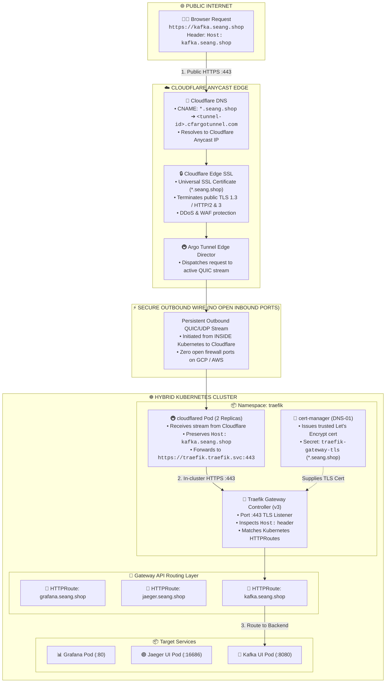

# 📖 Cloudflare Tunnel & Traefik Gateway API Architecture Guide & FAQ

This document provides a complete, end-to-end operational guide explaining how **Cloudflare**, **`cloudflared` Tunnels**, and **Traefik Gateway API** work together to securely expose Kubernetes services over HTTPS.

---

## 📌 Table of Contents
1. [Golden Rules & Core Concepts](#-golden-rules--core-concepts)
2. [Complete End-to-End HTTPS Flow](#-1-complete-end-to-end-https-flow)
3. [Step 1: Create the Cloudflare Tunnel](#-2-step-1-create-the-cloudflare-tunnel)
4. [Step 2: Connect Domain to Tunnel & The Wildcard Trick](#-3-step-2-connect-domain-to-tunnel--the-wildcard-trick)
5. [Step 3: Deploy `cloudflared` into Kubernetes (Token vs. CLI)](#-4-step-3-deploy-cloudflared-into-kubernetes)
6. [Step 4: In-Cluster Traefik Gateway & TLS Setup](#-5-step-4-in-cluster-traefik-gateway--tls-setup)
7. [Step 5: How Traefik Knows Where to Route Traffic](#-6-step-5-how-traefik-knows-where-to-route-traffic)
8. [Step 6: Deploying a New Service (Zero-Touch Workflow)](#-7-step-6-deploying-a-new-service-zero-touch-workflow)

---

## 📌 Golden Rules & Core Concepts

1. **One Tunnel Per Cluster (Best Practice):**  
   Do **NOT** create a new tunnel or token for every microservice. One tunnel connects Cloudflare to your **Traefik Gateway**. Traefik routes traffic to different services using Kubernetes `HTTPRoute` objects.
2. **Token Mode vs. CLI Mode are Mutually Exclusive:**  
   * If you deploy **TOKEN** mode ➔ **DO NOT** deploy CLI mode.
   * If you deploy **CLI** mode ➔ **DO NOT** deploy TOKEN mode.
   * Running both simultaneously for the same tunnel will cause conflicting connections.
3. **DNS is Still Required:**  
   Traefik lives *inside* your cluster. Public browsers live *outside*. Cloudflare DNS is required so browsers know where to send traffic.

---

## 🌐 1. Complete End-to-End HTTPS Flow



### Detailed Hop-by-Hop Breakdown:
1. **Browser ➔ Cloudflare Edge:** Client types `https://kafka.seang.shop`. Cloudflare terminates client TLS with Cloudflare’s Edge SSL certificate.
2. **Cloudflare Edge ➔ `cloudflared` Pod:** Cloudflare forwards the encrypted HTTP request through the persistent outbound QUIC tunnel established by your `cloudflared` pod.
3. **`cloudflared` Pod ➔ Traefik Gateway:** `cloudflared` forwards the request internally to `https://traefik.traefik.svc.k8scluster:443` preserving the original `Host: kafka.seang.shop` header.
4. **Traefik Gateway ➔ Pod:** Traefik matches the `Host` header against the Kubernetes `HTTPRoute` for `kafka.seang.shop` and proxies the request to `kafka-ui-service:8080`.

---

## 🛠️ 2. Step 1: Create the Cloudflare Tunnel

Choose **Option A (Token Mode)** OR **Option B (CLI Mode)**.

### Option A: Token Mode via Cloudflare Zero Trust (Recommended)
1. Open [Cloudflare Zero Trust Dashboard](https://one.dash.cloudflare.com/).
2. Navigate to **Networks** ➔ **Tunnels** ➔ Click **Create a tunnel**.
3. Select **Cloudflared** connector ➔ Click **Next**.
4. Name the tunnel (e.g. `k8s-monitoring-tunnel`) ➔ Click **Save tunnel**.
5. Copy the generated **`TUNNEL_TOKEN`** (a long base64 string).

### Option B: CLI Mode via Terminal (No Credit Card / Headless)
1. On your terminal, log in to Cloudflare:
   ```bash
   cloudflared tunnel login
   ```
2. Create the tunnel:
   ```bash
   cloudflared tunnel create k8s-monitoring-tunnel
   ```
3. Cloudflare outputs:
   * **Tunnel ID** (UUID e.g. `2749c806-0e57-4941-a095-a86501f9ac2c`)
   * **Credentials file** (`~/.cloudflared/<tunnel-id>.json`)

---

## 🔗 3. Step 2: Connect Domain to Tunnel & The Wildcard Trick

### Why you still need DNS records:
* Traefik only exists *inside* your private cluster.
* When someone types `grafana.seang.shop` on the internet, their browser needs DNS to find Cloudflare Anycast edge.
* The DNS record instructs Cloudflare: *"Send traffic for this domain into `k8s-monitoring-tunnel`."*
* If the DNS record does not exist, browsers will get `DNS_PROBE_FINISHED_NXDOMAIN`.

---

### The Wildcard Trick (Do this once, never touch Cloudflare DNS again!)

Instead of adding individual CNAME records every time you deploy a service, add **ONE Wildcard CNAME Record**:

| Field | Value |
| :--- | :--- |
| **Type** | `CNAME` |
| **Name** | `*` (which covers `*.seang.shop`) |
| **Target** | `<your-tunnel-id>.cfargotunnel.com` |
| **Proxy status** | **Proxied** (Orange Cloud ☁️) |

#### CLI Command to add the wildcard:
```bash
cloudflared tunnel route dns k8s-monitoring-tunnel "*.seang.shop"
```

#### What happens:
* `grafana.seang.shop` ➔ automatically routes to tunnel
* `jaeger.seang.shop` ➔ automatically routes to tunnel
* `kafka.seang.shop` ➔ automatically routes to tunnel
* `any-future-service.seang.shop` ➔ **automatically routes to tunnel**

---

## ☸️ 4. Step 3: Deploy `cloudflared` into Kubernetes

> [!IMPORTANT]
> **Pick Option A OR Option B. DO NOT deploy both!**

### Option A: Token Mode Deployment (Recommended)
Passes the token directly as an environment variable and forwards all requests to Traefik:

```yaml
apiVersion: v1
kind: Secret
metadata:
  name: cloudflare-tunnel-token
  namespace: traefik
type: Opaque
stringData:
  token: "<PASTE_YOUR_TUNNEL_TOKEN>"
---
apiVersion: apps/v1
kind: Deployment
metadata:
  name: cloudflared
  namespace: traefik
spec:
  replicas: 2
  selector:
    matchLabels:
      app: cloudflared
  template:
    metadata:
      labels:
        app: cloudflared
    spec:
      containers:
        - name: cloudflared
          image: cloudflare/cloudflared:latest
          args:
            - tunnel
            - --metrics
            - 0.0.0.0:2000
            - --no-autoupdate
            - run
            - --url
            - https://traefik.traefik.svc.k8scluster:443
            - --no-tls-verify
            - --token
            - $(TUNNEL_TOKEN)
          env:
            - name: TUNNEL_TOKEN
              valueFrom:
                secretKeyRef:
                  name: cloudflare-tunnel-token
                  key: token
```

### Option B: CLI Mode Deployment (GitOps)
Requires mounting `credentials.json` (Secret) and `config.yaml` (ConfigMap):

```yaml
apiVersion: v1
kind: Secret
metadata:
  name: cloudflared-credentials
  namespace: traefik
stringData:
  credentials.json: '{"AccountTag":"...","TunnelID":"...","TunnelSecret":"..."}'
---
apiVersion: v1
kind: ConfigMap
metadata:
  name: cloudflared-config
  namespace: traefik
data:
  config.yaml: |
    tunnel: <TUNNEL_ID>
    credentials-file: /etc/cloudflared/creds/credentials.json
    metrics: 0.0.0.0:2000
    no-autoupdate: true
    ingress:
      - hostname: "*.seang.shop"
        service: https://traefik.traefik.svc.k8scluster:443
        originRequest:
          originServerName: "seang.shop"
      - service: http_status:404
---
apiVersion: apps/v1
kind: Deployment
metadata:
  name: cloudflared
  namespace: traefik
spec:
  replicas: 2
  template:
    spec:
      containers:
        - name: cloudflared
          image: cloudflare/cloudflared:latest
          args:
            - tunnel
            - --config
            - /etc/cloudflared/config/config.yaml
            - run
          volumeMounts:
            - name: config
              mountPath: /etc/cloudflared/config
            - name: creds
              mountPath: /etc/cloudflared/creds
      volumes:
        - name: config
          configMap:
            name: cloudflared-config
        - name: creds
          secret:
            secretName: cloudflared-credentials
```

### 💡 Does CLI Mode require updating `config.yaml` when adding a new service?

* **Normally in CLI mode:** Yes, this is usually a big limitation—teams have to edit `config.yaml`, update the ConfigMap, and restart the `cloudflared` pods whenever a new service is added.
* **In this architecture:** **NO! You do NOT have to update `config.yaml`!**  
  Because your config includes the wildcard rule:
  ```yaml
  - hostname: "*.seang.shop"
    service: https://traefik.traefik.svc.k8scluster:443
  ```
  Any request for `kafka.seang.shop`, `myapp.seang.shop`, or any other subdomain automatically matches `*.seang.shop` and gets forwarded directly to Traefik!

#### When WOULD you have to update `config.yaml` in CLI mode?
You only need to edit `config.yaml` and restart pods if:
1. You introduce a **completely different base domain** (e.g. `api.otherclient.com` instead of `*.seang.shop`).
2. You want a specific service to **bypass Traefik** and route directly to a specific backend pod.

#### Why Token Mode is still preferred:
* In **CLI mode**, you must maintain that wildcard rule in Git, mount ConfigMaps, and manage secret files.
* In **Token mode (`--url https://traefik...:443`)**, there is no file at all. It forwards **100% of all traffic** directly to Traefik with zero configuration files to maintain or update.

---

## 🚦 5. Step 4: In-Cluster Traefik Gateway & TLS Setup

Traefik acts as the centralized Gateway listening on port 443.

### 1. Traefik Gateway Resource (`gateway.networking.k8s.io/v1`)
```yaml
apiVersion: gateway.networking.k8s.io/v1
kind: Gateway
metadata:
  name: traefik-gateway
  namespace: traefik
spec:
  gatewayClassName: traefik
  listeners:
    - name: https
      protocol: HTTPS
      port: 443
      hostname: "*.seang.shop"
      tls:
        mode: Terminate
        certificateRefs:
          - name: traefik-gateway-tls  # Managed by cert-manager
```

### 2. cert-manager Certificate (DNS-01 Challenge via Cloudflare API)
```yaml
apiVersion: cert-manager.io/v1
kind: Certificate
metadata:
  name: traefik-gateway-wildcard-cert
  namespace: traefik
spec:
  secretName: traefik-gateway-tls
  issuerRef:
    name: letsencrypt-cloudflare
    kind: ClusterIssuer
  dnsNames:
    - "seang.shop"
    - "*.seang.shop"
```

---

## 🔀 6. Step 5: How Traefik Knows Where to Route Traffic

When you use **Token mode**, `cloudflared` has no routing rules inside it. How does Traefik know where to send requests?

1. **The Browser sends the `Host:` Header:**  
   When visiting `https://kafka.seang.shop`, the browser sends:
   ```http
   GET / HTTP/1.1
   Host: kafka.seang.shop
   ```
2. **`cloudflared` preserves the header:**  
   It delivers the request to `https://traefik.traefik.svc:443` without altering the `Host:` header.
3. **Traefik matches the `HTTPRoute`:**  
   Traefik inspects `Host: kafka.seang.shop` and queries its in-memory table of Kubernetes `HTTPRoute` resources.
4. **Forwarded to Pod:**  
   Traefik proxies the traffic directly to `kafka-ui-service:8080`.

---

## 🚀 7. Step 6: Deploying a New Service (Zero-Touch Workflow)

When you deploy a new service (e.g. `kafka.seang.shop`):

### 1. Check Cloudflare DNS:
* If you created the wildcard record `*.seang.shop`, **do nothing on Cloudflare.**
* If using individual records, add a CNAME: `kafka` ➔ `<tunnel-id>.cfargotunnel.com` (Proxied).

### 2. Deploy your Application & Service:
```yaml
apiVersion: apps/v1
kind: Deployment
metadata:
  name: kafka-ui
  namespace: kafka
spec:
  replicas: 1
  template:
    spec:
      containers:
        - name: kafka-ui
          image: provectuslabs/kafka-ui:latest
          ports:
            - containerPort: 8080
---
apiVersion: v1
kind: Service
metadata:
  name: kafka-ui-service
  namespace: kafka
spec:
  selector:
    app: kafka-ui
  ports:
    - port: 8080
      targetPort: 8080
```

### 3. Apply the `HTTPRoute`:
```yaml
apiVersion: gateway.networking.k8s.io/v1
kind: HTTPRoute
metadata:
  name: kafka-ui-route
  namespace: kafka
spec:
  parentRefs:
    - name: traefik-gateway
      namespace: traefik
  hostnames:
    - "kafka.seang.shop"
  rules:
    - matches:
        - path:
            type: PathPrefix
            value: /
      backendRefs:
        - name: kafka-ui-service
          port: 8080
```

### 4. Verify:
Test the endpoint from any internet connection:
```bash
curl -Iv https://kafka.seang.shop
```
Traffic flows instantly from Cloudflare Edge ➔ Tunnel ➔ Traefik ➔ Kafka Pod with **zero changes to `cloudflared`**!
