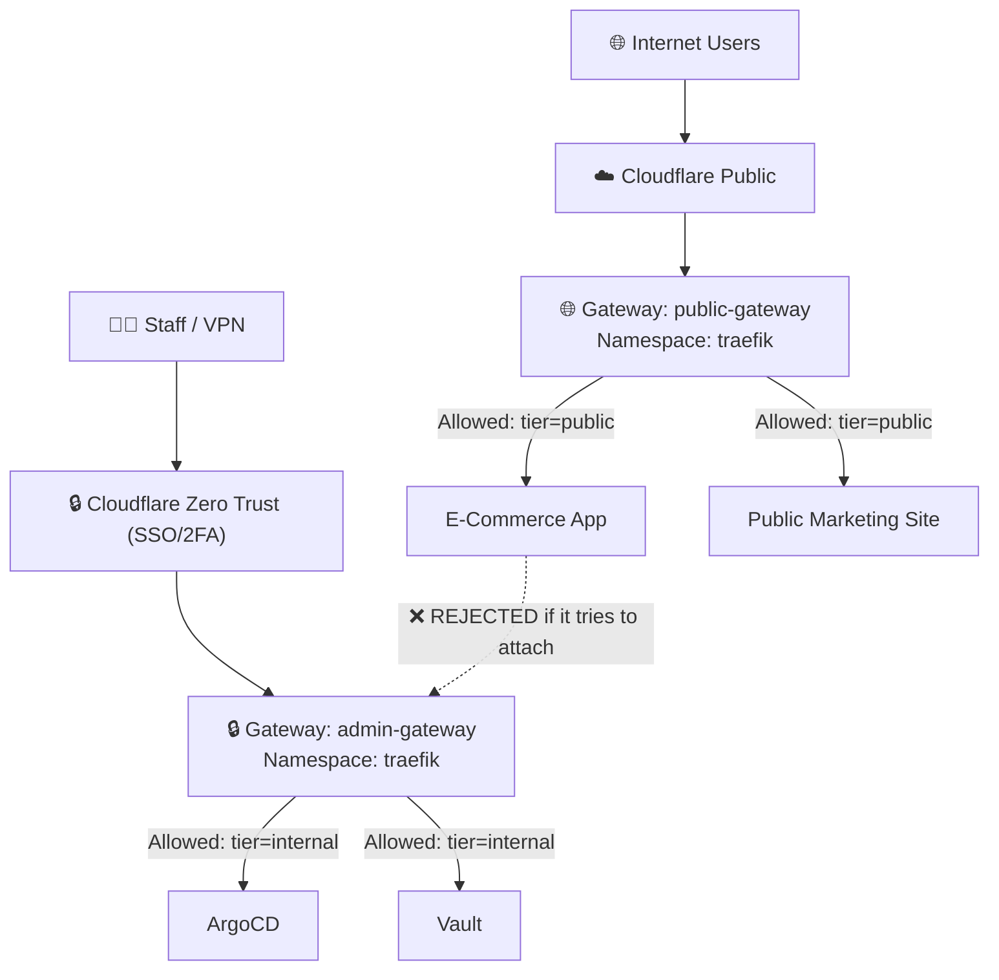

# 🏛️ Complete Guide: How to Create & Configure Kubernetes Gateways (`kind: Gateway`)

This document is a comprehensive, production-ready reference on how to create, configure, and secure **`kind: Gateway`** resources using the **Kubernetes Gateway API (`gateway.networking.k8s.io/v1`)**.

---

## 📌 Table of Contents
1. [Core Concepts: Why Gateway API?](#-1-core-concepts-why-gateway-api)
2. [Anatomy of a `kind: Gateway` Manifest](#-2-anatomy-of-a-kind-gateway-manifest)
3. [Pattern 1: The Shared Wildcard HTTPS Gateway (Recommended)](#-3-pattern-1-the-shared-wildcard-https-gateway)
4. [Pattern 2: Multi-Gateway Architecture (Public vs. Internal Admin)](#-4-pattern-2-multi-gateway-architecture-public-vs-internal-admin)
5. [Pattern 3: Dedicated Single-Namespace Gateway (`from: Same`)](#-5-pattern-3-dedicated-single-namespace-gateway)
6. [Pattern 4: Dual Listener Gateway (HTTP-to-HTTPS Redirect + TLS)](#-6-pattern-4-dual-listener-gateway-http-to-https-redirect)
7. [Pattern 5: Multi-Domain SNI Gateway (Multiple Hostnames & Certs)](#-7-pattern-5-multi-domain-sni-gateway)
8. [Pattern 6: TCP / UDP / Non-HTTP Gateways](#-8-pattern-6-tcp--udp--non-http-gateways)
9. [How `HTTPRoute`s Attach to Gateways (`parentRefs`)](#-9-how-httproutes-attach-to-gateways)
10. [Verification & Troubleshooting Common Errors](#-10-verification--troubleshooting-common-errors)

---

## 💡 1. Core Concepts: Why Gateway API?

The Kubernetes Gateway API replaces legacy `Ingress` with role-oriented separation of concerns:

| Persona | Resource | Responsibility |
| :--- | :--- | :--- |
| **Infrastructure / DevOps** | **`GatewayClass`** & **`Gateway`** | Configures ports, IP addresses, TLS certs, firewall rules, and allowed namespaces. Created **once**. |
| **Application Developer** | **`HTTPRoute`** / **`GRPCRoute`** | Configures paths, headers, rewrites, and backend services. Attached to the Gateway via `parentRefs`. |

```
                       ┌────────────────────────┐
                       │   traefik-gateway      │  (kind: Gateway)
                       │   Port 443 + Wildcard  │  Managed by DevOps
                       └───────────┬────────────┘
                                   │
         ┌─────────────────────────┼─────────────────────────┐
         │ (parentRef)             │ (parentRef)             │ (parentRef)
         ▼                         ▼                         ▼
┌──────────────────┐      ┌──────────────────┐      ┌──────────────────┐
│  grafana-route   │      │   kafka-route    │      │   argocd-route   │  (kind: HTTPRoute)
│  (monitoring ns) │      │    (kafka ns)    │      │   (argocd ns)    │  Managed by Devs
└──────────────────┘      └──────────────────┘      └──────────────────┘
```

---

## 🔍 2. Anatomy of a `kind: Gateway` Manifest

Every `Gateway` consists of key sections:

```yaml
apiVersion: gateway.networking.k8s.io/v1
kind: Gateway
metadata:
  name: <gateway-name>             # Name referenced by HTTPRoutes
  namespace: <namespace>           # Usually 'traefik', 'gateway-system', or app namespace
spec:
  gatewayClassName: traefik        # Must match an installed GatewayClass controller
  listeners:                       # One or more network ports/protocols
    - name: https                  # Unique listener identifier
      protocol: HTTPS              # HTTP, HTTPS, TLS, TCP, UDP
      port: 443                    # Target port
      hostname: "*.seang.shop"     # Restricts which hostnames can use this listener
      allowedRoutes:               # CRITICAL: Security gatekeeper for which routes can attach
        namespaces:
          from: All                # All | Same | Selector
      tls:
        mode: Terminate            # Terminate | Passthrough
        certificateRefs:
          - name: traefik-gateway-tls # Kubernetes Secret containing tls.crt and tls.key
```

---

## 🌟 3. Pattern 1: The Shared Wildcard HTTPS Gateway

👉 **When to use:** The standard production setup for 90% of clusters. One central entry point for all subdomains and namespaces.

```yaml
apiVersion: gateway.networking.k8s.io/v1
kind: Gateway
metadata:
  name: traefik-gateway
  namespace: traefik
  labels:
    app.kubernetes.io/name: traefik-gateway
spec:
  gatewayClassName: traefik
  listeners:
    - name: https
      protocol: HTTPS
      port: 443
      hostname: "*.seang.shop"           # Accepts ANY subdomain under seang.shop
      allowedRoutes:
        namespaces:
          from: All                     # Allows HTTPRoutes from ANY namespace (monitoring, kafka, argocd)
      tls:
        mode: Terminate
        certificateRefs:
          - kind: Secret
            name: traefik-gateway-tls   # Wildcard cert (*.seang.shop) from cert-manager
```

* **Why `hostname: "*.seang.shop"`?** Allows `grafana`, `jaeger`, `kafka`, `argocd`, and future services to share this single listener.
* **Why `from: All`?** Prevents having to move all workloads into the `traefik` namespace.

---

## 🔒 4. Pattern 2: Multi-Gateway Architecture (Public vs. Internal Admin)

👉 **When to use:** You want strict network and access isolation between public customer apps and sensitive internal tools (ArgoCD, Vault, Grafana).



### 1. The Public Gateway (`public-gateway.yaml`)
Accepts routes **only** from namespaces labeled `tier: public`:

```yaml
apiVersion: gateway.networking.k8s.io/v1
kind: Gateway
metadata:
  name: public-gateway
  namespace: traefik
spec:
  gatewayClassName: traefik
  listeners:
    - name: https-public
      protocol: HTTPS
      port: 443
      hostname: "*.seang.shop"
      allowedRoutes:
        namespaces:
          from: Selector
          selector:
            matchLabels:
              tier: public              # Only namespaces with label tier=public
      tls:
        mode: Terminate
        certificateRefs:
          - name: public-wildcard-tls
```

### 2. The Admin Gateway (`admin-gateway.yaml`)
Accepts routes **only** from namespaces labeled `tier: internal`:

```yaml
apiVersion: gateway.networking.k8s.io/v1
kind: Gateway
metadata:
  name: admin-gateway
  namespace: traefik
spec:
  gatewayClassName: traefik
  listeners:
    - name: https-admin
      protocol: HTTPS
      port: 8443                        # Or dedicated ingress port
      hostname: "*.internal.seang.shop"
      allowedRoutes:
        namespaces:
          from: Selector
          selector:
            matchLabels:
              tier: internal            # Only namespaces with label tier=internal
      tls:
        mode: Terminate
        certificateRefs:
          - name: internal-wildcard-tls
```

### How to label namespaces:
```bash
kubectl label namespace apps tier=public
kubectl label namespace argocd tier=internal
kubectl label namespace monitoring tier=internal
```

---

## 📦 5. Pattern 3: Dedicated Single-Namespace Gateway (`from: Same`)

👉 **When to use:** A team or application (like ArgoCD) wants their own completely independent Gateway inside their own namespace without sharing with other teams.

```yaml
apiVersion: gateway.networking.k8s.io/v1
kind: Gateway
metadata:
  name: argocd-gateway
  namespace: argocd                     # Gateway lives directly inside argocd namespace
spec:
  gatewayClassName: traefik
  listeners:
    - name: https
      protocol: HTTPS
      port: 443
      hostname: "argocd.seang.shop"
      allowedRoutes:
        namespaces:
          from: Same                    # ONLY routes inside 'argocd' namespace are permitted
      tls:
        mode: Terminate
        certificateRefs:
          - name: argocd-tls-secret
```

---

## 🔀 6. Pattern 4: Dual Listener Gateway (HTTP-to-HTTPS Redirect)

👉 **When to use:** You want port 80 to automatically redirect traffic to port 443 HTTPS.

```yaml
apiVersion: gateway.networking.k8s.io/v1
kind: Gateway
metadata:
  name: traefik-dual-gateway
  namespace: traefik
spec:
  gatewayClassName: traefik
  listeners:
    # Port 80 Listener (Plain HTTP)
    - name: http
      protocol: HTTP
      port: 80
      hostname: "*.seang.shop"
      allowedRoutes:
        namespaces:
          from: All

    # Port 443 Listener (Secure HTTPS)
    - name: https
      protocol: HTTPS
      port: 443
      hostname: "*.seang.shop"
      allowedRoutes:
        namespaces:
          from: All
      tls:
        mode: Terminate
        certificateRefs:
          - name: traefik-gateway-tls
```

*(Note: Traefik automatically enforces HTTPS redirection when configured with entrypoint redirects or via Traefik Middlewares).*

---

## 🏷️ 7. Pattern 5: Multi-Domain SNI Gateway (Multiple Hostnames & Certs)

👉 **When to use:** One Gateway manages multiple completely different domain names (e.g. `*.seang.shop` AND `*.myclient.com`) with separate SSL certificates.

```yaml
apiVersion: gateway.networking.k8s.io/v1
kind: Gateway
metadata:
  name: multi-domain-gateway
  namespace: traefik
spec:
  gatewayClassName: traefik
  listeners:
    # Listener 1: seang.shop
    - name: https-seang
      protocol: HTTPS
      port: 443
      hostname: "*.seang.shop"
      allowedRoutes:
        namespaces:
          from: All
      tls:
        mode: Terminate
        certificateRefs:
          - name: seang-shop-wildcard-tls

    # Listener 2: myclient.com
    - name: https-client
      protocol: HTTPS
      port: 443
      hostname: "*.myclient.com"
      allowedRoutes:
        namespaces:
          from: All
      tls:
        mode: Terminate
        certificateRefs:
          - name: myclient-wildcard-tls
```

---

## 🔌 8. Pattern 6: TCP / UDP / Non-HTTP Gateways

👉 **When to use:** Exposing databases (PostgreSQL, MySQL), Redis, or Kafka brokers via `TCPRoute` or `UDPRoute`.

```yaml
apiVersion: gateway.networking.k8s.io/v1
kind: Gateway
metadata:
  name: tcp-gateway
  namespace: traefik
spec:
  gatewayClassName: traefik
  listeners:
    # PostgreSQL TCP Listener
    - name: postgres
      protocol: TCP
      port: 5432
      allowedRoutes:
        kinds:
          - kind: TCPRoute
        namespaces:
          from: Selector
          selector:
            matchLabels:
              database: enabled
```

---

## 🔗 9. How `HTTPRoute`s Attach to Gateways (`parentRefs`)

Application developers attach their service routes to a Gateway using **`parentRefs`**:

### Example 1: Standard attachment (by Gateway Name)
```yaml
apiVersion: gateway.networking.k8s.io/v1
kind: HTTPRoute
metadata:
  name: argocd-route
  namespace: argocd
spec:
  parentRefs:
    - name: traefik-gateway             # Gateway Name
      namespace: traefik               # Gateway Namespace
  hostnames:
    - "argocd.seang.shop"
  rules:
    - matches:
        - path:
            type: PathPrefix
            value: /
      backendRefs:
        - name: argocd-server
          port: 80
```

### Example 2: Target a specific listener inside a Multi-Listener Gateway (`sectionName`)
If a Gateway has multiple HTTPS listeners (e.g. `https-seang` and `https-client`), specify **`sectionName`**:

```yaml
spec:
  parentRefs:
    - name: multi-domain-gateway
      namespace: traefik
      sectionName: https-seang          # Binds strictly to this specific listener
```

---

## 🛠️ 10. Verification & Troubleshooting Common Errors

### Useful Inspection Commands:

```bash
# 1. Check all Gateways in cluster and their status
kubectl get gateway -A

# 2. Inspect Gateway status, listeners, and attached routes count
kubectl describe gateway traefik-gateway -n traefik

# 3. Check all attached HTTPRoutes
kubectl get httproute -A

# 4. Check if an HTTPRoute successfully bound to its parent Gateway
kubectl describe httproute argocd-route -n argocd
```

### Healthy Gateway Output Example:
When you run `kubectl describe gateway traefik-gateway -n traefik`, verify these conditions:
```text
Conditions:
  Type            Status   Reason
  ----            ------   ------
  Accepted        True     Accepted
  Programmed      True     Programmed
Listeners:
  Attached Routes:  5
  Name:             https
  Conditions:
    Type          Status   Reason
    ----          ------   ------
    Accepted      True     Accepted
    Programmed    True     Programmed
    ResolvedRefs  True     ResolvedRefs
```

---

### Common Gateway Errors & How to Fix Them:

| Error Message / Status | Cause | Fix |
| :--- | :--- | :--- |
| **`NotAllowed: Route not permitted to parent ref`** | The Gateway's `allowedRoutes` does not allow your namespace. | Change Gateway's `allowedRoutes.namespaces.from` to `All` or add the required namespace label. |
| **`ResolvedRefs: False` (on Gateway Listener)** | The TLS Secret referenced in `certificateRefs` does not exist or has a typo. | Verify `kubectl get secret -n traefik traefik-gateway-tls`. Ensure cert-manager successfully generated it. |
| **`404 Not Found` when opening browser** | Gateway listener `hostname` does not match the HTTP request `Host:` header. | Ensure Gateway listener uses wildcard `*.seang.shop` rather than a specific app name. |
| **`ParentRefConflict`** | Two different HTTPRoutes claimed the exact same hostname/path on the same Gateway. | Ensure each service has a unique `hostname` or distinct `path` prefix. |
| **`GatewayClass Not Found`** | `spec.gatewayClassName: traefik` does not match an installed controller. | Check installed classes: `kubectl get gatewayclass`. Ensure Traefik is running with Gateway API enabled. |
