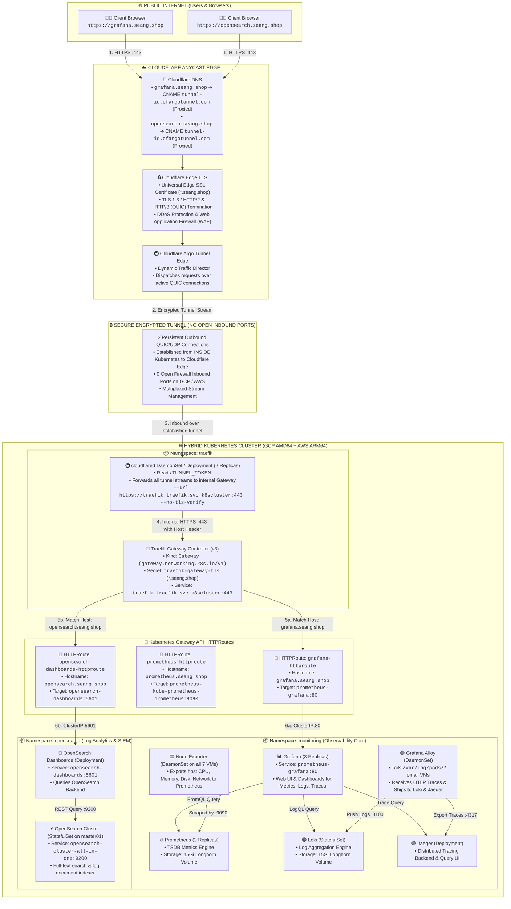
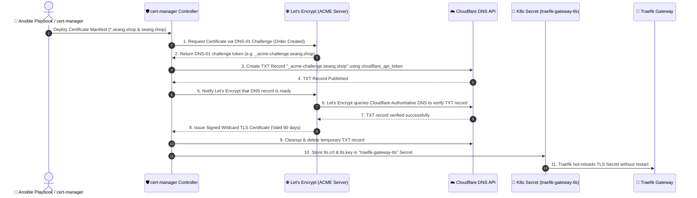
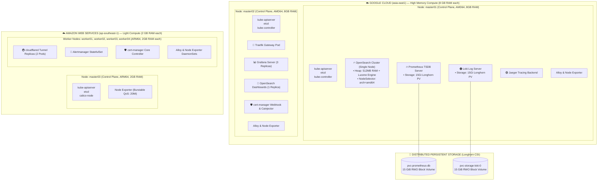

# 🏛️ Complete Architecture & End-to-End Traffic Flow Diagram

This document details the exact architecture, network pathways, and protocol layers connecting public internet clients to the Kubernetes observability stack deployed across the hybrid GCP + AWS cluster.

---

## 🌐 1. End-to-End HTTPS Request & Data Flow

---

## 🔒 2. Automated TLS Certificate Issuance (DNS-01 ACME Challenge)

How the wildcard certificate `*.seang.shop` is generated and renewed automatically without exposing port 80 to the public:

---

## 🗺️ 3. Physical Node Topology & Workload Placement

The cluster spans two public clouds interconnected via an encrypted **Calico WireGuard mesh** on internal subnet `10.0.0.0/24`:

---

## ⚡ 4. Step-by-Step Request Lifecycle Breakdown

| Step | Component | Protocol | Description |
| :---: | :--- | :---: | :--- |
| **1** | **Browser Client** | `HTTPS (443)` | User visits `https://grafana.seang.shop` or `https://opensearch.seang.shop`. |
| **2** | **Cloudflare DNS** | `DNS` | Resolves to Cloudflare Anycast edge IP (`104.21.28.65` / `172.67.144.150`) via proxied CNAME to `2749c806-0e57-4941-a095-a86501f9ac2c.cfargotunnel.com`. |
| **3** | **Cloudflare Edge** | `TLS 1.3` | Cloudflare terminates edge TLS with trusted public certificate, performs DDoS inspection, and locates active tunnel connections. |
| **4** | **Argo Tunnel** | `QUIC / UDP` | Cloudflare encapsulates the HTTP/2 stream into the existing outbound QUIC connection established by the in-cluster `cloudflared` pod. |
| **5** | **`cloudflared` Pod** | `Internal HTTPS` | The pod decapsulates the stream and forwards it internally to `https://traefik.traefik.svc.k8scluster:443` preserving the original `Host:` header. |
| **6** | **Traefik Gateway** | `Gateway API` | Traefik presents the Let's Encrypt wildcard certificate (`*.seang.shop`), inspects the `Host` header, and matches the corresponding `HTTPRoute`. |
| **7** | **HTTPRoute Dispatch** | `ClusterIP` | • `grafana.seang.shop` ➔ routed to `prometheus-grafana.monitoring.svc.k8scluster:80` • `opensearch.seang.shop` ➔ routed to `opensearch-dashboards.opensearch.svc.k8scluster:5601`. |
| **8** | **Application Backends** | `HTTP` | Grafana and OpenSearch Dashboards process the request and stream the rendered UI back through the tunnel to the user's browser with **`HTTP/2 200/302`**. |
