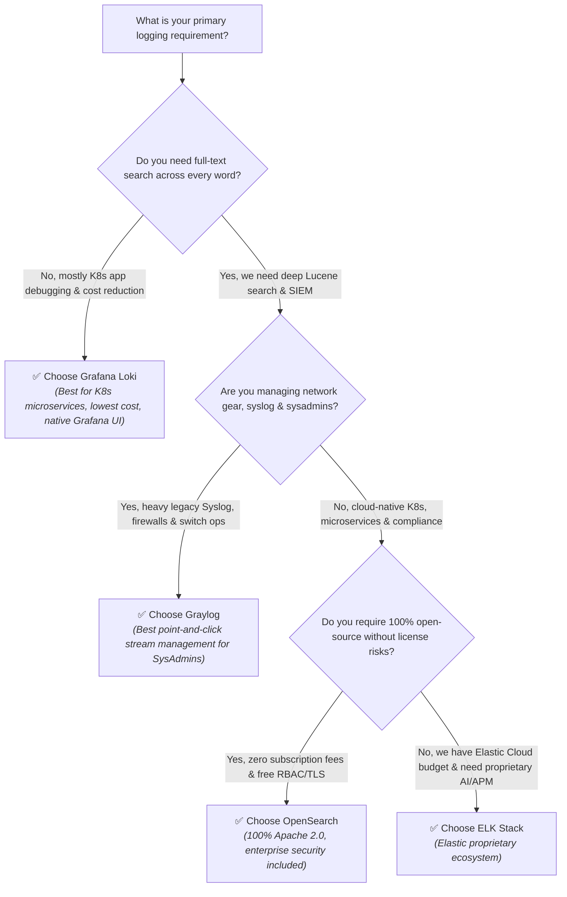
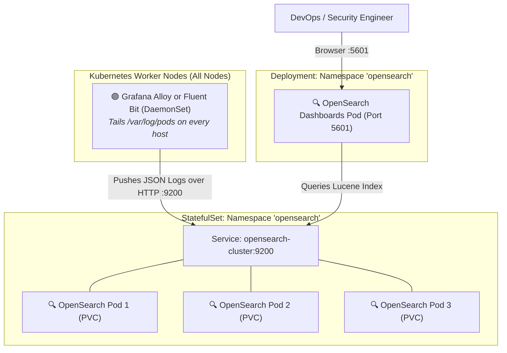
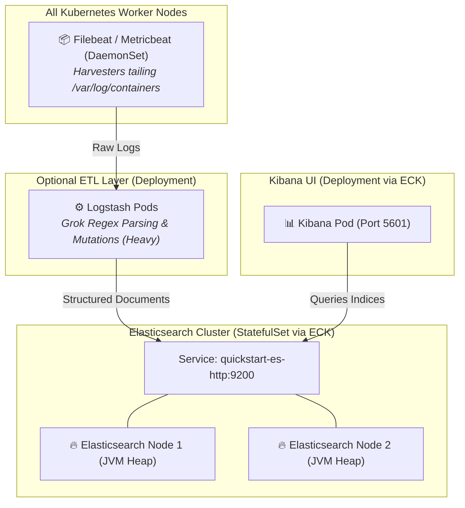
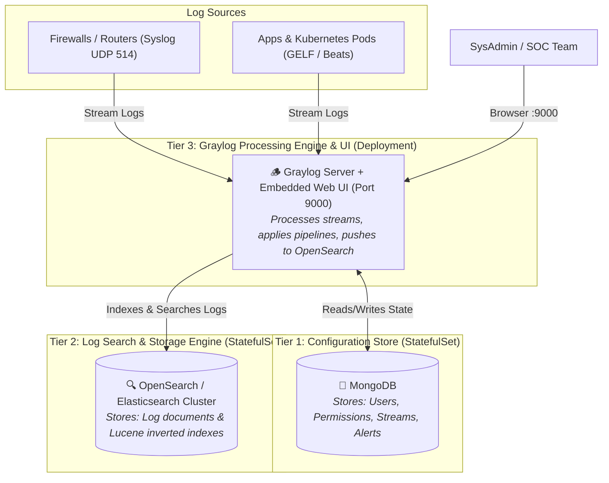

# 🪵 Centralized Logging Architecture Guide: ELK vs. OpenSearch vs. Graylog vs. Grafana Loki

Comprehensive comparison and architectural guide evaluating the leading enterprise log management and analysis platforms for Kubernetes and hybrid cloud environments.

---

## 📑 Table of Contents
1. [Executive Overview & Comparison Matrix](#1-executive-overview--comparison-matrix)
2. [Deep Dive: Individual Platforms](#2-deep-dive-individual-platforms)
   - [2.1 The ELK Stack (Elasticsearch, Logstash, Kibana)](#21-the-elk-stack-elasticsearch-logstash-kibana)
   - [2.2 OpenSearch (OpenSearch + OpenSearch Dashboards)](#22-opensearch-opensearch--opensearch-dashboards)
   - [2.3 Graylog (Graylog Server + OpenSearch/Elasticsearch + MongoDB)](#23-graylog-graylog-server--opensearchelasticsearch--mongodb)
   - [2.4 Grafana Loki (Cloud-Native Label-Indexed Log Engine)](#24-grafana-loki-cloud-native-label-indexed-log-engine)
3. [Under the Hood: Inverted Index vs. Label Index](#3-under-the-hood-inverted-index-vs-label-index)
4. [Resource & Operational Cost Analysis](#4-resource--operational-cost-analysis)
5. [Should You Run Them All Together? (Anti-Patterns Explained)](#5-should-you-run-them-all-together-anti-patterns-explained)
6. [The Recommended Architecture: Two-Tier Dual Logging](#6-the-recommended-architecture-two-tier-dual-logging)
7. [Decision Framework: Which Tool Should You Choose?](#7-decision-framework-which-tool-should-you-choose)
8. [Installation Architectures & Step-by-Step Deployment (Do Tools Install Separately?)](#8-installation-architectures--step-by-step-deployment-do-tools-install-separately)
   - [8.1 Why and How Tools Install Separately](#81-why-and-how-tools-install-separately)
   - [8.2 OpenSearch Installation & Architecture](#82-opensearch-installation--architecture)
   - [8.3 ELK Stack Installation & Architecture (via ECK Operator)](#83-elk-stack-installation--architecture-via-eck-operator)
   - [8.4 Graylog Installation & Architecture (3-Tier Sequential Dependencies)](#84-graylog-installation--architecture-3-tier-sequential-dependencies)
   - [8.5 Installation Complexity & Component Comparison](#85-installation-complexity--component-comparison)
9. [Mapping to Our Kubernetes Cluster Setup](#9-mapping-to-our-kubernetes-cluster-setup)

---

## 1. Executive Overview & Comparison Matrix

| Feature / Metric | **ELK Stack (Elastic)** | **OpenSearch** | **Graylog** | **Grafana Loki** |
| :--- | :--- | :--- | :--- | :--- |
| **Core Storage Engine** | Apache Lucene | Apache Lucene (Fork) | OpenSearch / Elasticsearch | Compressed Chunks + TSDB Index |
| **Metadata / Config DB** | Built-in cluster state | Built-in cluster state | **MongoDB** (Separate DB) | Object Storage / BoltDB |
| **Open-Source License** | Dual: SSPL / AGPLv3 / Elastic | **100% Apache 2.0 (True OSS)** | SSPL / Commercial Enterprise | AGPLv3 |
| **Free Security & RBAC** | ⚠️ Basic free, advanced paid | ✅ **Full Enterprise RBAC free** | ⚠️ Basic free, advanced paid | ✅ Built-in / Grafana RBAC |
| **Index State Management (ISM)** | Paid (ILM Platinum) | ✅ **Included free (ISM)** | Graylog Stream retention rules | Retention / Compactor rules |
| **Primary Ingestion Method** | Logstash / Beats / Agent | Data Prepper / Alloy / Fluent Bit | Graylog GELF / Syslog / Beats | Grafana Alloy / Promtail |
| **Search Engine Type** | Inverted Index (Every word) | Inverted Index (Every word) | Inverted Index (via OpenSearch) | Label-only index (Grep-style scan) |
| **Query Language** | KQL, Lucene, ES|QL | DQL, Lucene, PPL, SQL | Graylog Search Syntax | LogQL |
| **RAM Footprint (Min)** | 4 GB – 16+ GB per node | 4 GB – 16+ GB per node | 6 GB – 20+ GB (Graylog + OS + Mongo) | **512 MB – 2 GB** |
| **Storage Cost Factor** | 🔴 High (Large index files) | 🔴 High (Large index files) | 🔴 High (Large index files) | 🟢 **Ultra Low** (Compressed S3/PV) |
| **Best Suited For** | Proprietary APM & Enterprise SIEM | **Open-source SIEM, Audit & Search** | **SysAdmin, Network & Syslog Ops** | **K8s Microservices & App Logs** |

---

## 2. Deep Dive: Individual Platforms

### 2.1 The ELK Stack (Elasticsearch, Logstash, Kibana)

The **ELK Stack** is the historic pioneer of centralized log management, created by Elastic NV:

- **Elasticsearch**: A distributed JSON document database built on top of **Apache Lucene**. It parses every document into an *inverted index*, mapping every tokenized word to its exact document location.
- **Logstash**: An ETL (Extract, Transform, Load) server that consumes logs from multiple inputs, executes filtering and transformations (e.g., regex via Grok), and streams them to Elasticsearch.
- **Kibana**: The visualization and discovery interface for searching logs, creating time-series visualizations, and monitoring application health.

```text
┌─────────────────┐       ┌──────────┐       ┌─────────────────┐       ┌────────────┐
│ K8s Pods / Apps │ ────> │ Logstash │ ────> │  Elasticsearch  │ <───> │   Kibana   │
└─────────────────┘       └──────────┘       │ (Lucene Index)  │       └────────────┘
                                             └─────────────────┘
```

#### Licensing History & Vendor Lock-In Note
In 2021, Elastic moved Elasticsearch and Kibana from the open-source Apache 2.0 license to proprietary source-available licenses (**SSPL** and the **Elastic License**). While parts of the project reintroduced AGPLv3 in late 2024, many enterprise-grade features (field-level security, anomaly detection, machine learning, cross-cluster replication) remain locked behind paid commercial subscription tiers.

---

### 2.2 OpenSearch (OpenSearch + OpenSearch Dashboards)

**OpenSearch** is a community-driven, 100% open-source fork of Elasticsearch 7.10.2 and Kibana 7.10.2 led by AWS and industry partners:

- **OpenSearch**: The distributed search engine and document datastore (100% compatible with Elasticsearch APIs, indexing patterns, and Lucene syntax).
- **OpenSearch Dashboards**: The web UI fork of Kibana providing log discovery, visualizations, Dev Tools, and alerting management.
- **Why OpenSearch is Popular**:
  1. **100% Apache 2.0 License:** Completely free from commercial license traps. You can run, modify, distribute, or monetize it without subscription costs.
  2. **Enterprise Features for Free:** TLS encryption, role-based access control (RBAC down to specific JSON fields or document tags), automated index lifecycles (ISM), alerting, and anomaly detection are all completely free out of the box.
  3. **Drop-in Compatibility:** Standard Elasticsearch clients and ingest pipelines (Logstash, Fluent Bit, Vector, Grafana Alloy) work seamlessly with OpenSearch.

```text
┌─────────────────┐       ┌────────────────────────┐       ┌────────────────────────┐       ┌──────────────────────┐
│ K8s Pods / Apps │ ────> │ Grafana Alloy / Prepper│ ────> │       OpenSearch       │ <───> │ OpenSearch Dashboards│
└─────────────────┘       └────────────────────────┘       │ (Free TLS & Full RBAC) │       └──────────────────────┘
                                                           └────────────────────────┘
```

---

### 2.3 Graylog (Graylog Server + OpenSearch/Elasticsearch + MongoDB)

**Graylog** is not a database. It is an **opinionated log management application** built specifically for IT operations, network engineers, and Security Operations Center (SOC) teams:

- **Architecture**:
  - **Graylog Server**: Handles ingest (via GELF, Syslog, Kafka), parsing, stream routing, rule evaluation, and user authentication.
  - **OpenSearch / Elasticsearch**: Used as the downstream storage and indexing engine for log messages.
  - **MongoDB**: Used by Graylog to store its internal configuration state, user permissions, dashboards, and stream definitions.
- **Key Advantages**:
  - **Stream-Based Routing:** You can easily route logs into isolated "Streams" (e.g., Firewall, Windows Auth, Kubernetes, Database) and grant granular permissions per team.
  - **Simplified Extractors:** Create point-and-click Grok or JSON extractors directly from the web UI without modifying configuration files.
  - **Syslog-Friendly:** Native support for RFC 5424/3164 syslog, Windows Event Logs, and network appliances.
- **Key Disadvantages**:
  - Requires managing **three separate systems** simultaneously (Graylog + OpenSearch + MongoDB).
  - High operational complexity and memory footprint on Kubernetes.

```text
┌────────────────────┐
│ Network / Firewalls│
│ K8s Pods / Syslog  │
└─────────┬──────────┘
          │ (Syslog / GELF / Beats)
          ▼
┌────────────────────────────────────┐
│           Graylog Server           │
│ (Parsing, Stream Routing, Pipelines│
└─────────┬────────────────┬─────────┘
          │                │
          ▼                ▼
  ┌──────────────┐  ┌──────────────┐
  │   MongoDB    │  │  OpenSearch  │
  │ (User State, │  │ (Log Indexes │
  │ Stream Rules)│  │   & Storage) │
  └──────────────┘  └──────────────┘
```

---

### 2.4 Grafana Loki (Cloud-Native Label-Indexed Log Engine)

**Grafana Loki** is a completely different architectural paradigm, designed by Grafana Labs around the philosophy of Prometheus:

- **How it Works**: Loki **does not build an inverted full-text index** of log contents. Instead, it only indexes the **metadata labels** (e.g., `namespace="monitoring"`, `app="order-api"`, `level="error"`).
- **Storage**: Raw log text is compressed into gzip/snappy chunks and written sequentially to cheap object storage (AWS S3, Google Cloud Storage, MinIO) or persistent volumes.
- **LogQL**: Uses a PromQL-like syntax to query logs. You filter by labels first, then grep/regex through the compressed chunks at query time.
- **Cost Advantage**: Consumes a fraction of the RAM and disk required by Lucene-based engines (ELK/OpenSearch/Graylog).

```text
┌─────────────────┐       ┌─────────────────┐       ┌────────────────────────┐       ┌──────────────────┐
│ K8s Pods / Apps │ ────> │  Grafana Alloy  │ ────> │      Grafana Loki      │ <───> │ Unified Grafana  │
└─────────────────┘       └─────────────────┘       │ (Chunk Store: S3 / PV) │       └──────────────────┘
                                                    └────────────────────────┘
```

---

## 3. Under the Hood: Inverted Index vs. Label Index

The fundamental technical difference between **ELK / OpenSearch / Graylog** and **Grafana Loki** lies in how they index data:

### Inverted Full-Text Index (ELK, OpenSearch, Graylog)
```text
Raw Log: "Payment failed for user 454 at 10:00 AM"

Inverted Index Table:
  "Payment" ──> Document #10492
  "failed"  ──> Document #10492, #10495, #10502
  "user"    ──> Document #10492, #10493
  "454"     ──> Document #10492

Pros: Sub-second search for exact terms, phrases, or wildcards across billions of lines.
Cons: High RAM consumption; index often takes up 100% to 150% of the raw data size on disk!
```

### Label Indexing (Grafana Loki)
```text
Raw Log: "Payment failed for user 454 at 10:00 AM"

Label Index Table:
  {app="billing", env="prod"} ──> Chunk File #8492 [Compressed Chunks on Disk / S3]

Pros: Incredibly fast ingestion; tiny index footprint (<1% of data size); low RAM usage.
Cons: Regex/grep across unindexed text requires scanning raw chunks over the network/disk.
```

---

## 4. Resource & Operational Cost Analysis

When choosing a log architecture for Kubernetes, resource consumption is often the deciding factor:

```text
TYPICAL RAM USAGE COMPARISON (Single Node / Small Production Cluster)

Graylog Stack  ████████████████████████ 12 GB - 20 GB+ (Graylog + OpenSearch + MongoDB)
OpenSearch     ████████████████ 8 GB - 16 GB+ (JVM Heap + OS Page Cache)
ELK Stack      ████████████████ 8 GB - 16 GB+ (Elasticsearch + Logstash + Kibana)
Grafana Loki   ██ 1 GB - 2 GB (No Inverted Index)
```

1. **JVM Heap & Page Cache (ELK & OpenSearch):** Lucene requires 50% of available RAM dedicated to the JVM heap (for caching index terms and aggregation buffers) and 50% left to the OS kernel page cache (for memory-mapped file access).
2. **MongoDB Overhead (Graylog):** Graylog requires an additional database layer to maintain state, adding operational burden (backups, upgrades, replication).
3. **Object Storage Offloading (Loki):** Loki streams compressed chunks straight to cloud object storage (S3/GCS), cutting storage costs by up to 80% compared to NVMe SSD block storage.

---

## 5. Should You Run Them All Together? (Anti-Patterns Explained)

> [!CAUTION]
> **Anti-Pattern Warning:** Do **NOT** run **ELK, OpenSearch, and Graylog** together in the same infrastructure.

Here is why running multiple full-text log engines together is harmful:

1. **Massive Redundancy:** OpenSearch, Elasticsearch, and Graylog all serve the exact same core purpose: full-text Lucene indexing. Running two or three of them means indexing the same log line two or three times.
2. **Resource Exhaustion:** Running multiple JVM-based engines will consume most of your Kubernetes cluster's CPU and memory, leaving fewer resources for your actual applications.
3. **Operational Overhead:** Your team must manage upgrades, backups, cluster health, and index maintenance across multiple complex distributed databases.
4. **Architectural Duplication:** Because Graylog itself uses OpenSearch or Elasticsearch under the hood, running Graylog + OpenSearch means running an OpenSearch cluster inside or beside an existing OpenSearch cluster.

---

## 6. The Recommended Architecture: Two-Tier Dual Logging

The industry-standard best practice is **not** to run multiple Lucene engines, but to combine **one lightweight label-based engine** with **one full-text search engine**. This is the exact architecture designed in our project:

```text
                                  ┌─────────────────────────────┐
                                  │      KUBERNETES PODS        │
                                  │  (Applications & Daemons)   │
                                  └──────────────┬──────────────┘
                                                 │
                                                 ▼
                                  ┌─────────────────────────────┐
                                  │      🟣 Grafana Alloy       │
                                  │ (Universal Telemetry Shipper│
                                  └──────┬───────────────┬──────┘
                                         │               │
                     ┌───────────────────┘               └───────────────────┐
                     │ (90% High-Volume Logs)                                │ (10% High-Value Logs)
                     ▼                                                       ▼
      ┌─────────────────────────────┐                         ┌─────────────────────────────┐
      │       🟠🟡 Grafana Loki     │                         │        🔍 OpenSearch        │
      │    "Raw Container Logs"     │                         │   "Audit, Security & SIEM"  │
      ├─────────────────────────────┤                         ├─────────────────────────────┤
      │ • stdout / stderr / debug   │                         │ • Financial / Order audit   │
      │ • Cheap object storage      │                         │ • Ingress access logs       │
      │ • Minimal RAM footprint     │                         │ • Auth & security events    │
      │ • Queried in Grafana UI     │                         │ • Full-text Lucene search   │
      └─────────────────────────────┘                         └──────────────┬──────────────┘
                                                                             │
                                                                             ▼
                                                              ┌─────────────────────────────┐
                                                              │  🔍 OpenSearch Dashboards   │
                                                              │ (SIEM & Security Discovery) │
                                                              └─────────────────────────────┘
```

### Why this combination is optimal:
- **Cost Efficiency:** You do not pay the Lucene RAM/disk penalty for the 90% of logs that are routine informational or debug chatter.
- **Deep Search Where It Counts:** For compliance, security audits, and financial transactions, you retain full-text Lucene search and SIEM anomaly detection.
- **Single Shipper:** **Grafana Alloy** handles the routing at the edge, sending routine container logs to Loki and tagged audit events to OpenSearch.

---

## 7. Decision Framework: Which Tool Should You Choose?

Use this decision matrix if deciding on a single logging platform:



---

## 8. Installation Architectures & Step-by-Step Deployment (Do Tools Install Separately?)

### 8.1 Why and How Tools Install Separately

In production Kubernetes environments, **logging tools are almost never installed as a single monolithic package**. They are decoupled into separate workloads that are deployed in distinct stages:

1. **Edge Collectors / Shippers (DaemonSet):** Must run on **every worker node** to access `/var/log/pods` and node system journals (e.g., Grafana Alloy, Filebeat, Promtail).
2. **Storage & Search Engine (StatefulSet):** Requires persistent storage (PVCs on Longhorn/EBS), Java heap configuration, and stateful clustering (e.g., OpenSearch, Elasticsearch).
3. **Visualization / Web UI (Deployment):** Stateless web applications (OpenSearch Dashboards, Kibana) deployed separately and pointed at the storage service via HTTP/gRPC.
4. **Metadata & State Stores (Prerequisite DBs):** Required by tools like Graylog, which cannot start until **MongoDB** is already active to hold configuration, streams, and credentials.

---

### 8.2 OpenSearch Installation & Architecture

OpenSearch consists of two core workloads inside the cluster plus the edge shipper:

#### 📐 OpenSearch Architecture


#### 🛠️ Step-by-Step Installation (3 Steps)

##### Step 1: Deploy OpenSearch (Storage Engine)
```bash
helm repo add opensearch https://opensearch-project.github.io/helm-charts/
helm repo update

helm install opensearch-cluster opensearch/opensearch \
  --namespace opensearch --create-namespace \
  --set singleNode=true \
  --set persistence.storageClass="longhorn" \
  --set persistence.size="15Gi" \
  --set opensearchJavaOpts="-Xms512m -Xmx512m" \
  --set securityConfig.anonymousAuthEnabled=true
```

##### Step 2: Deploy OpenSearch Dashboards (Web UI)
Installed as a separate Deployment that connects to the OpenSearch service:
```bash
helm install opensearch-dashboards opensearch/opensearch-dashboards \
  --namespace opensearch \
  --set opensearchHosts="http://opensearch-cluster:9200" \
  --set service.type=ClusterIP \
  --set service.port=5601
```

##### Step 3: Deploy the Shipper DaemonSet
Deploy **Grafana Alloy** across all nodes to tail container logs and push to `http://opensearch-cluster.opensearch.svc:9200` *(already automated in our `roles/alloy`)*.

---

### 8.3 ELK Stack Installation & Architecture (via ECK Operator)

In the ELK ecosystem, every letter is an independent project. The recommended Kubernetes deployment method uses the **ECK (Elastic Cloud on Kubernetes) Operator**.

#### 📐 ELK Stack Architecture


#### 🛠️ Step-by-Step Installation (4 Stages)

##### Stage 1: Deploy the ECK Operator
```bash
kubectl apply -f https://download.elastic.co/downloads/eck/2.12.1/crds.yaml
kubectl apply -f https://download.elastic.co/downloads/eck/2.12.1/operator.yaml
```

##### Stage 2: Deploy Elasticsearch Cluster Manifest
```yaml
apiVersion: elasticsearch.k8s.elastic.co/v1
kind: Elasticsearch
metadata:
  name: quickstart
  namespace: elastic-system
spec:
  version: 8.13.0
  nodeSets:
  - name: default
    count: 3
    config:
      node.store.allow_mmap: false
    volumeClaimTemplates:
    - metadata:
        name: elasticsearch-data
      spec:
        accessModes: [ "ReadWriteOnce" ]
        storageClassName: "longhorn"
        resources:
          requests:
            storage: 20Gi
```

##### Stage 3: Deploy Kibana Manifest
```yaml
apiVersion: kibana.k8s.elastic.co/v1
kind: Kibana
metadata:
  name: quickstart
  namespace: elastic-system
spec:
  version: 8.13.0
  count: 1
  elasticsearchRef:
    name: quickstart
```

##### Stage 4: Deploy Filebeat DaemonSet
Deploy Filebeat to harvest node container logs and ship them into `quickstart-es-http`.

---

### 8.4 Graylog Installation & Architecture (3-Tier Sequential Dependencies)

Graylog **cannot be installed in a single step**. It has a strict 3-stage dependency chain:

#### 📐 Graylog 3-Tier Architecture


#### 🛠️ Step-by-Step Installation (Strict Sequence)

##### Stage 1: Deploy MongoDB First (Dependency 1)
Graylog stores user accounts, access permissions, stream rules, and alert definitions in MongoDB:
```bash
helm repo add bitnami https://charts.bitnami.com/bitnami
helm install graylog-mongo bitnami/mongodb \
  --namespace graylog --create-namespace \
  --set persistence.storageClass="longhorn" \
  --set persistence.size="5Gi"
```

##### Stage 2: Deploy OpenSearch Second (Dependency 2)
Graylog delegates all log document storage and text indexing to OpenSearch:
```bash
helm install graylog-opensearch opensearch/opensearch \
  --namespace graylog \
  --set singleNode=true \
  --set persistence.storageClass="longhorn" \
  --set persistence.size="20Gi" \
  --set opensearchJavaOpts="-Xms1g -Xmx1g"
```

##### Stage 3: Generate Secrets & Deploy Graylog Server Third
Generate required authentication secrets, then install Graylog Server configured with connections to both databases:
```bash
# 1. Generate secrets
SECRET=$(pwgen -N 1 -s 96)
PASSWORD_HASH=$(echo -n "YourAdminPassword" | sha256sum | awk '{print $1}')

# 2. Deploy Graylog Server
helm repo add kong-z https://kong-z.github.io/charts
helm install graylog kong-z/graylog \
  --namespace graylog \
  --set graylog.secret=$SECRET \
  --set graylog.rootPasswordSha2=$PASSWORD_HASH \
  --set graylog.elasticsearch.hosts="http://graylog-opensearch:9200" \
  --set graylog.mongodb.uri="mongodb://graylog-mongo:27017/graylog" \
  --set graylog.service.type=NodePort
```

---

### 8.5 Installation Complexity & Component Comparison

| Logging Stack | Separate Workloads to Deploy | Total Microservices Running | Installation Complexity | Minimum RAM Required |
| :--- | :--- | :---: | :---: | :---: |
| **OpenSearch** | 1. OpenSearch Cluster<br>2. OpenSearch Dashboards<br>3. Shipper DaemonSet (Alloy) | **3** | ⭐⭐ Moderate | **1.5 GB – 3 GB** |
| **ELK Stack** | 1. ECK Operator Controller<br>2. Elasticsearch Cluster<br>3. Kibana Web UI<br>4. Filebeat DaemonSet / Logstash | **4 to 5** | ⭐⭐⭐ High | **4 GB – 8 GB** |
| **Graylog** | **1. MongoDB**<br>**2. OpenSearch/Elasticsearch**<br>**3. Graylog Server & Web UI**<br>4. Log Shippers | **4 to 6** | ⭐⭐⭐⭐ High *(3 separate DB systems)* | **5 GB – 10 GB** |
| **Grafana Loki** *(In our stack)* | 1. Loki StatefulSet<br>2. Grafana Alloy DaemonSet<br>*(Grafana UI is shared with Prometheus)* | **2** | ⭐ Low *(Lightweight)* | **< 1 GB** |

---

## 9. Mapping to Our Kubernetes Cluster Setup

In this repository, our infrastructure is configured to use the **Two-Tier Strategy**:

| Role / Manifest | Technology | Purpose in our Cluster |
| :--- | :--- | :--- |
| [`roles/alloy`](./roles/alloy) | **Grafana Alloy** | Runs as a DaemonSet to tail `/var/log/pods`, scrub PII, and route streams. |
| [`roles/loki_stack`](./roles/loki_stack) | **Grafana Loki** | Stores all general application and cluster pod logs cheaply on Longhorn storage. |
| [`roles/opensearch`](./roles/opensearch) | **OpenSearch 2.19.1** | Provides Apache 2.0 full-text search, audit indexing, and OpenSearch Dashboards (port 5601). |
| [`roles/kafka`](./roles/kafka) | **Confluent Kafka (KRaft)** | Acts as a shock-absorbing buffer between collectors and storage backends during surges. |
| [`group_vars/all.yml`](./group_vars/all.yml) | **Global Variables** | Controls component toggles (`enable_loki_stack`, `enable_opensearch`, `enable_alloy`). |

---

*Document version: 1.0.0 — Maintained by DevOps & Cloud Architecture Team.*
