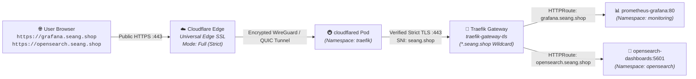

# 🛡️ Zero-Trust HTTPS Guide: Gateway API + Traefik + cert-manager + Cloudflare Tunnel

This guide documents the complete end-to-end architecture and manual step-by-step instructions for exposing Kubernetes internal monitoring dashboards (**Grafana** and **OpenSearch Dashboards**) securely over HTTPS using **Kubernetes Gateway API (`gateway.networking.k8s.io/v1`)**, **Traefik v3**, **cert-manager (DNS-01)**, and **Cloudflare Tunnel (`cloudflared`)**.

---

## 🌐 1. End-to-End Traffic Architecture



### 🔒 Architectural Decision: Why Zero-Trust (Option B)?

| Requirement / Hop | Standard Ingress / Tunnel Only | This Zero-Trust Architecture |
| :--- | :--- | :--- |
| **Public Browser TLS** | ✅ Yes (Managed by Cloudflare Edge) | ✅ Yes (Managed by Cloudflare Edge) |
| **Edge-to-Cluster Tunnel** | ✅ Encrypted wire (WireGuard/QUIC) | ✅ Encrypted wire (WireGuard/QUIC) |
| **Internal Cluster In-Transit TLS** | ⚪ Plain HTTP inside cluster network | ✅ **Strict cryptographically verified TLS** |
| **Cloudflare SSL Encryption Mode** | Flexible / Full (no verify) | **Full (Strict)** |
| **Inbound Open Ports Needed?** | ❌ None (Tunnel initiates outbound) | ❌ **None** (Zero inbound firewall rules) |
| **Public Port 80 for Let's Encrypt?**| ⚠️ Required for HTTP-01 challenges | ❌ **Not needed** (DNS-01 uses Cloudflare API) |
| **Direct Cluster / VPN Access** | ❌ Browser warning ("Not Secure") | ✅ **Valid green padlock** inside and outside |

---

## 📋 2. Step-by-Step Manual Setup

### Step 1: Create Cloudflare API Token (For cert-manager DNS-01)

cert-manager uses this API token to dynamically create and delete `_acme-challenge.seang.shop` TXT DNS records during Let's Encrypt certificate issuance.

1. Log in to the [Cloudflare Dashboard](https://dash.cloudflare.com/).
2. Click your user icon at the top right > **My Profile** > **API Tokens**.
3. Click **Create Token** > find **Custom Token** at the bottom > click **Get started**.
4. Configure the token permissions:
   - **Token name**: `k8s-cert-manager-dns01`
   - **Permissions**:
     - `Zone` | `DNS` | `Edit`
     - `Zone` | `Zone` | `Read`
   - **Zone Resources**:
     - `Include` | `Specific zone` | `seang.shop`
   - **TTL**: Leave empty (tokens will not expire prematurely).
5. Click **Continue to summary**, review, and click **Create Token**.
6. **Copy the API Token immediately** and store it safely.

---

### Step 2: Set Up Cloudflare Tunnel (`cloudflared`)

Choose either **Option 2A (Dashboard-Managed)** or **Option 2B (CLI-Managed)**.

#### Option 2A: Dashboard-Managed Tunnel (Recommended if you have Cloudflare Zero Trust)

1. Open [Cloudflare Zero Trust Dashboard](https://one.dash.cloudflare.com/).
2. Navigate to **Networks** > **Tunnels** > Click **Create a tunnel**.
3. Select **Cloudflared** connector > click **Next**.
4. Name your tunnel (e.g. `k8s-monitoring-tunnel`) > click **Save tunnel**.
5. In the **Install and run a connector** step, look at the Docker/Kubernetes command:
   - Copy the token string from `--token <TUNNEL_TOKEN>`.
6. Click **Next** to proceed to the **Public Hostnames** tab.
7. Add the routes:

   **Route 1 (Grafana):**
   - **Public Hostname**: Subdomain: `grafana`, Domain: `seang.shop`
   - **Service**: Type: `HTTPS`, URL: `traefik.traefik.svc.cluster.local:443`
   - **Additional application settings** > **TLS**:
     - **Origin Server Name**: `seang.shop`

   **Route 2 (OpenSearch Dashboards):**
   - **Public Hostname**: Subdomain: `opensearch`, Domain: `seang.shop`
   - **Service**: Type: `HTTPS`, URL: `traefik.traefik.svc.cluster.local:443`
   - **Additional application settings** > **TLS**:
     - **Origin Server Name**: `seang.shop`

   *(Or simply create a single wildcard route `*.seang.shop` pointing to `HTTPS://traefik.traefik.svc.cluster.local:443` with Origin Server Name `seang.shop`)*.

---

#### Option 2B: CLI-Managed Tunnel (NO Credit Card / Billing Required)

If you do not want to enter any payment info into Cloudflare Zero Trust, use the CLI method:

1. **Install `cloudflared` on your local terminal / machine**:
   ```bash
   # Linux AMD64
   curl -L --output cloudflared.deb https://github.com/cloudflare/cloudflared/releases/latest/download/cloudflared-linux-amd64.deb
   sudo dpkg -i cloudflared.deb
   ```
2. **Authenticate with Cloudflare**:
   ```bash
   cloudflared tunnel login
   ```
   Open the browser URL, choose your domain `seang.shop`, and authorize. This downloads `~/.cloudflared/cert.pem`.
3. **Create the Tunnel**:
   ```bash
   cloudflared tunnel create k8s-monitoring-tunnel
   ```
   Save the output:
   - **Tunnel ID** (UUID e.g. `4b8b6e22-8c7e-41d1-92b7-a3f8db1e8a90`)
   - **Credentials file** (`~/.cloudflared/<TUNNEL_ID>.json`)
4. **Route DNS into the Tunnel**:
   ```bash
   cloudflared tunnel route dns k8s-monitoring-tunnel "*.seang.shop"
   cloudflared tunnel route dns k8s-monitoring-tunnel "seang.shop"
   ```

---

### Step 3: Set Cloudflare SSL/TLS to Full (Strict)

1. In the standard [Cloudflare Dashboard](https://dash.cloudflare.com/), select your domain `seang.shop`.
2. Go to **SSL/TLS** > **Overview**.
3. Select **Full (Strict)**.

> [!NOTE]
> Because cert-manager generates a real, trusted Let's Encrypt certificate inside Kubernetes and attaches it to Traefik, `cloudflared` can validate the origin certificate against public WebPKI roots without needing `noTLSVerify: true`.

---

## ⚙️ 3. How to Deploy via Ansible

All automation is pre-built into the Ansible repository. You only need to populate your values in **[`group_vars/all.yml`](file:///home/seang/kubernete-aws-gcp/single-cluster/group_vars/all.yml#L320-L370)**.

### 1. Fill in Variables in `single-cluster/group_vars/all.yml`

Open [`single-cluster/group_vars/all.yml`](file:///home/seang/kubernete-aws-gcp/single-cluster/group_vars/all.yml) and update Section 16:

```yaml
# ------------------------------------------------------------------------------
# 16. ROLE: GATEWAY API, CERT-MANAGER & CLOUDFLARE TUNNEL (`roles/gateway_tls`)
# ------------------------------------------------------------------------------
enable_gateway_tls: true

base_domain: "seang.shop"
grafana_domain: "grafana.seang.shop"
opensearch_domain: "opensearch.seang.shop"

# Step 1: Paste your Cloudflare API Token here
cloudflare_cluster_issuer_name: "letsencrypt-cloudflare"
cloudflare_api_token: "PASTE_YOUR_CLOUDFLARE_API_TOKEN_HERE"

# Step 2: Choose tunnel mode and paste token or credentials
cloudflare_tunnel_mode: "token"     # "token" (Dashboard) or "credentials" (CLI)

# If using mode: "token":
cloudflare_tunnel_token: "PASTE_YOUR_TUNNEL_TOKEN_HERE"

# If using mode: "credentials":
# cloudflare_tunnel_id: "PASTE_TUNNEL_UUID_HERE"
# cloudflare_tunnel_credentials_json: |
#   {"AccountTag":"...","TunnelSecret":"...","TunnelID":"..."}
```

### 2. Run the Playbook

```bash
cd ~/kubernete-aws-gcp/single-cluster
ansible-playbook -i inventory.ini site.yml
```

The playbook executes `gateway_tls` in **Stage 5 (Last Stage)**, provisioning the certificates, HTTPRoutes, and Cloudflare Tunnel pods, followed by automated verification (`verify.yml`).

---

## 📄 4. Raw Kubernetes Manifest Reference (Manual `kubectl` Alternative)

If you ever need to inspect or deploy these resources manually with `kubectl` without Ansible, here are the standalone manifests:

### 1. Cloudflare API Token Secret
```yaml
# cloudflare-api-token-secret.yaml
apiVersion: v1
kind: Secret
metadata:
  name: cloudflare-api-token-secret
  namespace: cert-manager
type: Opaque
stringData:
  api-token: "<YOUR_CLOUDFLARE_API_TOKEN>"
```

### 2. Let's Encrypt DNS-01 ClusterIssuer
```yaml
# cluster-issuer.yaml
apiVersion: cert-manager.io/v1
kind: ClusterIssuer
metadata:
  name: letsencrypt-cloudflare
spec:
  acme:
    server: https://acme-v02.api.letsencrypt.org/directory
    email: pengseangsim210@gmail.com
    privateKeySecretRef:
      name: letsencrypt-cloudflare-account-key
    solvers:
      - dns01:
          cloudflare:
            apiTokenSecretRef:
              name: cloudflare-api-token-secret
              key: api-token
```

### 3. Traefik Wildcard TLS Certificate
```yaml
# wildcard-certificate.yaml
apiVersion: cert-manager.io/v1
kind: Certificate
metadata:
  name: traefik-wildcard-cert
  namespace: traefik
spec:
  secretName: traefik-gateway-tls
  issuerRef:
    name: letsencrypt-cloudflare
    kind: ClusterIssuer
  dnsNames:
    - "seang.shop"
    - "*.seang.shop"
```

### 4. Gateway API HTTPRoute for Grafana
```yaml
# grafana-httproute.yaml
apiVersion: gateway.networking.k8s.io/v1
kind: HTTPRoute
metadata:
  name: grafana-httproute
  namespace: monitoring
spec:
  parentRefs:
    - name: traefik-gateway
      namespace: traefik
  hostnames:
    - "grafana.seang.shop"
  rules:
    - matches:
        - path:
            type: PathPrefix
            value: /
      backendRefs:
        - name: prometheus-grafana
          port: 80
```

### 5. Gateway API HTTPRoute for OpenSearch Dashboards
```yaml
# opensearch-httproute.yaml
apiVersion: gateway.networking.k8s.io/v1
kind: HTTPRoute
metadata:
  name: opensearch-dashboards-httproute
  namespace: opensearch
spec:
  parentRefs:
    - name: traefik-gateway
      namespace: traefik
  hostnames:
    - "opensearch.seang.shop"
  rules:
    - matches:
        - path:
            type: PathPrefix
            value: /
      backendRefs:
        - name: opensearch-dashboards
          port: 5601
```

### 6. Cloudflare Tunnel Deployment (Token Mode)
```yaml
# cloudflared-deployment.yaml
apiVersion: v1
kind: Secret
metadata:
  name: cloudflare-tunnel-token
  namespace: traefik
type: Opaque
stringData:
  token: "<YOUR_TUNNEL_TOKEN>"
---
apiVersion: apps/v1
kind: Deployment
metadata:
  name: cloudflared
  namespace: traefik
  labels:
    app: cloudflared
spec:
  replicas: 2
  selector:
    matchLabels:
      app: cloudflared
  template:
    metadata:
      labels:
        app: cloudflared
    spec:
      containers:
        - name: cloudflared
          image: cloudflare/cloudflared:latest
          args:
            - tunnel
            - --no-autoupdate
            - run
            - --token
            - $(TUNNEL_TOKEN)
          env:
            - name: TUNNEL_TOKEN
              valueFrom:
                secretKeyRef:
                  name: cloudflare-tunnel-token
                  key: token
          livenessProbe:
            httpGet:
              path: /ready
              port: 2000
            initialDelaySeconds: 5
            periodSeconds: 10
          resources:
            requests:
              cpu: 50m
              memory: 64Mi
            limits:
              cpu: 500m
              memory: 256Mi
```

---

## 🔍 5. Verification & Troubleshooting Commands

### 1. Check Certificate Status
```bash
# Check if Certificate is Ready: True
kubectl get certificate -n traefik

# Inspect cert-manager events and orders
kubectl describe certificate traefik-wildcard-cert -n traefik
kubectl get challenges -A
kubectl get orders -A
```

### 2. Check Gateway API HTTPRoutes
```bash
# Verify both routes are programmed and attached to traefik-gateway
kubectl get httproute -A
kubectl describe httproute -n monitoring grafana-httproute
kubectl describe httproute -n opensearch opensearch-dashboards-httproute
```

### 3. Check Cloudflare Tunnel Pods
```bash
# Check pod health
kubectl get pods -n traefik -l app=cloudflared

# Inspect tunnel connection logs
kubectl logs -n traefik -l app=cloudflared -f
```

### 4. Common Troubleshooting Scenarios

| Symptom | Probable Cause | Quick Fix |
| :--- | :--- | :--- |
| `x509: certificate is valid for ..., not traefik.traefik.svc` | `cloudflared` connecting to internal K8s service name without SNI | In Cloudflare Zero Trust public hostname settings (or `config.yaml`), set **Origin Server Name** to `seang.shop`. |
| DNS-01 Challenge stuck in `Pending` | Cloudflare API token permissions insufficient | Ensure token has **Zone > DNS > Edit** and **Zone > Zone > Read** permissions specifically scoped to `seang.shop`. |
| HTTPRoute returns `503 Service Unavailable` | Backend Pod not ready or service name mismatch | Check `kubectl get svc -n monitoring prometheus-grafana` and `kubectl get svc -n opensearch opensearch-dashboards`. |
| HTTPRoute returns `404 Not Found` | Domain header mismatch or listener namespace policy | Ensure `traefik-gateway` has `allowedRoutes.namespaces.from: All` (already configured in this setup). |
