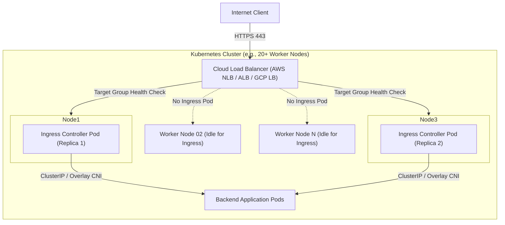
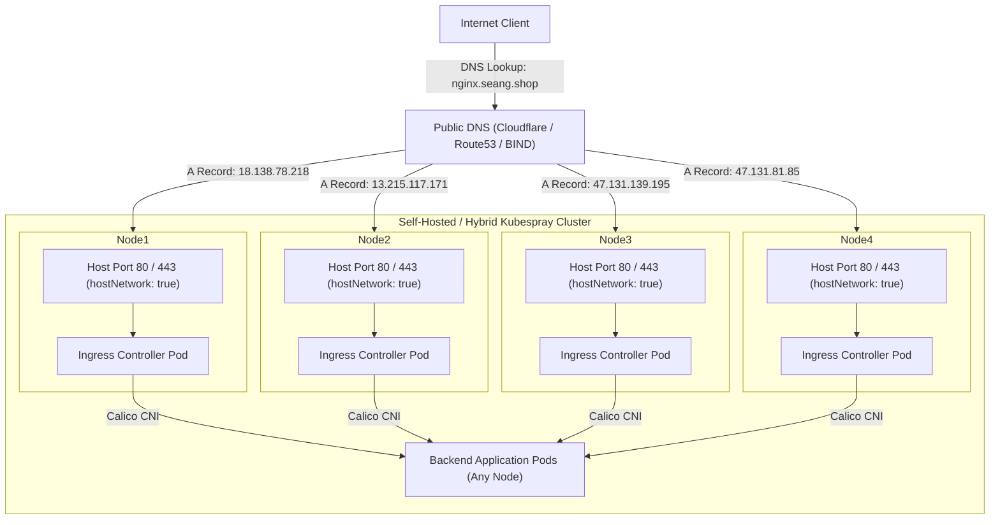

# Two Approaches to Deploying NGINX Ingress Controller

When deploying an Ingress Controller (such as NGINX Ingress) to a Kubernetes cluster, there are two primary architectural patterns:

1. **Deployment Pattern** (Horizontal Scaling with Cloud Load Balancers)
2. **DaemonSet Pattern** (Every-Node Coverage for Self-Hosted / Bare-Metal)

This guide breaks down each architecture, provides traffic-flow diagrams, and explains when to choose each approach.

---

## 1. Approach A: Deployment (Cloud Environments: EKS, GKE, AKS)

### Architecture Overview
In managed cloud environments, a managed cloud load balancer (such as an AWS ALB/NLB, Google Cloud External Application Load Balancer, or Azure Load Balancer) fronts the entire cluster.

In this model:
- The Ingress Controller runs as a standard **Kubernetes Deployment** with a modest number of replicas (e.g., 2 or 3 pods).
- Replicas automatically scale up or down based on incoming CPU/memory or request volume via the **Horizontal Pod Autoscaler (HPA)**.
- The cloud load balancer dynamically directs incoming internet traffic to whichever worker nodes are currently running an ingress pod.
- **Resource Efficiency**: If your cluster scales to 50 or 100 worker nodes, running ingress pods on every node wastes significant CPU and RAM. A Deployment keeps resource consumption small and focused.

### Traffic Flow Diagram (Deployment)



### Key Advantages & Trade-Offs
* **Pros:**
  * Auto-scalable (HPA scales replicas as traffic surges).
  * Low resource overhead on large clusters (only uses CPU/RAM on nodes hosting replicas).
  * Leverages native cloud features (managed DDoS protection, ACM TLS termination, regional failover).
* **Cons:**
  * Requires a cloud provider with a Load Balancer controller (adds cloud infrastructure cost).
  * May introduce an additional network hop (`NodePort` routing) unless using direct pod routing (e.g., AWS VPC CNI Target Groups).

---

## 2. Approach B: DaemonSet (Self-Hosted / Bare-Metal / Kubespray)

### Architecture Overview
Kubespray is designed for self-hosted, on-premises, and hybrid bare-metal clusters where automated cloud load balancers are either absent or undesirable.

In this model:
- The Ingress Controller runs as a **DaemonSet** (`kind: DaemonSet`), guaranteeing that exactly **one Ingress Controller pod runs on every eligible worker node**.
- Ingress pods frequently utilize `hostNetwork: true`. This binds the Ingress Controller directly to the host's actual network interface on ports `80` and `443`, bypassing `NodePort` NAT layers.
- **No Cloud Load Balancer Required:** You do not need to pay for or configure an AWS ALB/NLB. Every worker node with an Ingress pod serves as a direct gateway into the cluster.

### Traffic Flow Diagram (DaemonSet)



### How Traffic is Exposed Without a Cloud Load Balancer
1. **Single Entry Point (Simple Setup):**
   * Point your DNS `A` record (e.g., `app.example.com`) directly to `worker01`'s public IP.
2. **Multi-Node High Availability (DNS Round-Robin):**
   * Add multiple `A` records in DNS for `worker01`, `worker02`, `worker03`, etc.
   * Clients balance across the IP list; if one node goes down, other nodes continue to accept requests.
3. **External Hardware/Software Load Balancer (HAProxy / Keepalived):**
   * Place an on-premise HAProxy or Keepalived VIP in front of all worker IPs.

---

## 3. Comprehensive Comparison Matrix

| Feature | Approach A: Deployment (Helm / Cloud) | Approach B: DaemonSet (Kubespray Default) |
| :--- | :--- | :--- |
| **Primary Environment** | Managed Cloud (AWS EKS, GCP GKE, Azure AKS) | Bare-Metal, On-Premise, Self-Hosted (Kubespray, Talos) |
| **Workload Kind** | `kind: Deployment` | `kind: DaemonSet` |
| **Pod Placement** | Placed dynamically on a few nodes (e.g. 2–3 replicas) | Exactly 1 pod runs on every matching node |
| **Scaling Mechanism** | Horizontal Pod Autoscaler (HPA) based on CPU/RAM/RPS | Scales automatically only when nodes are added to cluster |
| **Cluster Ingress Entry** | Cloud Load Balancer (AWS ALB/NLB, GCP GCLB) | Every node IP directly (via `hostNetwork` or `NodePort`) |
| **Resource Overhead** | **Low:** Minimal footprint on large (50+ node) clusters | **Higher:** Consumes memory and CPU on every node |
| **Cloud Cost** | Extra monthly cost for Cloud Load Balancer instances | **Zero:** No cloud load balancers required |
| **Network Hop** | Client → Cloud LB → NodePort/Kube-Proxy → Ingress Pod | Client → Node Host Port → Ingress Pod (direct) |

---

## 4. Kubespray Implementation Details

In Kubespray, the NGINX Ingress Controller is configured via:
* File: `inventory/<cluster>/group_vars/k8s_cluster/addons.yml`

```yaml
# Enable NGINX Ingress Controller
ingress_nginx_enabled: true

# Use host network to bind ports 80/443 directly to node network interfaces
ingress_nginx_host_network: true

# Expose via NodePort or LoadBalancer
ingress_nginx_service_type: NodePort

# Restrict ingress to worker nodes only (exclude control-plane)
ingress_nginx_nodeselector:
  kubernetes.io/os: "linux"
```

### Applying in Kubespray
To apply or update Ingress without rerunning the entire cluster setup:
```bash
ansible-playbook -i inventory/sample/inventory.ini cluster.yml --tags=ingress-nginx --limit master01
```